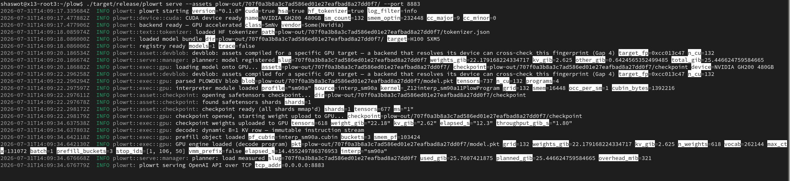

# plow

[](LICENSE)
[](https://www.rust-lang.org/)
[](#recipe-a--nvidia-rtx-5090-sm_120-170-sms-32-gb)
[](#recipe-c--amd-mi350x--mi355x-gfx950-256-cus)
[](https://nixos.org/)
[](lean-plow/)
[](https://infervisor.ai)

**Packet Language for On-device Warps** — an LLM inference stack from
[Infervisor](https://infervisor.ai).

plow compiles a Hugging Face checkpoint into a static **packet stream**, then
runs it with a **persistent on-device interpreter**: one cooperative GPU launch
that stays resident, executes ops at warp granularity, and coordinates with
counters instead of per-op CPU dispatch.

| Component | Role |
|-----------|------|
| `plowc` | AOT compiler (checkpoint → `.pkt` + weight sidecars) |
| `plowrt` | Host runtime + OpenAI-compatible HTTP server |
| `runtime/` | CUDA / HSA persistent interpreters |
| `lean-plow/` | Lean 4 checks for rewrites and the counter protocol |

## Table of contents

- [Fully supported today](#fully-supported-today)
- [Requirements](#requirements)
- [0. Build the host tools](#0-build-the-host-tools)
- [1. Download Gemma-4-12B](#1-download-gemma-4-12b)
- [Recipe A — NVIDIA RTX 5090](#recipe-a--nvidia-rtx-5090-sm_120-170-sms-32-gb)
  - [A1. Interpreter cubins](#a1-interpreter-cubins)
  - [A2. Compile the packet](#a2-compile-the-packet-bundle)
  - [A3. Serve and chat](#a3-serve-and-chat)
- [Recipe B — NVIDIA RTX PRO 6000 Blackwell](#recipe-b--nvidia-rtx-pro-6000-blackwell-sm_120-188-sms-96-gb)
- [Recipe C — AMD MI350X / MI355X](#recipe-c--amd-mi350x--mi355x-gfx950-256-cus)
  - [C1. Interpreter code objects](#c1-interpreter-code-objects)
  - [C2. Compile the packet](#c2-compile-the-packet-bundle)
  - [C3. Serve and chat](#c3-serve-and-chat)
  - [Example running instance](#example-running-instance)
- [Recipe D — AMD MI300X](#recipe-d--amd-mi300x-gfx942-304-cus)
- [Asset layout](#asset-layout-what-serve-expects)
- [Architecture](#architecture)
- [Contributing](#contributing)
- [Security](#security)
- [License](#license)
- [Code of Conduct](#code-of-conduct)

## Fully supported today

These paths are the ones exercised end-to-end for serving. Start here.

| GPU | Arch | SMs / CUs | VRAM | `plowc` flags |
|-----|------|-----------|------|----------------|
| **NVIDIA RTX 5090** | `sm_120` | 170 SMs | 32 GB GDDR7 | `--gpu rtx5090 --n-cu 170` + `PLOW_UNISEG=1` |
| **NVIDIA RTX PRO 6000 Blackwell** | `sm_120` | 188 SMs | 96 GB GDDR7 | `--gpu rtx6000pro --n-cu 188` + `PLOW_UNISEG=1` |
| **AMD Instinct MI350X** | `gfx950` | 256 CUs | 288 GB HBM3E | `--arch gfx950 --gpu mi350x --n-cu 256` (**no** `PLOW_UNISEG`) |
| **AMD Instinct MI355X** | `gfx950` | 256 CUs | 288 GB HBM3E | `--arch gfx950 --gpu mi355x --n-cu 256` (**no** `PLOW_UNISEG`) |
| **AMD Instinct MI300X** | `gfx942` | 304 CUs | 192 GB HBM3 | `--arch gfx942 --gpu MI300X` (**no** `PLOW_UNISEG`) |

| Model (first-run) | HF id | Notes |
|-------------------|-------|--------|
| **Gemma-4 12B Instruct** | `google/gemma-4-12B-it` | Dense bf16 primary path below |
| Gemma-4 31B Instruct | `google/gemma-4-31B-it` | Same recipes; needs more VRAM / shorter ctx on 5090 |
| Gemma-4 26B-A4B MoE | `google/gemma-4-26B-A4B-it` | MoE emit + serve on the same GPUs |

Also emit-capable (not the first-run walkthrough): Qwen3, Llama-3.1; bf16 and
weight-only fp8 (e4m3). Descriptors exist for other parts (H100, B200) — do
**not** treat those as drop-in substitutes for the recipes below without
matching interpreter objects and `--n-cu`.

## Requirements

- Nix with flakes → `nix develop` at the repo root (Rust / cmake / Lean)
- **NVIDIA recipe:** driver + CUDA ≥ 12.9 (`nvcc` on `PATH`, usually
  `/usr/local/cuda/bin`) to *build* cubins; run needs `libcuda.so.1` only
- **AMD recipe:** ROCm ≥ **7.2.4** at `/opt/rocm` (`hipcc`, bundler); run needs
  amdgpu + `libhsa-runtime64.so`. ROCm 7.0.2 is too old for the register cliff
- Hugging Face access for `google/gemma-4-12B-it` (gated model — accept the
  license and `hf auth login` first)

`plowrt` does not link CUDA/HIP. Features `cuda` / `hsa` `dlopen` the drivers at
runtime.

## 0. Build the host tools

```bash
cd /path/to/plow
nix develop

cargo build --release -p plowc
cargo build --release -p plowrt --features cuda,hsa
```

Binaries: `./target/release/plowc`, `./target/release/plowrt`.
(`cuda` / `hsa` already pull the HF tokenizer.)

If the nix store is only visible inside the shell, keep using
`nix develop --command …` for every command below.

Optional: `cargo test --workspace` and `(cd lean-plow && lake build)`.

## 1. Download Gemma-4-12B

```bash
mkdir -p "$HOME/models"
hf download google/gemma-4-12B-it \
  --local-dir "$HOME/models/gemma-4-12B-it"
```

The API slug is the lowercased directory name: **`gemma-4-12b-it`**.
Keep that name; `plowc` and `/v1/models` both derive it this way.

---

## Recipe A — NVIDIA RTX 5090 (`sm_120`, 170 SMs, 32 GB)

Use a moderate context on 32 GB. `--n-cu` **must** be `170` for this SKU.

### A1. Interpreter cubins

`nvcc`/`cmake` should see the **system** CUDA, not nix’s glibc. From a normal
shell (or with a clean `PATH`):

```bash
export PATH=/usr/local/cuda/bin:$PATH
mkdir -p "$HOME/plow-assets/gemma4-12b-5090"
scripts/build_sm120_cubin.sh \
  "$HOME/plow-assets/gemma4-12b-5090/interp_sm120.cubin" \
  -DPLOW_NV_FA_GF_FULL=4
# writes interp_sm120.cubin + interp_sm120_pf.cubin beside it
```

### A2. Compile the packet (bundle)

Back in `nix develop`:

```bash
ASSETS="$HOME/plow-assets/gemma4-12b-5090"
CKPT="$HOME/models/gemma-4-12B-it"

PLOW_UNISEG=1 PLOW_NS_FULL_ABS=8 \
  ./target/release/plowc \
  --hf-dir "$CKPT" \
  --emit devblob \
  --gpu rtx5090 \
  --n-cu 170 \
  --max-ctx 8192 \
  --out "$ASSETS"
```

Bundle mode writes `model.pkt` + `weights.json` and symlinks `checkpoint` →
`$CKPT` and `tokenizer.json`. Cubins from A1 must already sit in `$ASSETS`.

`PLOW_UNISEG=1` is **NVIDIA-only**. Never set it for AMD.

### A3. Serve and chat

```bash
ASSETS="$HOME/plow-assets/gemma4-12b-5090"
./target/release/plowrt serve --assets "$ASSETS" --port 8080
```

Build must have included `--features cuda` (see §0). Re-run via cargo if
needed:

```bash
cargo run --release -p plowrt --features cuda -- \
  serve --assets "$ASSETS" --port 8080
```

```bash
curl -s http://127.0.0.1:8080/v1/models | jq .

curl -s http://127.0.0.1:8080/v1/chat/completions \
  -H 'content-type: application/json' \
  -d '{
    "model": "gemma-4-12b-it",
    "messages": [{"role":"user","content":"What is the capital of France?"}],
    "max_tokens": 64
  }' | jq .
```

---

## Recipe B — NVIDIA RTX PRO 6000 Blackwell (`sm_120`, 188 SMs, 96 GB)

Same as A, but SKU flags and longer context:

```bash
ASSETS="$HOME/plow-assets/gemma4-12b-6000pro"
CKPT="$HOME/models/gemma-4-12B-it"
mkdir -p "$ASSETS"

export PATH=/usr/local/cuda/bin:$PATH
scripts/build_sm120_cubin.sh "$ASSETS/interp_sm120.cubin" -DPLOW_NV_FA_GF_FULL=4

PLOW_UNISEG=1 PLOW_NS_FULL_ABS=8 \
  ./target/release/plowc \
  --hf-dir "$CKPT" \
  --emit devblob \
  --gpu rtx6000pro \
  --n-cu 188 \
  --max-ctx 131072 \
  --out "$ASSETS"

./target/release/plowrt serve --assets "$ASSETS" --port 8080
```

Curl uses the same `"model": "gemma-4-12b-it"`.

`--n-cu` is **not** portable across SM counts. Emitting with `188` and running on
a 170-SM 5090 (or the reverse) mis-schedules work.

---

## Recipe C — AMD MI350X / MI355X (`gfx950`, 256 CUs)

Do **not** set `PLOW_UNISEG`. Use `--arch gfx950` and `--gpu mi350x` or
`mi355x`.

### C1. Interpreter code objects

Needs system ROCm ≥ 7.2.4 (`hipcc` must not come from nix):

```bash
cmake -S runtime -B build-amd \
  -DPLOW_GFX950_HSACO=ON \
  -DPLOW_HSACO_ARCH=gfx950
cmake --build build-amd -j
# objects land in build-amd/hsaco/
```

Equivalent: `scripts/build_gfx950.sh build-amd/hsaco`.

### C2. Compile the packet (bundle)

```bash
ASSETS="$HOME/plow-assets/gemma4-12b-mi355x"
CKPT="$HOME/models/gemma-4-12B-it"
mkdir -p "$ASSETS"

./target/release/plowc \
  --hf-dir "$CKPT" \
  --emit devblob \
  --arch gfx950 \
  --gpu mi355x \
  --n-cu 256 \
  --max-ctx 131072 \
  --out "$ASSETS"

ln -sfn "$(pwd)/build-amd/hsaco" "$ASSETS/hsaco"
```

For MI350X swap `--gpu mi350x` and the assets dirname. `--n-cu` stays `256`.

A correct Gemma-4 dense emit reports **121 segments per prefill bucket** in
`build.json` (`2·layers + 1`). If you accidentally used `PLOW_UNISEG=1` on AMD,
prefill can “finish” in a few ms with zero logits — that flag collapses
wave-class segments and is invalid on gfx950.

### C3. Serve and chat

```bash
./target/release/plowrt serve --assets "$ASSETS" --port 8080
```

```bash
curl -s http://127.0.0.1:8080/v1/chat/completions \
  -H 'content-type: application/json' \
  -d '{
    "model": "gemma-4-12b-it",
    "messages": [{"role":"user","content":"What is the capital of France?"}],
    "max_tokens": 64
  }' | jq .
```

### Example running instance

`plowrt serve` after a successful load — Gemma-4 12B (~22 GiB weights) on an
NVIDIA GH200, OpenAI-compatible API on TCP:



---

## Recipe D — AMD MI300X (`gfx942`, 304 CUs)

CDNA3 is a first-class served target: the full interpreter object set builds and
serves on MI300X. It is a separate build script rather than an `$ARCH` knob
because CDNA3 genuinely diverges — 64 KiB LDS forces a single-buffered GEMM
stage at 192x256, and there are no CDNA4 MFMA/fp4 primitives, so
`runtime/amd/amd_arch.h` is the shim layer and the exported symbols carry the
arch suffix. Do **not** set `PLOW_UNISEG`.

### D1. Interpreter code objects

Build outside nix — `hipcc` needs the system glibc. `PLOW_OCC4=1` is the
batch-1 occupancy profile:

```bash
PLOW_OCC4=1 PLOW_L2HIER=1 bash scripts/build_gfx942.sh build-amd/hsaco/gfx942
```

### D2. Compile the packet (bundle)

On gfx942, `PLOW_FP8=1 PLOW_W8A8=1` selects the per-channel fp8 serving mode
(weights *and* activations); `PLOW_FP8_HEAD=1` additionally quantizes the
lm_head, for which `scripts/quantize_fp8_head.py` builds the missing shard.
L2-domain packet placement is on by default for gfx942.

```bash
ASSETS="$HOME/plow-assets/gemma4-12b-mi300x"
CKPT="$HOME/models/gemma-4-12B-it"
mkdir -p "$ASSETS"

PLOW_FP8=1 PLOW_W8A8=1 PLOW_FP8_HEAD=1 PLOW_FUSE_HNR=1 \
  ./target/release/plowc \
    --hf-dir "$CKPT" \
    --emit devblob \
    --arch gfx942 \
    --gpu MI300X \
    --max-ctx 131072 \
    --out "$ASSETS/model.pkt"

ln -sfn "$(pwd)/build-amd/hsaco/gfx942" "$ASSETS/hsaco"
```

MX-FP4 stays gfx950-only — CDNA3 has no fp4 hardware and `plowc` refuses it at
emit.

### D3. Serve and chat

Identical to [C3](#c3-serve-and-chat): `plowrt serve --assets "$ASSETS"`.

### Measured behaviour

Gemma-4-12B on one MI300X against vLLM 0.26 — bf16 vLLM vs fp8-served plow, same
box, same bench client, interleaved rounds. Full tables and the apples-to-apples
protocol are in [`perf-data/plow-gfx942/`](perf-data/plow-gfx942/).

plow's sliding-window decode is close to context-flat, so it leads from roughly
16k context up and trails at short context:

| Context | plow TPOT | vLLM 0.26 TPOT |
|---------|-----------|----------------|
| 4k  | 10.95 ms | 9.81 ms |
| 8k  | ~tie     | ~tie    |
| 16k | 11.31 ms | 11.67 ms |
| 32k | 11.81 ms | 14.10 ms |

Prefill TTFT is the known weak side — 1.5-3x behind, un-tuned; the auto-tuner
does not cover the prefill path yet.

---

## Asset layout (what `serve` expects)

After a successful recipe, `$ASSETS` contains at least:

```
model.pkt
weights.json          # "network": "gemma-4-12b-it"
tokenizer.json -> …   # symlink into the HF dir
checkpoint -> …       # symlink to the HF dir (weights mmap’d / uploaded)
# NVIDIA:
interp_sm120.cubin
interp_sm120_pf.cubin
# AMD:
hsaco/ -> …           # interp_decode.elf, interp_prefill.elf, interp_flash.elf, …
```

Confirm the slug before curling:

```bash
jq -r .network "$ASSETS/weights.json"
# → gemma-4-12b-it
```

Streaming: `"stream": true`. Also `/healthz`, `/metrics`. Multiple
`--assets DIR` register more models.

## Architecture

Architecture chapters: [`docs/arch/`](docs/arch/00-overview.md) — compiler
pipeline, tile graph, scheduler, packet ABI, counter system, runtime, cost
model, formal verification, multi-GPU. Build-system rationale:
[`docs/BUILD.md`](docs/BUILD.md). Every emit/build/runtime flag:
[`docs/flags-reference.md`](docs/flags-reference.md).

## Contributing

See [CONTRIBUTING.md](CONTRIBUTING.md). Please follow the
[Code of Conduct](CODE_OF_CONDUCT.md).

## Security

Report vulnerabilities privately — see [SECURITY.md](SECURITY.md).

## License

Copyright 2026 Infervisor.

Licensed under the [Apache License, Version 2.0](LICENSE).

## Code of Conduct

This project follows the [Contributor Covenant](CODE_OF_CONDUCT.md).
Report unacceptable behavior to **lava@infervisor.ai**.
