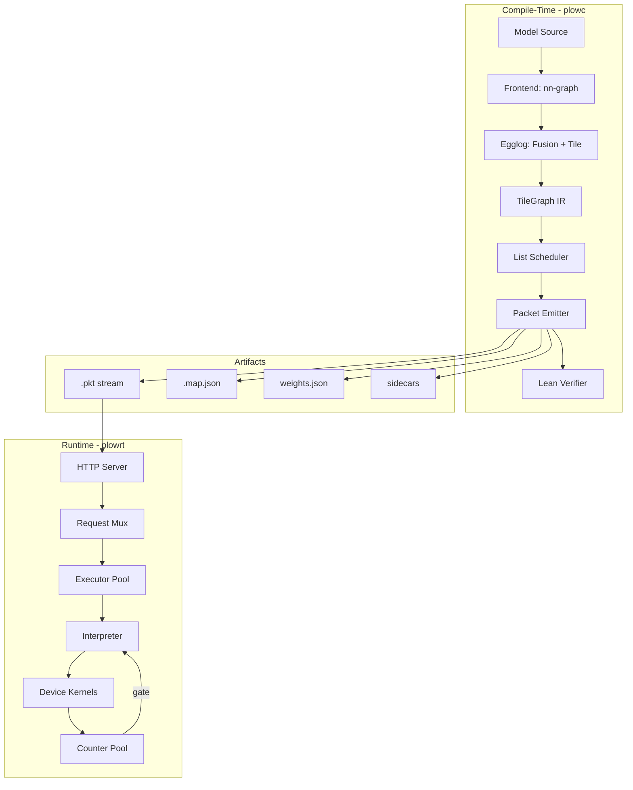
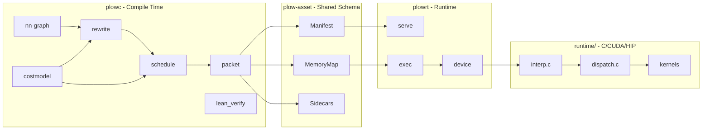

# Plow Architecture — Overview & Index

> Plow is an ahead-of-time compiler and persistent-kernel runtime for transformer inference across heterogeneous accelerators (NVIDIA, AMD, CPU, DPU).

---

## Document Map

| # | Document | Scope |
|---|----------|-------|
| [00](00-overview.md) | **Overview** (this file) | System summary, philosophy, and navigation |
| [01](01-compiler-pipeline.md) | **Compiler Pipeline** | Egglog rewriting, fusion, extraction |
| [02](02-tile-graph.md) | **Tile Dependency Graph** | Central IR between rewriting and scheduling |
| [03](03-scheduler.md) | **Scheduler** | Interval-conflict list scheduling, passes |
| [04](04-packet-abi.md) | **Packet ABI** | Wire format, opcode encoding, record types |
| [05](05-counter-system.md) | **Counter Coordination** | Scope tiers, clustering, determination |
| [06](06-runtime.md) | **Runtime** | Execution model, interpreter, backends |
| [07](07-cost-model.md) | **Cost Model** | Hardware abstraction, tile selection |
| [08](08-formal-verification.md) | **Formal Verification** | Lean 4 proofs, checkpoint architecture |
| [09](09-multi-gpu.md) | **Multi-GPU & Parallelism** | TP/PP/EP strategies, collectives |
| [10](10-implementation-status.md) | **Implementation Status** | What's built vs. planned |
| [11](11-tuning-coverage.md) | **Tuning Coverage** | Per-family: distinct kernels, knobs, oracles, blockers |
| [12](12-using-the-tuner.md) | **Using the Tuner** | `plowc tune`, reading the output, taking a measurement |
| [13](13-prefill-chunking.md) | **Prefill Chunking** | Bucket ladder, the ragged tail, ragged-M |
| [14](14-amd-arch-divergence.md) | **AMD Arch Divergence** | gfx942 vs gfx950: one tree, what forks, the tripwire |
| [architecture.md](architecture.md) | **Index / landing page** | Intro + linked table of contents for these chapters |

---

## System Identity

**Name:** Plow (née Infervisor)  
**Purpose:** Compile transformer models into static packet streams; execute them on persistent-kernel interpreters across GPU/CPU/DPU  
**Key bet:** Static AOT scheduling + counter-based coordination eliminates the CPU from the critical path, outperforming dynamic runtime dispatch for latency-sensitive inference

---

## Core Architecture Diagram

---

## Design Philosophy

### 1. Static over Dynamic

The entire inference schedule — which tile runs on which SM, in what order, with which DMA prefetches — is decided at compile time. The runtime interpreter is a simple loop: wait on counter → dispatch kernel → increment successors → advance.

**Why:** Dynamic scheduling (e.g. CUDA streams, work-queue atomics) pays per-dispatch overhead and cannot globally optimize across the full model graph. Static scheduling amortizes the optimization cost over millions of inferences.

**Counter-claim:** Stanford's megakernel work shows dynamic work-stealing beats static by up to 14% at large batch (≥2048) due to SM jitter. Plow's response: a batch-gated hybrid where the static baseline carries correctness/isolation properties and a work-stealing layer activates for throughput-dominated regimes.

### 2. Equality Saturation for Rewriting

Operator fusion uses egglog (e-graph + datalog) rather than ordered pattern matching. The e-graph explores all equivalent forms simultaneously and extracts the globally optimal one via a cost function.

**Why:** Greedy passes hit local optima. A GEMM-bias fusion blocks a downstream GEMM-activation fusion that would have been globally better. Equality saturation finds both and picks the best.

**Counter-claim:** E-graph compilation time grows super-linearly. Plow mitigates by compiling per-layer (transformer layers are structurally identical), keeping the e-graph manageable.

### 3. Borrow-Checker Logic for Resource Scheduling

The scheduler's feasibility test is structurally identical to Rust's Non-Lexical Lifetimes: exclusive holds on resources must not overlap in time. This is the same algorithm as linear-scan register allocation.

**Why:** The correspondence is exact and well-understood. Resources (SM, SRAM slot, DMA engine) are "places"; reservations are "borrows"; the scheduler proves no two conflicting borrows overlap.

### 4. Counters as Universal Coordination

All synchronization — within an SM, across SMs, across GPUs — uses the same atomic-integer counter primitive at different scope tiers. No kernel launches, no stream synchronization, no CPU-gated transfers.

**Why:** Uniformity eliminates coordination-class bugs. One mechanism, three implementations (shared-mem barrier, device-scope atomic, system-scope atomic). The compiler decides scope by placement.

### 5. Cross-Vendor via Capabilities + Calibration

The semantic rewrite rules and scheduler are intended to be hardware-agnostic. A port is not complete by adding a `GpuSpec`: the compiler must select only kernel variants that the target interpreter actually instantiates. The target design therefore combines a generated kernel-capability registry, the analytical cost model for cold-start ranking, and offline measurements keyed by hardware and interpreter build.

**Current implementation:** this boundary is incomplete. Generic `OpKind` selection coexists with model-specific `DevOp` emitters and duplicated `pick_tile` functions; some model-specific selection still names a particular GPU spec directly. Until those paths use one registry-backed selector, “swap the cost model” is a design goal rather than a portability guarantee.

### 6. Formal Verification as Compile-Time Check

Every compiled schedule passes through Lean 4 theorem provers that verify partition validity, counter protocol correctness, memory safety, and wire-format fidelity. Rejections fail the compile.

**Why:** Runtime bugs in GPU coordination are catastrophic (silent data corruption, hangs). Proving correctness once at compile time — backed by universal theorems — is cheaper than testing every possible interleaving.

---

## System Boundaries

**Compile-time crates** (Rust): `nn-graph` (frontend/graph IR), `rewrite`, `costmodel`, `schedule`, `packet`, `lean_verify`; plus `hwspec`, `kernelcaps`, and `tunedb` (hardware/kernel/tuning registries)  
**Shared schema** (Rust): `plow-asset` — single source of truth for compiler↔runtime types  
**Runtime host** (Rust): `plowrt` — HTTP server, mux, executor management  
**Runtime device** (C/CUDA/HIP): `runtime/` — interpreter, dispatch table, vendor kernels

---

## Data Flow Summary

1. **Input:** HuggingFace model ID or `NetConfig` JSON
2. **Frontend (`nn-graph`):** Resolves model → builds `nn_graph::Graph` specialized to shape bucket
3. **Rewrite:** Lowers to egglog, runs fusion rules to saturation, extracts `FusedGraph`
4. **Bridge:** Converts `FusedGraph` → `LayerPlan` (named ops with shapes + operand wiring)
5. **Assemble:** Lowers `LayerPlan` × `Soc` → `TileGraph` + `ConstraintSet`
6. **Schedule:** List-schedules the TileGraph, allocates counters, plans memory
7. **Emit:** Encodes as binary `.pkt` stream + JSON sidecars
8. **Verify:** Lean checks all six correctness properties (opt-in)
9. **Serve:** Runtime loads artifacts, allocates arena, dispatches per-request

---

## Key Design Decisions (Quick Reference)

| Decision | Chosen | Alternative Considered | Rationale |
|----------|--------|----------------------|-----------|
| Scheduling approach | AOT static | Dynamic work-queue | Isolation, determinism, cross-vendor |
| Rewrite engine | Egglog (equality saturation) | Ordered passes (MLIR-style) | Global optimality |
| Coordination | Atomic counters | CUDA streams / events | Vendor-neutral, no CPU gating |
| Packet format | Variable-length `repr(C)` POD | Fixed 128-byte | Space efficiency for small ops |
| IR between halves | TileGraph (petgraph DAG) | MLIR dialect | Simpler, domain-specific |
| Kernel selection | Offline calibrated AOT selection | Production runtime autotuning | Reproducible packets with hardware-specific evidence |
| Formal verification | Lean 4 decidable checks | Fuzzing / property tests | Proves legality/correctness, not measured speed |
| Multi-GPU | TP as outer wrapper | Interleaved TP+PP | Keeps single-GPU path clean |
| Weight layout | M-independent (BK,BN) | Per-bucket layout | One copy serves prefill+decode |
