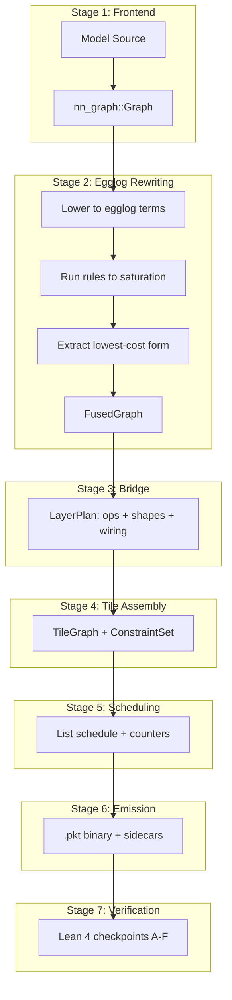

# 01 — Compiler Pipeline

> The compiler is two distinct halves with a clean interface: the **rewriting half** (egglog) finds the best equivalent computation; the **scheduling half** maps it to hardware.

---

## Pipeline Stages



---

## Stage 1: Frontend

**Module:** `crates/frontend/src/lib.rs`  
**Input:** HuggingFace model ID or local config.json  
**Output:** `nn_graph::Graph` (typed operator DAG)

The frontend is intentionally thin — a hub layer over the `nn-graph` model zoo crate. It:
1. Fetches `config.json` from HuggingFace Hub (via `hf-hub` with pure-Rust TLS)
2. Parses model config (architecture, hidden_size, num_heads, num_layers, etc.)
3. Builds a shape-specialized graph for the target bucket (batch, seq, phase)

**Supported architectures:** Gemma 2/3/4, Llama 2/3, Qwen 2/2.5, DeepSeek v2/v3, GLM 4/5

### Design Decision: nn-graph as External Vendor Crate

**Chosen:** `nn-graph` lives in its own private repo, used as a cargo git dependency from `https://github.com/infervisor/nn-graph.git`.

**Rationale:** The model zoo evolves independently (new architectures land frequently). Keeping it separate avoids polluting the compiler's Cargo.lock with model-specific dependencies and lets it maintain its own test suite.

**Counter-claim:** A mono-repo would simplify the build. Response: the Nix flake pins it deterministically, and path-dep means `cargo` resolves it without git at eval time.

---

## Stage 2: Egglog Rewriting

**Module:** `crates/rewrite/src/lib.rs`  
**Input:** `nn_graph::Graph`  
**Output:** `FusedGraph`

### 2.1 Lowering to Egglog

The `lower` module translates the nn-graph DAG into egglog let-bindings:

```
(let norm_0 (rmsnorm x_0 wn_0))
(let qkv_0 (gemm norm_0 wqkv_0))
(let silu_0 (silu (gemm norm_0 wgate_0)))
```

Each node becomes a typed egglog term. Shape information is preserved as term attributes.

### 2.2 Rewrite Rules

**Source:** `crates/rewrite/src/egl/rules.egg`

Rules are declarative and annotated with `; rule: <name>` for Lean verification:

```egglog
; rule: gemm_silu_fuse
(rewrite (silu (gemm ?a ?b)) (gemm_silu ?a ?b))

; rule: rmsnorm_qkv_fuse
(rewrite (gemm (rmsnorm ?x ?wn) ?w) (norm_gemm ?x ?wn ?w))

; rule: swiglu_fuse
(rewrite (mul (silu (gemm ?x ?wg)) (gemm ?x ?wu)) (swiglu ?x ?wg ?wu))
```

### 2.3 Extraction

The custom extractor walks the saturated e-graph choosing the lowest-cost form per e-class. Cost = estimated cycles from the shared cost model.

### Design Decision: Egglog over Ordered Passes

**Chosen:** Equality saturation via egglog.

**Rationale:**
- Greedy fusion passes interact: fusing A+B may prevent a more profitable B+C fusion
- E-graph explores ALL equivalent forms simultaneously in one pass
- Global cost-optimal extraction, not first-match
- Rules are composable: adding a rule never breaks existing ones (monotonic)
- Same engine can later host placement constraints (Polonius-style datalog)

**Counter-claim: Compilation time.** E-graph saturation can be superlinear. Mitigations:
1. **Per-layer compilation** — transformer layers are structurally identical; compile one, replicate
2. **Bounded saturation** — node/iteration limits prevent pathological growth
3. **Amortized cost** — compile once at startup, serve millions of inferences

**Counter-claim: Debuggability.** E-graphs are harder to debug than sequential passes. Mitigations:
1. Each rule is individually annotated and Lean-verified
2. `RewriteStats` reports ops_before/after/fused for quick sanity checks
3. The extracted `FusedGraph` is inspectable (named nodes with clear lineage)

**Counter-claim: Limited scope.** Egg cannot enforce global constraints (SRAM budgets, counter correctness). Response: that's exactly why the scheduler is **separate** — egg stops at extraction; the scheduler does constraint-aware assignment. This mirrors LLVM: the optimizer rewrites IR; the backend allocates registers.

---

## Stage 3: Bridge

**Module:** `crates/rewrite/src/bridge.rs`  
**Input:** `FusedGraph` + shape bucket  
**Output:** `LayerPlan`

The bridge converts the egglog-extracted graph into a concrete plan:

```rust
pub struct LayerPlan {
    pub ops: Vec<OpDesc>,
    pub wiring: Vec<(String, String)>, // (producer_output, consumer_input)
}

pub struct OpDesc {
    pub name: String,
    pub kind: OpKind,      // Gemm(GemmShape) | Flash(AttnShape) | Row(RowShape) | Layout(LayoutSpec)
    pub inputs: Vec<String>,
    pub output: String,
}
```

**Current limitation:** these four generic kinds do not describe the complete
production device surface. Model-specific emitters also select a much larger
`DevOp` namespace for fused norms, quantized GEMM/GEMV, MoE, MLA, and token
operations. Their tile pickers are duplicated and are not derived from the
generic candidate set.

**Target seam:** lower both paths to a common semantic `OpSignature`, then
query a generated `KernelSpec` registry. A candidate exists only when the
target backend builds and dispatches that exact kernel. Model configuration may
choose semantics and shapes; it must not own hardware tile tables.

**Key behavior:** `plan_from_all_blocks` bakes **every** transformer block into one plan, enabling cross-block tile pipelining. This unlocks:
- Layer N's output tiles feeding layer N+1's inputs without a global barrier
- Heterogeneous block types (Gemma 4 sliding/full attention mix) in one graph
- The scheduler seeing the full dependency structure

### Design Decision: All-Blocks in One Plan

**Chosen:** One `LayerPlan` spanning all transformer blocks.

**Alternative:** Per-layer plan with implicit barriers between layers.

**Rationale:** Cross-layer pipelining is where the biggest latency wins hide — a GEMM in layer N+1 can start the moment its specific input tiles from layer N complete, not when the entire layer N finishes. The single-plan approach makes this free for the scheduler.

**Cost:** Larger tile graphs (proportional to num_layers × tiles_per_layer). Mitigated by `max_tiles_per_op` cap and the scheduler's efficient interval-tree lookups.

---

## Stage 4: Tile Assembly

**Module:** `crates/rewrite/src/tilegraph.rs`  
**Input:** `LayerPlan` + `Soc` (hardware topology)  
**Output:** `TileGraph` + `ConstraintSet`

This stage currently:
1. For each generic op in the plan, queries the cost model for abstract tile shapes
2. Selects the best abstract tile per (op, unit) via `explore::select`
3. Generates DmaIn / Compute / DmaOut nodes per tile coordinate
4. Wires data-dependency edges between producers and consumers
5. Records constraints: colocation groups, SRAM footprints, locality requirements
6. Handles multi-unit (TP) by partitioning GEMM along N, adding Join nodes

The target flow inserts executable-kernel selection before assembly:

1. query the capability registry for kernel realizations of the semantic op;
2. reject shape/dtype/layout/resource-incompatible variants;
3. rank with matching offline measurements, falling back to the analytical model;
4. price conversions, dispatch, state traffic, and fusions as a region;
5. bake the chosen kernel/profile ID and tuning provenance into the artifact.

A `NetworkBlockDefinition` supplies the concrete semantic DAG, state, precision,
and phase buckets. The compiler deduplicates its op/region signatures, tunes
only relevant missing cases, block-validates winners, and transactionally
publishes qualified measurements. See
[`plans/arch-gemm-tuning-system.md`](../../plans/arch-gemm-tuning-system.md#36-network-block-driven-tuning-and-database-publication).

No runtime stub, alias-only opcode, or uninstantiated tile may enter the
TileGraph as a selectable candidate.

See [02-tile-graph.md](02-tile-graph.md) for the full TileGraph design.

---

## Stage 5: Scheduling

**Module:** `crates/schedule/`  
**Input:** `TileGraph` + `ConstraintSet`  
**Output:** `Scheduled` (per-resource ordered tasks + counters + memory plan)

See [03-scheduler.md](03-scheduler.md) for the full scheduler design.

---

## Stage 6: Emission

**Module:** `crates/packet/`  
**Function:** `schedule::emit_program`

Converts the scheduled task graph into a binary `.pkt` stream:
1. Each task → one `Inst` with its body (Gemm/Flash/Row/Dma/Layout/Token)
2. Counter assignments → `wait` and `succ` ID arrays per instruction
3. Counter table appended (id, threshold, scope)
4. Stream header prepended (magic, version, bucket_id, counts)

See [04-packet-abi.md](04-packet-abi.md) for the wire format.

---

## Stage 7: Verification

**Module:** `crates/lean_verify/`  
**Tool:** `lean-plow/.lake/build/bin/plow_verify`

Optional (controlled by `--lean-verify` flag). Each bucket's compiled output is submitted to six checkpoints:

| Checkpoint | Property Verified |
|------------|------------------|
| A | Every rewrite rule has a Lean soundness theorem |
| B | Tile partition covers GEMM shape; tile-work ≤ cost bound |
| C | SRAM temporal-fit conditions (opt-in) |
| D | Schedule respects counter protocol; reclamation safety |
| E | Wire format round-trips correctly |
| F | Address-map allocation non-overlapping + within arena |

See [08-formal-verification.md](08-formal-verification.md) for details.

---

## Compiler Outputs (per bucket)

| Artifact | Format | Consumer |
|----------|--------|----------|
| `{stem}.pkt` | Binary packet stream (v5) | Runtime interpreter |
| `{stem}.map.json` | Address map (arena layout) | Runtime memory allocator |
| `{stem}.blocks.json` | Per-block task ranges | Pipeline-parallel sharding |
| `{stem}.experts.json` | MoE routing metadata | Expert-parallel dispatch |
| `{stem}.decode_kv.json` | KV patching schema | Decode-phase runtime |
| `{stem}.request_io.json` | Per-request buffers | Host marshaling |
| `{stem}.trace.json` | Chrome trace (optional) | Developer debugging |
| `weights.json` | Network manifest | Runtime model loading |
| `assets.json` | HBM sizing summary | Capacity planning |
| `footprint.json/.csv` | Per-bucket memory | Operator tooling |

---

## Post-Schedule Optimization Passes

Applied after the main schedule, before emission:

### §8.1 Counter Elimination

**What:** Drop counters whose ordering is already implied by resource-order (same resource, earlier position).

**Lean backing:** `Plow.Protocol.resourceOrdered ⊆ happensBefore`

**Effect:** 20-40% counter reduction on typical models.

### §8.2 Scope Narrowing

**What:** Downgrade `Scope::IntraGpu` counters to `Scope::IntraSm` when all producers and consumers are on the same SM.

**Effect:** Swaps L2 atomic (~40 cycles) for shared-memory barrier (~4 cycles).

### §8.3 Prefetch Hoisting

**What:** Reorder each resource's stream so DMA-in packets sit immediately after their last stream-local predecessor — hiding memory latency behind compute.

**Effect:** Closes the makespan/ideal_makespan gap on memory-bound workloads.

### §8.5 SRAM Temporal Fit (Phase 3)

**What:** The relax pass conservatively demotes handoffs to HBM when SRAM *capacity* overflows. But some pairs are temporally disjoint — producer's pages are freed before consumer needs them. This pass:
1. Identifies candidates where `producer_release ≤ consumer_acquire`
2. Greedy per-candidate: promote + reschedule; keep only if makespan improves
3. Accept the final set that strictly improves the baseline

**Design Decision:** Greedy-per-candidate, not bulk-promote.

**Rationale:** Phase 2 showed bulk promotion regresses 100% of the time — forcing full colocation trades away too much compute parallelism. Greedy gives the scheduler freedom to reject promotions that hurt.
