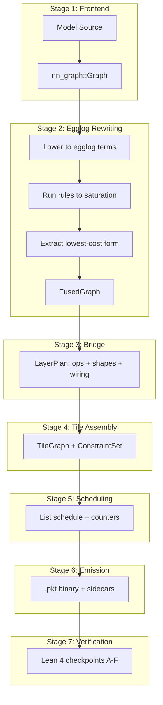

# 01 — Compiler Pipeline

> The compiler is two distinct halves with a clean interface: the **rewriting half** (egglog) finds the best equivalent computation; the **scheduling half** maps it to hardware.

> [!WARNING]
> **The rewriting half described below is not in the shipping emit path.** This
> document describes the pipeline as DESIGNED. As built:
>
> * `plowc`'s plan path lowers the **raw** `nn_graph::Graph` (`plan_from_all_blocks`).
>   The `FusedGraph` is computed for statistics and discarded. `plan_from_fused` — the
>   only bridge that consumes a fused term — has no production caller.
> * `plowc --emit devblob` (the path every gfx950 asset is built with) calls
>   `report_devblob_egglog`, which saturates a second graph, `info!`s the fusion count,
>   and drops it. On Gemma-4-31B that is `graph_ops=1444, fusions_found=662`, **0 applied**.
> * `crates/devgen/Cargo.toml` has **no `rewrite`/`egglog` dependency**, so no fused
>   term can reach the emitter even in principle.
>
> **No egglog rewrite reaches a GPU.** Measured coverage on Gemma-4-12B: 0 of 1156 ops,
> 0 of 24,226 GFLOP (`perf-data/px18-egglog-wholemodel.md`). Every fusion in a shipped
> packet — `GemvQkv` (op 22), `GemvGlu` (op 19), `NormResidualNorm` — is hand-written in
> `devgen`.
>
> Wiring it up is **not** a measured perf lever: A/B on gfx950 shows deleting 100
> packets/token is worth ≤0.064 ms, and the +100-gate arm actually ran *faster*
> (17.704 vs 18.070 ms/token, n=8). Sections 2–3 below therefore document intent and a
> working library, not a stage that runs on the way to an asset.

---

## Pipeline Stages



---

## Stage 1: Frontend

**Crate:** `crates/nn-graph` (in-workspace frontend IR)  
**Input:** HuggingFace model ID or local config.json  
**Output:** `nn_graph::Graph` (typed operator DAG)

The frontend is the `nn-graph` crate: a model-agnostic operator-graph IR plus a
model zoo. Architecture-specific builders (HF model → ops) live under
`nn_graph::models` (behind the `models` feature); resolving a model *id* to its
`config.json` over the network is `nn_graph::hub` (behind the `hub` feature). It:
1. Resolves `config.json` from HuggingFace Hub (`nn_graph::hub`, via `hf-hub` 0.4)
2. Parses model config (architecture, hidden_size, num_heads, num_layers, etc.)
3. Builds a graph, runs symbolic shape inference (`infer_shapes`), then binds it
   to concrete batch/seq/phase parameters for the target bucket

**Supported architectures (`nn_graph::models`):** Gemma, Llama, Qwen 2.5/3/VL/Image,
DeepSeek, GLM, Kimi, SigLIP.

> [!NOTE]
> **Deviation from implementation:** the shipping `plowc --emit devblob` path
> does **not** build an `nn_graph::Graph`. `plowc::hf_config` synthesizes a
> full-model `LayerPlan` directly from `config.json` dimensions (compile-time
> layer unroll) and feeds it straight to `assemble`, bypassing Stages 2–3
> entirely. The `nn_graph::Graph` → egglog path is exercised only by the advisory
> `report_devblob_egglog` fusion count.

### Design Decision: nn-graph as a Workspace Crate

**Chosen:** `nn-graph` is an in-workspace crate (`crates/nn-graph`), consumed as a
path dependency. It was formerly external; the `hub` feature and its optional
`hf-hub` dependency are the remnants of that split.

**Rationale:** The model zoo evolves quickly (new architectures land often), but
keeping it in-workspace lets `cargo` resolve it without git and keeps the frontend
IR, its `DType` (which reaches emitted code via `costmodel::dtype_cost`), and the
compiler in one lockfile.

---

## Stage 2: Egglog Rewriting

**Module:** `crates/rewrite/src/lib.rs`  
**Input:** `nn_graph::Graph`  
**Output:** `FusedGraph`

### 2.1 Lowering to Egglog

The `lower` module (`rewrite::lower`) walks the nn-graph DAG in program order,
emitting one `(let nN <term>)` per node. Leaves inline as `(Input "name")` /
`(Weight "name")` constructors; interior nodes reference earlier `let`
variables. The term vocabulary is the `Expr` datatype in
`crates/rewrite/src/egl/schema.egg` (e.g. `RmsNorm`, `Linear`, `Rope`,
`Attention`, `Ew`, `Act`):

```
(let n0 (RmsNorm (Input "x") (Weight "input_layernorm.weight") 1e-6))
(let n1 (Linear n0 (Weight "q_proj.weight") 4096))
(let n2 (Act "silu" (Linear n0 (Weight "gate_proj.weight") 14336)))
```

Each node becomes a fixed-arity, typed egglog term; scalar attributes
(out-features, eps, rotary dim) ride along as term arguments.

### 2.2 Rewrite Rules

**Source:** `crates/rewrite/src/egl/rules.egg`

Rules are declarative and each is preceded by a `; rule: <name>` annotation that
`plowc` parses and submits to Lean checkpoint A (`Plow.Rewrite.soundRules`). A
rule missing that annotation, or whose name lacks a Lean theorem, fails the
compile under `--lean-verify`. There are deliberately no `:cost` annotations:
extraction runs on egglog's tree-additive cost (uniform head weight 1), so a
fused target wins by having strictly fewer e-nodes. Representative rules:

```egglog
; rule: rmsnorm-linear-fuse
(rewrite (Linear (RmsNorm ?x ?w ?eps) ?wl ?out)
         (FusedNormLinear ?x ?w ?wl ?eps ?out))

; rule: gated-mlp-fuse
(rewrite (Ew "mul" (Act ?k ?g) ?u)
         (SwiGLU ?k ?g ?u))

; rule: residual-rmsnorm-fuse
(rewrite (RmsNorm (Ew "add" ?a ?b) ?w ?eps)
         (FusedResidualNorm ?a ?b ?w ?eps))
```

### 2.3 Extraction

The custom extractor walks the saturated e-graph choosing the lowest-cost form per e-class. Cost = estimated cycles from the shared cost model.

### Design Decision: Egglog over Ordered Passes

**Chosen:** Equality saturation via egglog.

**Rationale:**
- Greedy fusion passes interact: fusing A+B may prevent a more profitable B+C fusion
- E-graph explores ALL equivalent forms simultaneously in one pass
- Global cost-optimal extraction, not first-match
- Rules are composable: adding a rule never breaks existing ones (monotonic)
- Same engine can later host placement constraints (Polonius-style datalog)

**Counter-claim: Compilation time.** E-graph saturation can be superlinear. Mitigations:
1. **Per-layer compilation** — transformer layers are structurally identical; compile one, replicate
2. **Bounded saturation** — node/iteration limits prevent pathological growth
3. **Amortized cost** — compile once at startup, serve millions of inferences

**Counter-claim: Debuggability.** E-graphs are harder to debug than sequential passes. Mitigations:
1. Each rule is individually annotated and Lean-verified
2. `RewriteStats` reports ops_before/after/fused for quick sanity checks
3. The extracted `FusedGraph` is inspectable (named nodes with clear lineage)

**Counter-claim: Limited scope.** Egg cannot enforce global constraints (SRAM budgets, counter correctness). Response: that's exactly why the scheduler is **separate** — egg stops at extraction; the scheduler does constraint-aware assignment. This mirrors LLVM: the optimizer rewrites IR; the backend allocates registers.

---

## Stage 3: Bridge

**Module:** `crates/rewrite/src/bridge.rs`  
**Input:** shape-inferred `nn_graph::Graph` (as designed: `FusedGraph`) + shape bucket  
**Output:** `LayerPlan`

The bridge converts a shape-inferred graph into a concrete plan. A `LayerPlan` is
just a list of `OpSpec`s in program order (data-flow is expressed by operand
names, not a separate wiring list):

```rust
pub struct LayerPlan {
    pub ops: Vec<OpSpec>,
}

pub struct OpSpec {
    pub name: String,
    pub inputs: Vec<String>,   // inputs[0] is the shared activation; inputs[1..] parameters
    pub output: String,
    pub kind: OpKind,          // Gemm(GemmShape) | Flash(AttnShape) | Row(RowShape) | Layout(LayoutSpec)
    pub weight_dtype: nn_graph::DType,
    pub compute_dtype: nn_graph::DType,
}
```

> [!NOTE]
> **Deviation from implementation:** `plan_from_all_blocks` — the only bridge
> entry with a production caller — lowers the **raw** `nn_graph::Graph`, not a
> `FusedGraph`. `plan_from_fused` is the sole entry that consumes an
> egglog-extracted term, and it has no production caller.

**Current limitation:** these four generic kinds do not describe the complete
production device surface. Model-specific emitters also select a much larger
`DevOp` namespace for fused norms, quantized GEMM/GEMV, MoE, MLA, and token
operations. Their tile pickers are duplicated and are not derived from the
generic candidate set.

**Target seam:** lower both paths to a common semantic `OpSignature`, then
query a generated `KernelSpec` registry. A candidate exists only when the
target backend builds and dispatches that exact kernel. Model configuration may
choose semantics and shapes; it must not own hardware tile tables.

**Key behavior:** `plan_from_all_blocks` bakes **every** transformer block into one plan, enabling cross-block tile pipelining. This unlocks:
- Layer N's output tiles feeding layer N+1's inputs without a global barrier
- Heterogeneous block types (Gemma 4 sliding/full attention mix) in one graph
- The scheduler seeing the full dependency structure

### Design Decision: All-Blocks in One Plan

**Chosen:** One `LayerPlan` spanning all transformer blocks.

**Alternative:** Per-layer plan with implicit barriers between layers.

**Rationale:** Cross-layer pipelining is where the biggest latency wins hide — a GEMM in layer N+1 can start the moment its specific input tiles from layer N complete, not when the entire layer N finishes. The single-plan approach makes this free for the scheduler.

**Cost:** Larger tile graphs (proportional to num_layers × tiles_per_layer). Mitigated by `max_tiles_per_op` cap and the scheduler's efficient interval-tree lookups.

---

## Stage 4: Tile Assembly

**Module:** `crates/rewrite/src/tilegraph.rs`  
**Input:** `LayerPlan` + `Soc` (hardware topology)  
**Output:** `TileGraph` + `ConstraintSet`

This stage currently:
1. For each generic op in the plan, queries the cost model for abstract tile shapes
2. Selects the best abstract tile per (op, unit) via `explore::select`
3. Generates DmaIn / Compute / DmaOut nodes per tile coordinate
4. Wires data-dependency edges between producers and consumers
5. Records constraints: colocation groups, SRAM footprints, locality requirements
6. Handles multi-unit (TP) by partitioning GEMM along N, adding Join nodes

The target flow inserts executable-kernel selection before assembly:

1. query the capability registry for kernel realizations of the semantic op;
2. reject shape/dtype/layout/resource-incompatible variants;
3. rank with matching offline measurements, falling back to the analytical model;
4. price conversions, dispatch, state traffic, and fusions as a region;
5. bake the chosen kernel/profile ID and tuning provenance into the artifact.

**Deviation from implementation:** the seam is partially wired. `OpSignature` and
`KernelSpec` exist in `crates/kernelcaps`, and `assemble_tuned` already accepts a
`KernelOracle` (`crates/rewrite/src/oracle.rs`) to filter and re-cost candidates.
The default `assemble` passes `NoOracle`, so no capability registry is consulted
on the shipping path — the analytical cost model still chooses every tile. A
network-block definition that supplies the concrete semantic DAG, state,
precision, and phase buckets, and the tuning/publication loop that deduplicates
signatures and block-validates winners, are design intent, not built.

The invariant the target flow enforces: no runtime stub, alias-only opcode, or
uninstantiated tile may enter the TileGraph as a selectable candidate.

See [02-tile-graph.md](02-tile-graph.md) for the full TileGraph design.

---

## Stage 5: Scheduling

**Module:** `crates/schedule/`  
**Input:** `TileGraph` + `ConstraintSet`  
**Output:** `Scheduled` (per-resource ordered tasks + counters + memory plan)

See [03-scheduler.md](03-scheduler.md) for the full scheduler design.

---

## Stage 6: Emission

**Module:** `crates/schedule/src/emit.rs` (wire format defined in `crates/packet/`)  
**Function:** `schedule::emit_program`

Converts the scheduled task graph into a binary `.pkt` stream:
1. Each task → one `Inst` with its body (Gemm/Flash/Row/Dma/Layout/Token)
2. Counter assignments → `wait` and `succ` ID arrays per instruction
3. Counter table appended (id, threshold, scope)
4. Stream header prepended (magic, version, bucket_id, counts)

See [04-packet-abi.md](04-packet-abi.md) for the wire format.

---

## Stage 7: Verification

**Module:** `crates/lean_verify/`  
**Tool:** `lean-plow/.lake/build/bin/plow_verify`

Optional (controlled by `--lean-verify` flag). Each bucket's compiled output is submitted to six checkpoints:

| Checkpoint | Property Verified |
|------------|------------------|
| A | Every rewrite rule has a Lean soundness theorem |
| B | Tile partition covers GEMM shape; tile-work ≤ cost bound |
| C | SRAM temporal-fit conditions (opt-in) |
| D | Schedule respects counter protocol; reclamation safety |
| E | Wire format round-trips correctly |
| F | Address-map allocation non-overlapping + within arena |

See [08-formal-verification.md](08-formal-verification.md) for details.

---

## Compiler Outputs (per bucket)

| Artifact | Format | Consumer |
|----------|--------|----------|
| `{stem}.pkt` | Binary packet stream (v5) | Runtime interpreter |
| `{stem}.map.json` | Address map (arena layout) | Runtime memory allocator |
| `{stem}.blocks.json` | Per-block task ranges | Pipeline-parallel sharding |
| `{stem}.experts.json` | MoE routing metadata | Expert-parallel dispatch |
| `{stem}.decode_kv.json` | KV patching schema | Decode-phase runtime |
| `{stem}.request_io.json` | Per-request buffers | Host marshaling |
| `{stem}.trace.json` | Chrome trace (optional) | Developer debugging |
| `weights.json` | Network manifest | Runtime model loading |
| `assets.json` | HBM sizing summary | Capacity planning |
| `footprint.json/.csv` | Per-bucket memory | Operator tooling |

---

## Post-Schedule Optimization Passes

Applied after the main schedule, before emission:

### §8.1 Counter Elimination

**What:** Drop counters whose ordering is already implied by resource-order (same resource, earlier position).

**Lean backing:** `Plow.Protocol.resourceOrdered ⊆ happensBefore`

**Effect:** 20-40% counter reduction on typical models.

### §8.2 Scope Narrowing

**What:** Downgrade `Scope::IntraGpu` counters to `Scope::IntraSm` when all producers and consumers are on the same SM.

**Effect:** Swaps L2 atomic (~40 cycles) for shared-memory barrier (~4 cycles).

### §8.3 Prefetch Hoisting

**What:** Reorder each resource's stream so DMA-in packets sit immediately after their last stream-local predecessor — hiding memory latency behind compute.

**Effect:** Closes the makespan/ideal_makespan gap on memory-bound workloads.

### §8.5 SRAM Temporal Fit (Phase 3)

**What:** The relax pass conservatively demotes handoffs to HBM when SRAM *capacity* overflows. But some pairs are temporally disjoint — producer's pages are freed before consumer needs them. This pass:
1. Identifies candidates where `producer_release ≤ consumer_acquire`
2. Greedy per-candidate: promote + reschedule; keep only if makespan improves
3. Accept the final set that strictly improves the baseline

**Design Decision:** Greedy-per-candidate, not bulk-promote.

**Rationale:** Phase 2 showed bulk promotion regresses 100% of the time — forcing full colocation trades away too much compute parallelism. Greedy gives the scheduler freedom to reject promotions that hurt.
