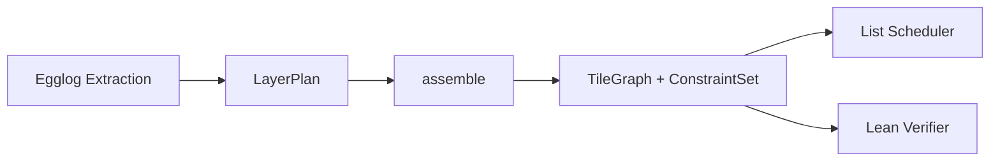
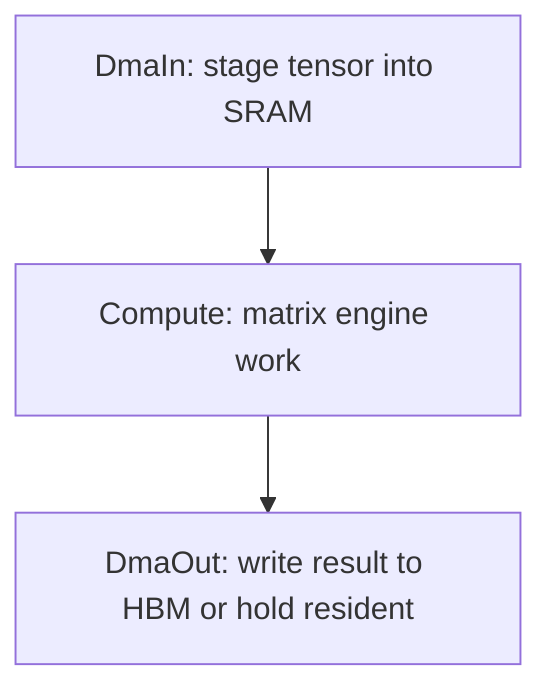
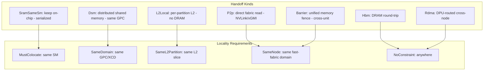
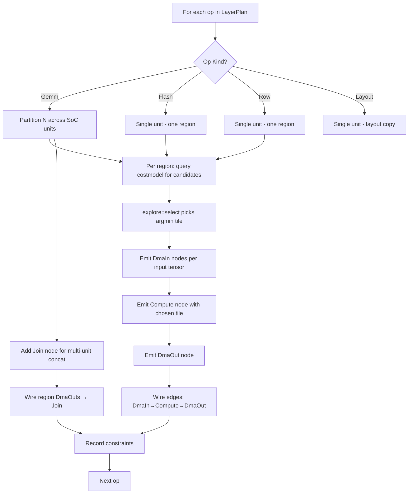

# 02 — Tile Dependency Graph

> The TileGraph is the **central IR** between the rewriting half (egglog) and the scheduling half (interval-conflict assignment). It captures exactly what the scheduler needs: tile-level tasks, data dependencies, and placement constraints.

---

## Role in the Pipeline



The TileGraph is the **handoff artifact** — everything upstream (fusion, extraction, tile selection) writes into it; everything downstream (scheduling, emission, verification) reads from it. This makes it the single source of truth for the scheduled computation.

---

## Structure

**Module:** [`crates/rewrite/src/tilegraph.rs`](../../crates/rewrite/src/tilegraph.rs)

```rust
pub struct TileGraph {
    pub nodes: Vec<TileNode>,
    pub edges: Vec<(usize, usize)>,  // (producer, consumer) DAG edges
}
```

A TileGraph is a DAG of **tile-level tasks** with data-dependency edges. Structurally simple; semantically rich through the accompanying ConstraintSet.

---

## Node Types



### TileNode::DmaIn

```rust
DmaIn { tensor: String, resident: bool }
```

- Stages an operand from HBM into SRAM for its consumer Compute node
- `resident: true` → the data is **already** in SRAM from a same-unit producer (no HBM read needed)
- Created one per unique (tensor, unit) pair; shared across all tiles that read it via **dma-dedup**

### TileNode::Compute

```rust
Compute {
    op: String,
    kind: Compute,        // Gemm(TileShape) | Flash(FlashTile) | Row(RowTile) | Join | Layout
    passes: u64,          // number of tile-steps this node streams over
    sram_pages: u64,      // SRAM page footprint (working set)
    inline_in: Vec<String>,   // boundary DMAs folded into kernel after collapse
    inline_out: bool,         // output is produced inline (no separate DmaOut)
}
```

- The actual matrix-engine work: one tile coordinate of one op
- `passes` = how many tile-steps the node iterates (determines duration)
- `sram_pages` = peak working set in page-pool slots (determines spatial demand)
- `inline_in`/`inline_out` populated by the collapse pass (post-assembly optimization)

### TileNode::DmaOut

```rust
DmaOut { tensor: String, resident: bool }
```

- Writes compute output back to HBM
- `resident: true` → data stays in SRAM for a same-unit consumer (no HBM write)
- When resident, this node effectively becomes a **no-op fence** (zero data movement)

---

## Compute Variants

```rust
pub enum Compute {
    Gemm(TileShape),
    Flash(FlashTile),
    Row(RowTile),
    Join,     // Concat of split GEMM partial outputs (layout/DMA only)
    Layout,   // Reshape/transpose/slice — no matrix engine, pure DMA
}
```

| Variant | Hardware Resource | Typical Duration |
|---------|------------------|-----------------|
| `Gemm` | MMA (WGMMA/MFMA) | ~100-5000 cycles per pass |
| `Flash` | MMA + shared memory | ~200-8000 cycles per pass |
| `Row` | Vector ALU | ~50-2000 cycles per pass |
| `Join` | DMA only | ~10-100 cycles |
| `Layout` | DMA only | ~10-100 cycles |

---

## Handoff System

The handoff system determines how data moves between a producer's DmaOut and a consumer's DmaIn.



### HandoffKind Selection

The `assemble()` function picks a **cost-driven default** handoff for each producer→consumer pair. This default is wrapped in a `RelaxableHandoff`:

```rust
pub struct RelaxableHandoff {
    pub producer: usize,
    pub consumer: usize,
    pub tensor: String,
    pub default: HandoffKind,      // preferred realization
    pub alts: Vec<(HandoffKind, u64)>, // alternatives with cost deltas
}
```

The scheduler's **relax pass** can demote a handoff (e.g. `SramSameSm` → `Hbm`) when SRAM capacity overflows. This is the central mechanism for balancing on-chip residency against parallelism.

---

## ConstraintSet

```rust
pub struct ConstraintSet {
    pub handoffs: Vec<Handoff>,
    pub relaxable: Vec<RelaxableHandoff>,
    pub locality: HashMap<(usize, usize), LocalityReq>,
    pub colocation_groups: Vec<Vec<usize>>,
    pub dedup_groups: Vec<Vec<usize>>,
    pub placement: HashMap<usize, UnitId>,
    pub concat_groups: Vec<ConcatGroup>,
    pub tile_deps: Vec<TileDep>,
    pub axis_couples: Vec<AxisCouple>,
}
```

| Constraint | Meaning | Scheduler Effect |
|-----------|---------|-----------------|
| `handoffs` | Which DmaOut → DmaIn pairs share data | Informs counter wiring |
| `relaxable` | Handoffs the scheduler may demote under pressure | SRAM/occupancy trade-off |
| `locality` | Placement proximity requirements | SM/GPC/unit pinning |
| `colocation_groups` | Nodes that must share one SM | Serial execution on one SM |
| `dedup_groups` | DmaIn nodes reading the same tensor | Single HBM read, shared staging |
| `placement` | Pre-decided unit assignment | Multi-unit partitioning |
| `concat_groups` | Join nodes collecting partial results | Ordering barrier |
| `tile_deps` | Fine-grained tile-to-tile data deps | Counter determination |
| `axis_couples` | Axes that must couple across ops | Shape compatibility |

---

## Assembly Algorithm

The [`assemble()`](../../crates/rewrite/src/tilegraph.rs:369) function:



### Key Steps:

1. **Partition (multi-unit only):** For GEMM, N-axis is divided across SoC units proportional to throughput. Each region gets its own tile shape (possibly different MMA configurations).

2. **Tile Selection:** `explore::select` uses egglog to pick the per-task cost-optimal tile from the candidates `costmodel` enumerated.

3. **Node Generation:** DmaIn/Compute/DmaOut triplet per tile. Input dedup merges DmaIn nodes reading the same tensor on the same unit.

4. **Edge Wiring:** Data-flow edges (DmaIn→Compute, Compute→DmaOut), plus cross-op edges when one op's output feeds another's input.

5. **Constraint Recording:**
   - Same-unit handoffs → colocation group + `SramSameSm` default
   - Cross-unit handoffs → `Barrier` or `P2p` based on memory model
   - Dedup groups for shared tensor reads
   - Placement map for pre-decided unit assignments

---

## Design Decisions

### Decision: TileGraph as Central IR (not an MLIR dialect)

**Chosen:** Custom Rust struct (`Vec<TileNode>` + `Vec<(usize, usize)>`).

**Alternatives:**
1. MLIR dialect with custom ops
2. Petgraph with typed edge/node indices
3. Keep separate IRs for rewriting and scheduling

**Rationale:**
- The graph is **flat** (no nesting) and **small** (hundreds to low thousands of nodes per bucket) — MLIR's infrastructure overhead (contexts, passes, dialects, C++ FFI) is pure cost with no benefit
- The constraint set is domain-specific and doesn't map to MLIR's type system
- Rust's pattern matching + enums give exhaustive handling of node/edge types
- The graph is constructed once and consumed twice (scheduler + verifier) — no need for mutation passes
- Petgraph was initially used but added indirection without benefit since edges are just `(usize, usize)` pairs

**Counter-claim: Interoperability.** MLIR would enable integration with upstream optimization passes (constant folding, dead-code elimination). Response: Plow's IR is post-fusion — those passes already happened in the egglog half. The tile graph only needs to express "what tile runs where" — not general IR transformations.

**Counter-claim: Visualization tooling.** MLIR has built-in graph dumpers. Response: Plow has a Chrome-trace exporter (`schedule::trace`) which provides richer temporal information than a static graph dump.

### Decision: Single-Unit = Same Path (not a special case)

**Chosen:** A single-GPU `Soc` with one unit produces the same graph structure as multi-unit — just with one region per op.

**Rationale:** Eliminates branch divergence between the common case (1 GPU) and the rare case (multi-GPU). The partition algorithm naturally handles `n_units=1` by putting everything in one region.

### Decision: Relaxable Handoffs (not hard SRAM commitment)

**Chosen:** Handoffs carry a default + alternatives with cost deltas.

**Alternative:** Commit to SramSameSm during assembly; fail if SRAM overflows.

**Rationale:** SRAM capacity is a shared resource across all tiles scheduled on an SM. The assembly phase doesn't know the temporal overlap — only the scheduler does. Relaxable handoffs let the scheduler trade latency (SRAM residency) for throughput (parallelism) under pressure.

**Counter-claim:** The relax pass adds complexity and non-determinism. Response: The relax pass is deterministic (sorted by cost delta, greedy demotion until fit). The complexity is inherent — SRAM is over-committed by design (optimistic default), and the scheduler is the right place to resolve it.

### Decision: Axis Coupling for Shape Compatibility

**Chosen:** `AxisCouple` records that two ops' M-dimensions must use compatible tile shapes.

**Rationale:** When RMSNorm feeds directly into GEMM (fused norm-gemm), both must tile M identically or the handoff buffer dimensions won't match. The coupling constraint prevents the cost model from independently choosing incompatible tile shapes.

---

## Relationship to Downstream

The TileGraph is consumed by:

1. **[`schedule::expand`](../../crates/schedule/src/expand.rs)** — converts TileNode→Task (with concrete durations, resource class, SRAM demand)
2. **[`schedule::relax`](../../crates/schedule/src/relax.rs)** — may modify the graph by demoting handoffs
3. **[`schedule::verify`](../../crates/schedule/src/verify.rs)** — checks counter protocol covers all TileGraph edges
4. **Lean verifier** — uses tile_deps for partition and protocol proofs
