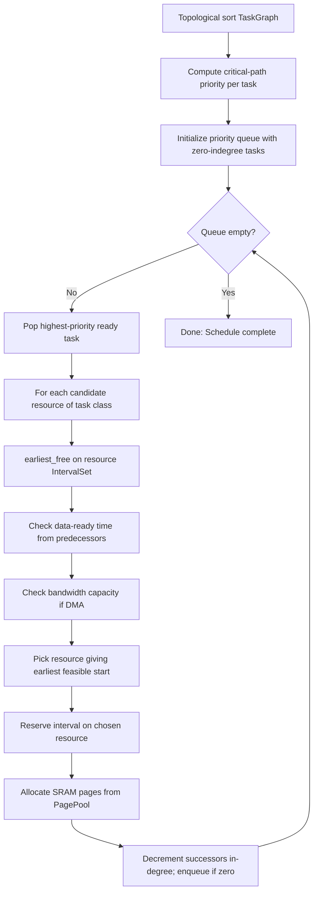
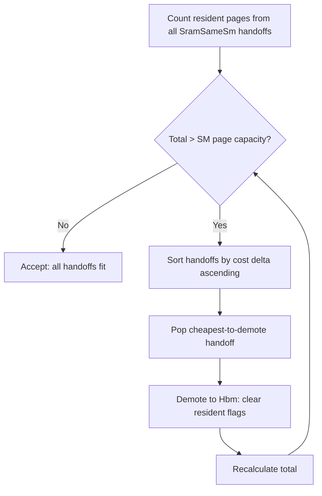

# 03 — Scheduler

> The scheduler maps the TileGraph's abstract tasks onto concrete hardware resources over time, using interval-conflict analysis analogous to Rust's borrow checker.

---

## Position in the Pipeline


**Module:** [`crates/schedule/`](../../crates/schedule/src/lib.rs)

The scheduler is the second half of the compiler. It transforms the hardware-agnostic TileGraph into a fully placed, ordered, and counter-wired execution plan.

---

## Core Algorithm: Interval-Conflict List Scheduling

### The Fundamental Insight

Scheduling a tile onto a resource is structurally identical to **register allocation** (or Rust's borrow checker):

| Concept | Register Allocator | Plow Scheduler | Rust Borrow Checker |
|---------|-------------------|----------------|---------------------|
| Resource | Register | SM / DMA engine | Memory location |
| Reservation | Live range | `[start, start+dur)` | Borrow lifetime |
| Conflict | Two lives in same reg | Two tasks on same SM overlap | Two `&mut` borrows overlap |
| Resolution | Spill to stack | Delay to next free slot | Compiler error |
| Capacity | Fixed reg count | Fixed SM count | N/A (one location) |

### Algorithm Sketch



---

## Resource Model

**Module:** [`crates/schedule/src/resource.rs`](../../crates/schedule/src/resource.rs)

### Resource Types

```rust
pub enum ResourceId {
    Sm(usize, usize),    // (unit, sm_index)
    Dma(usize, usize),   // (unit, engine_index)
    Dpu(usize),          // DPU engine for RDMA
    Host(usize),         // CPU thread (host coordination)
}
```

### ResourceState

```rust
pub struct ResourceState {
    sm: Vec<IntervalSet>,       // one per SM — exclusive
    dma: Vec<IntervalSet>,      // one per DMA engine — exclusive
    dpu: Vec<IntervalSet>,      // one per DPU engine — exclusive
    host: Vec<IntervalSet>,     // one per CPU thread — exclusive
    hbm: BandwidthSet,          // HBM bandwidth — capacity
    link: Vec<BandwidthSet>,    // per-link interconnect — capacity
    sram: Vec<PagePool>,        // one per SM — paged allocation
}
```

### The Two Primitives

**Module:** [`crates/schedule/src/interval.rs`](../../crates/schedule/src/interval.rs)

#### IntervalSet (Exclusive — the `&mut` rule)

```rust
pub struct IntervalSet {
    res: Vec<(Cycle, Cycle)>,  // sorted, non-overlapping [start, end)
}
```

- **`overlaps(start, end)`** — does any reservation conflict?
- **`earliest_free(after, dur)`** — first gap ≥ dur after cycle `after`
- **`reserve(start, dur)`** — claim `[start, start+dur)`

This is the borrow checker's core: no two exclusive holds may overlap. An SM is a "place"; a task's execution is a "borrow".

#### BandwidthSet (Capacity — fractional permissions)

```rust
pub struct BandwidthSet {
    res: Vec<(Cycle, Cycle, f64)>,  // [start, end), weight
}
```

- **`peak(start, end)`** — maximum concurrent utilization in window
- **`capacity_ok(start, end, w, limit)`** — would adding `w` exceed `limit`?
- **`reserve(start, end, w)`** — add a weighted hold

This models HBM bandwidth and interconnect links: multiple concurrent users are fine as long as their sum doesn't exceed capacity.

---

## SRAM Page Pool

**Module:** [`crates/schedule/src/resource.rs`](../../crates/schedule/src/resource.rs:26)

```rust
pub struct PagePool {
    pages: u64,
    occupied: Vec<(Cycle, Cycle, Vec<usize>)>,
}
```

SRAM is managed as a **linear-scan page allocator**:

1. Each SM has a fixed number of pages (computed from hardware SRAM size ÷ page_bytes)
2. A tile's `sram_pages` demand must fit **simultaneously** with all other tiles live on that SM at that moment
3. `allocate(start, end, need)` finds free page slots over the task's live interval
4. If allocation fails → **spill** (the tile runs without on-chip staging)

### Working Set vs Output Pages

```rust
pub fn allocate_with_working_set(
    &mut self, start: Cycle, end: Cycle,
    working: u64, working_end: Cycle,
    output: u64, output_end: Cycle,
) -> Option<Vec<usize>>
```

A tile has two page demands:
- **Working set** (A/B staging): live only during compute — `[start, working_end)`
- **Output pages** (C accumulator): live until last consumer reads — `[start, output_end)`

This distinction enables temporal sharing: a working-set page freed at cycle 100 can be reused by another tile starting at cycle 100.

---

## Scheduler Passes

**Module:** [`crates/schedule/src/passes.rs`](../../crates/schedule/src/passes.rs)

### Pass A+C: Placement + Ordering (Fused)

Placement and ordering are done together in the list scheduler:

1. **Priority:** Critical-path length (longest remaining path to sink) → higher priority tasks scheduled first
2. **Tie-breaking:** Out-degree (mobility) → shorter duration → lower task ID
3. **Placement:** For each ready task, try all resources of its class; pick the one giving the earliest feasible start

### Pass B: Liveness

Falls out naturally from start times + durations. A tile's "live range" is `[start, start + dur)` on its assigned resource.

### Pass D: Counter Clustering

Groups dependency edges into counters. See [05-counter-system.md](05-counter-system.md).

### Pass E: Counter Scoping

Assigns `Scope::IntraSm | IntraGpu | CrossUnit` based on placement. Same-SM → IntraSm (cheapest); same-GPU/different-SM → IntraGpu; different-GPU → CrossUnit.

### Pass F: Prefetch

Emergent from the dependency-respecting schedule: DMA-in tasks are naturally scheduled before their consumer Compute tasks. The prefetch pass explicitly hoists them to overlap with prior compute.

### Pass G: Packet Lowering

Each placed, ordered task → one `Packet` struct with its counter wait/signal lists. Grouped by resource into streams.

---

## Relax Pass

**Module:** [`crates/schedule/src/relax.rs`](../../crates/schedule/src/relax.rs)

### Problem

Assembly optimistically assigns `SramSameSm` handoffs for same-unit producer→consumer pairs. But SRAM is finite — if too many tiles' outputs are resident simultaneously, the page pool overflows.

### Solution



1. Computes resident-page sum from all `SramSameSm` handoffs
2. If over capacity: sort by `alt_cost - default_cost` (cheapest demotion first)
3. Greedily demote handoffs to `Hbm` until the budget fits
4. Returns modified `(TileGraph, ConstraintSet)` with cleared `resident` flags

### Design Decision: Greedy Demotion Order

**Chosen:** Sort by cost delta; demote cheapest-to-lose first.

**Alternative:** ILP/branch-and-bound for globally optimal selection.

**Rationale:** The relaxation is a fallback for when the optimistic assembly over-committed SRAM. At the scale of typical layers (10-50 handoffs), greedy gives near-optimal results with O(n log n) complexity. ILP would dominate compile time for negligible improvement.

---

## Expand: TileGraph → TaskGraph

**Module:** [`crates/schedule/src/expand.rs`](../../crates/schedule/src/expand.rs)

The expand phase converts abstract TileNodes into concrete `Task`s with:

```rust
pub struct Task {
    pub node: usize,          // index into TileGraph.nodes
    pub op: String,           // operation name
    pub kind: TaskKind,       // Compute | TmaIn | TmaOut | Rdma | HostCoord
    pub dur: Cycle,           // execution duration (from cost model)
    pub sram_pages: u64,      // working-set page demand
    pub out_pages: u64,       // output page demand (live until consumer)
    pub unit: usize,          // which SoC unit this belongs to
}
```

Key expansion rules:
- `TileNode::DmaIn` → `Task { kind: TmaIn, dur: dma_cycles(...) }`
- `TileNode::Compute` → `Task { kind: Compute, dur: passes * per_pass_cycles }`
- `TileNode::DmaOut` → `Task { kind: TmaOut, dur: dma_cycles(...) }`
- Resident DmaIn/DmaOut → `Task { dur: 0 }` (zero-cost fence)

---

## Wave-Class Segmentation

Occupancy (waves per SIMD, hence the per-wave register budget) is a **launch-time** property of a
kernel — it cannot change on-device. But different ops have different optimal occupancy: on CDNA4,
flash prefill at `FA_DC=256` wants a 4-wave workgroup (512 registers, no QK^T recompute) while GEMM
and the latency-bound norms want 8 waves. Since one persistent launch has one occupancy, the compiler
**partitions the op stream into wave-class segments** that the runtime dispatches separately (see
[06 — Runtime](06-runtime.md#segmented-dispatch-per-wave-class-execution)).

This is a dataflow-derived decision, the same shape as counter-granularity's `collapse` (see
[08 — Formal Verification](08-formal-verification.md)):

```
wave_class(op) = 4  if op is FlashPrefill      // wants FA_DC=256, 1 wave/SIMD
                 8  otherwise                   // GEMM/norm/GLU: 2 waves/SIMD latency hiding

// A SEGMENT is a maximal contiguous run of same-class ops in TOPOLOGICAL emit order.
seg_of[0] = 0
for i in 1..n:
    seg_of[i] = seg_of[i-1] + (wave_class(op[i]) != wave_class(op[i-1]))
```

`seg_of[op]` is written into each stream entry's `seg` field during lowering
([`devbuild.rs::finish`](../../crates/packet/src/devbuild.rs)). The boundaries fall out of the graph —
they land at op/layer edges only because that is where flash sits; nothing is hardcoded per layer. A
program with no class-4 op (e.g. decode) is a single segment and dispatches identically to the
unsegmented path.

### Soundness (the segmentation theorem)

Because segments partition the **topologically-ordered** stream, the no-deadlock invariant is
preserved: for any edge A→B every slice of A precedes every slice of B, so a cross-segment edge always
points from a lower segment to a higher one. The runtime runs segments in order with a barrier between
them, so a consumer's producers are always retired before its segment launches.

The **cost** side mirrors `collapse`'s contrapositive: a boundary *pays* only where a wave-class
change lets an op run at a strictly better occupancy by more than the boundary's drain cost. Where
neighbors share a class, no boundary is emitted (the run is maximal). The formal statement — validity
(topological partition + dependency-preserving hand-off) and pays-iff-class-differs — is stated in
[the design notes](../../the design notes) for mechanization alongside
`collapse` in `CounterGranularity.lean`.

### Relation to MPK (arXiv 2512.22219)

MPK mega-kernelizes a tensor program into one persistent, counter-gated launch with **one** occupancy,
absorbing op heterogeneity through tile-granular dynamic scheduling. plow's interpreter is the same
architecture. Segmentation is the one deliberate divergence: plow's measured `FA_DC=256` register win
is large enough (−38% on flash) to justify a *second* launch config, which a single-occupancy megakernel
cannot express. MPK's other lever — dynamic (work-stealing) task assignment to smooth intra-class load
imbalance — is orthogonal and not yet adopted (plow's per-CU assignment is static; see the load-imbalance
notes in the cost-model doc).

---

## Machine Model

**Module:** [`crates/schedule/src/machine.rs`](../../crates/schedule/src/machine.rs)

```rust
pub struct Machine {
    pub units: Vec<UnitHw>,
    pub links: Vec<LinkClass>,
}

pub struct UnitHw {
    pub sm_count: usize,
    pub dma_engines: usize,
    pub pages_per_sm: u64,
    pub tmem_cols: usize,          // Blackwell only
    pub locality_domains: usize,   // GPC count / XCD count
    pub locality_domain_sms: Vec<Vec<usize>>,
}
```

Built from `costmodel::Soc` + `Config`. Maps hardware topology to scheduling resources.

---

## Design Decisions

### Decision: List Scheduling (not ILP, not simulated annealing)

**Chosen:** Greedy priority-based list scheduling with critical-path heuristic.

**Alternatives:**
1. Integer Linear Programming (ILP)
2. Simulated annealing / genetic algorithms
3. Constraint programming (CP-SAT)

**Rationale:**
- List scheduling is O(V log V + E) — compiles in milliseconds even for thousands of tasks
- Critical-path priority gives provably optimal results for tree-shaped DAGs and near-optimal for general DAGs
- ILP doesn't scale past ~100 variables for real-time compilation; typical Plow graphs have 500-5000 tasks
- The quality gap is small: for transformer workloads (high parallelism, regular structure), list scheduling typically achieves >95% of ILP optimal

**Counter-claim:** FlashInfer/vLLM use dynamic scheduling and achieve good utilization. Response: They pay per-dispatch CPU overhead (~2-5μs per kernel launch). For latency-sensitive decode where individual GEMM tiles take ~10μs, dispatch overhead is 20-50% of useful work. Static scheduling amortizes this to zero.

**Counter-claim:** The schedule is brittle to runtime jitter. Response: The schedule is **conservative** — it accounts for worst-case durations from the cost model. Actual execution may finish early; the counter system allows consumers to proceed immediately (they poll, not block on a deadline).

### Decision: Fused Placement + Ordering

**Chosen:** Place and order in one pass (task gets assigned to the resource giving earliest feasible start).

**Alternative:** Two-phase: first assign all tasks to resources, then order within each.

**Rationale:** The feasibility of a placement depends on what's already ordered on that resource — they're inherently coupled. Separating them leads to suboptimal placements that can't be fixed in the ordering phase without costly re-placement.

### Decision: Sorted Vec, not Augmented BST

**Chosen:** `IntervalSet` backed by sorted `Vec<(Cycle, Cycle)>`.

**Alternative:** Red-black tree or augmented interval tree (O(log n) operations).

**Rationale:** Per-resource reservation counts are modest (~10-200 per SM in practice). The sorted-vec's O(n) insertion with cache-friendly linear scan outperforms tree structures for n < 500. The API (`overlaps`, `earliest_free`, `reserve`) is deliberately isomorphic to an interval tree — swap is trivial if profiling demands.

### Decision: Page Pool (not continuous SRAM allocation)

**Chosen:** SRAM divided into fixed-size pages; tiles request N pages.

**Alternative:** Byte-granular allocation (like malloc).

**Rationale:**
- Eliminates fragmentation: any free page can satisfy any request
- Simple occupancy tracking: just count live pages in each cycle window
- Matches hardware reality: TMA operates on aligned 128B/256B blocks
- The page size (`page_bytes` in config, typically 4KB-16KB) is tuned per-architecture

---

## Spill Handling

When a tile's page demand exceeds available pages:

1. The tile is marked as **spilled** in `Schedule::sram_slots` (absent from the map)
2. Its DmaIn reads bypass SRAM (direct HBM streaming, higher latency)
3. `SpillReport` collects all spill events for diagnostic output
4. The compiler emits a warning; users can adjust tile shapes or SRAM budget

Spills are a **correctness-preserving degradation**: the schedule remains valid, just slower. This contrasts with register allocation where spills require code changes (store/reload insertion).

---

## Simulation

**Module:** [`crates/schedule/src/sim.rs`](../../crates/schedule/src/sim.rs)

The `simulate()` function replays the schedule with counter semantics:

```rust
pub struct SimResult {
    pub makespan: Cycle,
    pub utilization: f64,
    pub bottleneck: ResourceId,
}
```

This is used for:
- Validating that counter gates don't deadlock
- Measuring predicted utilization and identifying bottlenecks
- Comparing schedule quality across configurations
