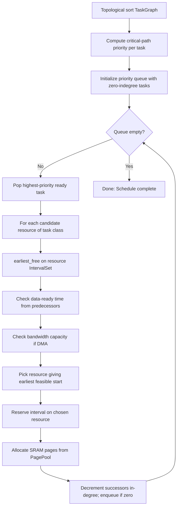
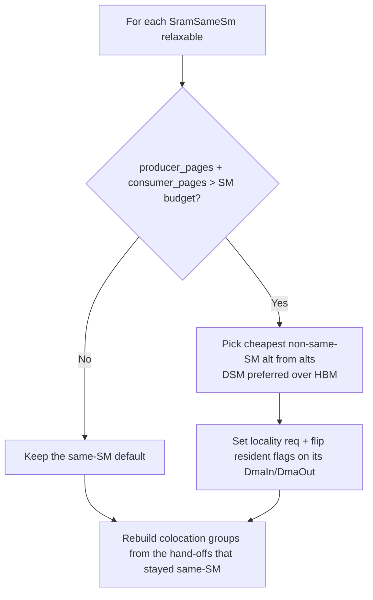

# 03 — Scheduler

> The scheduler maps the TileGraph's abstract tasks onto concrete hardware resources over time, using interval-conflict analysis analogous to Rust's borrow checker.

---

## Position in the Pipeline


**Module:** [`crates/schedule/`](../../crates/schedule/src/lib.rs)

The scheduler is the second half of the compiler. It transforms the hardware-agnostic TileGraph into a fully placed, ordered, and counter-wired execution plan.

---

## Core Algorithm: Interval-Conflict List Scheduling

### The Fundamental Insight

Scheduling a tile onto a resource is structurally identical to **register allocation** (or Rust's borrow checker):

| Concept | Register Allocator | Plow Scheduler | Rust Borrow Checker |
|---------|-------------------|----------------|---------------------|
| Resource | Register | SM / DMA engine | Memory location |
| Reservation | Live range | `[start, start+dur)` | Borrow lifetime |
| Conflict | Two lives in same reg | Two tasks on same SM overlap | Two `&mut` borrows overlap |
| Resolution | Spill to stack | Delay to next free slot | Compiler error |
| Capacity | Fixed reg count | Fixed SM count | N/A (one location) |

### Algorithm Sketch



---

## Resource Model

**Module:** [`crates/schedule/src/resource.rs`](../../crates/schedule/src/resource.rs)

### Resource Types

```rust
pub enum ResourceId {
    Sm(UnitId, SmId),    // (unit, sm index)
    Dma(UnitId, usize),  // (unit, engine index)
    Dpu(usize),          // node-level DPU engine (cross-unit RDMA / collectives)
    Host(usize),         // node-level CPU thread (host coordination)
}
```

`UnitId` and `SmId` are `usize` aliases. SMs and DMA engines are per-unit; DPU
engines and host threads are node-level (shared across all units).

### ResourceState

```rust
pub struct ResourceState {
    sm: Vec<Vec<IntervalSet>>,  // [unit][sm]     exclusive (whole SM)
    dma: Vec<Vec<IntervalSet>>, // [unit][engine] exclusive
    dpu: Vec<IntervalSet>,      // node-level RDMA / collective engines
    host: Vec<IntervalSet>,     // node-level CPU thread pool
    hbm: Vec<BandwidthSet>,     // [unit]         capacity
    link: BandwidthSet,         // aggregate interconnect capacity
}
```

`ResourceState` holds only the exclusive and capacity timelines. Per-page SRAM
allocation is **not** a field here — it runs as a separate post-placement pass
(`allocate_sram`, below), building one `PagePool` per SM on demand.

### The Two Primitives

**Module:** [`crates/schedule/src/interval.rs`](../../crates/schedule/src/interval.rs)

#### IntervalSet (Exclusive — the `&mut` rule)

```rust
pub struct IntervalSet {
    res: Vec<(Cycle, Cycle)>,  // sorted, non-overlapping [start, end)
}
```

- **`overlaps(start, end)`** — does any reservation conflict?
- **`earliest_free(after, dur)`** — first gap ≥ dur after cycle `after` (a
  single forward pass over the sorted reservations, entered via a
  `partition_point` binary search past everything already behind the window)
- **`reserve(start, dur)`** — claim `[start, start+dur)`

This is the borrow checker's core: no two exclusive holds may overlap. An SM is a "place"; a task's execution is a "borrow".

#### BandwidthSet (Capacity — fractional permissions)

`BandwidthSet` stores a **stepwise aggregate-load profile**, not a list of
reservations: `levels[i] = (t, load)` means the summed load is `load` on
`[t, levels[i+1].0)`. The tail level is always 0 (every reservation ends), and
the profile is anchored at `(0, 0.0)`.

```rust
pub struct BandwidthSet {
    levels: Vec<(Cycle, f64)>,  // (breakpoint, summed load on [t, next))
}
```

- **`peak(start, end)`** — maximum concurrent utilization in window (binary
  search + a walk over only the pieces inside the window)
- **`capacity_ok(start, end, w, limit)`** — would adding `w` exceed `limit`?
- **`next_feasible(after, dur, w, limit)`** — earliest `t ≥ after` where adding
  `w` over `[t, t+dur)` stays under `limit`; lets the scheduler jump straight to
  a feasible window instead of probing
- **`reserve(start, end, w)`** — add a weighted hold (splits the profile at the
  window's breakpoints and raises the load between them)

This models HBM bandwidth and the interconnect: multiple concurrent users are fine as long as their summed load stays under capacity. The profile answers `peak` and `next_feasible` without rescanning every prior reservation.

---

## SRAM Page Pool

**Module:** [`crates/schedule/src/resource.rs`](../../crates/schedule/src/resource.rs) (`PagePool`)

Each page slot has its own exclusive timeline — the pool is a `Vec` of
`IntervalSet`, one per page:

```rust
pub struct PagePool {
    slots: Vec<IntervalSet>,
}
```

SRAM is managed as a **linear-scan page allocator** (register-allocation shaped):

1. Each SM has a fixed number of pages (computed from hardware SRAM size ÷ page_bytes)
2. A tile's `sram_pages` demand must fit **simultaneously** with all other tiles live on that SM at that moment
3. `allocate(start, end, need)` picks `need` specific slots each free over
   `[start, end)`, reserving them
4. If fewer than `need` slots are free → **spill** (returns `None`; the tile runs without on-chip staging)

### Working Set vs Output Pages

```rust
pub fn allocate_with_working_set(
    &mut self, start: Cycle,
    end_compute: Cycle, working_pages: u64,
    end_live: Cycle, out_pages: u64,
) -> Option<Vec<usize>>
```

A tile has two page demands, allocated from distinct slots and committed
atomically (returns the **output** slot ids):
- **Working set** (A/B staging): transient, live only during compute — `[start, end_compute)`
- **Output pages** (C accumulator): live until last consumer reads — `[start, end_live)`

This distinction enables temporal sharing: a working-set page freed at `end_compute` can be reused by another tile starting at that cycle. It also guarantees that during the compute window there is room for *both* groups at once, preventing the bug where A/B staging overflows behind still-live output pages.

---

## Scheduler Passes

**Module:** [`crates/schedule/src/passes.rs`](../../crates/schedule/src/passes.rs)

Passes A and C are fused inside `list_schedule`; D and E run before it
(`build_counters`); B, F, and G run after. Prefetch (`prefetch.rs`) and scope
narrowing (`scope_narrow.rs`) are separate post-schedule modules.

### Pass A+C: Placement + Ordering (Fused)

Placement and ordering are done together in the list scheduler (`list_schedule`):

1. **Priority:** Critical-path length (longest remaining path to sink) → higher priority tasks scheduled first
2. **Tie-breaking:** Out-degree (mobility) → shorter duration → lower task ID (encoded in `Prioritized`'s `Ord`)
3. **Placement:** For each ready task, try all resources of its class (`choose_resource`); pick the one giving the earliest feasible start (`feasible_start` alternates the exclusive gap and the HBM/link capacity profile until both agree). A soft locality hint (`LOCALITY_SLACK`) prefers a predecessor's XCD/GPC when the start cost is within slack.

### Pass B: On-Chip Memory Allocation

Runs after placement (`allocate_sram`, `allocate_tmem`). A tile's live range is
`[start, start + dur)`; its output pages live until the last consumer *ends*.
Two per-SM allocators run:
- **SRAM pages** — `allocate_sram` groups compute tiles per SM and packs page slots over each tile's live interval (`allocate_with_working_set`). A tile that doesn't fit is a spill.
- **TMEM columns** — `allocate_tmem` assigns each matmul tile its MMA-accumulator columns in the SM's Tensor Memory (Blackwell `tcgen05`; no-op where TMEM is absent). A column holds 128 f32; overflow is a `tmem_spill`.

### Pass D: Counter Clustering

Groups dependency edges into counters (`build_counters`). `ClusterMode::Coarse`
emits one counter per `(producer_node, consumer_node)` boundary;
`ClusterMode::Fine` emits one per consumer tile, falling back to coarse for
all-to-all boundaries. See [05-counter-system.md](05-counter-system.md).

### Pass E: Counter Scoping

Assigned during clustering by `scope_of`: different unit → `CrossUnit`;
same-node *and colocated* (pinned to one SM) → `IntraSm`; otherwise `IntraGpu`.
A separate post-schedule pass (`scope_narrow::narrow_scopes`) then downgrades any
`IntraGpu` counter whose producers and consumers all landed on the same SM to
`IntraSm`, since actual placement is only known after scheduling.

### Pass F: Prefetch

**Module:** [`crates/schedule/src/prefetch.rs`](../../crates/schedule/src/prefetch.rs)

The dependency-respecting schedule already issues a DMA-in before its consumer,
but `list_schedule`'s per-resource FIFO order can pin it behind unrelated tasks.
`hoist_prefetches` reorders each stream so every `DmaIn` sits right after its
last stream-local predecessor (position 0 if it has none), then recomputes
starts — widening compute/DMA overlap while keeping the counter waits (and the
happens-before proof) intact.

### Pass G: Packet Lowering

Each placed, ordered task → one `Packet` (`build_packets`) with its counter
wait/successor lists, grouped by resource into streams. `emit.rs` lowers these
further to the runtime `packet::Program` ABI.

---

## Relax Pass

**Module:** [`crates/schedule/src/relax.rs`](../../crates/schedule/src/relax.rs)

### Problem

Assembly optimistically assigns `SramSameSm` hand-offs for same-unit producer→consumer pairs. But SRAM is finite — if a colocated producer's resident output plus its consumer's working set exceed one SM's page budget, they can't both live on that SM.

### Solution



The pass is **per-hand-off**, not a global budget loop:

1. For each `RelaxableHandoff` whose default is `SramSameSm`, compare the pair's
   summed `sram_pages` against `pages_per_sm` for the producer's unit.
2. If it fits, keep the default. If not, demote to the cheapest alternative in
   `alts` that isn't `SramSameSm` (`min_by_key` on cost) — `Dsm`
   (`SameDomain`, still resident) or `L2Local` (`SameL2Partition`, resident),
   else `Hbm` (a round-trip).
3. Update the pair's `LocalityReq` and flip the `resident` flags on the
   corresponding `DmaIn`/`DmaOut` nodes.
4. Rebuild `colocation_groups` (union-find) from the hand-offs that stayed
   `SramSameSm`. Returns the modified `(TileGraph, ConstraintSet)`.

### Design Decision: Cheapest Feasible Alternative

**Chosen:** For each over-budget hand-off, demote to its cheapest realizable non-same-SM alternative independently.

**Alternative:** A global selection (ILP / branch-and-bound) over all hand-offs jointly.

**Rationale:** The relaxation is a fallback for when the optimistic assembly over-committed one SM. Deciding each hand-off against its own pair budget is O(n) and near-optimal at the scale of typical layers; a global optimum would dominate compile time for negligible improvement.

---

## Expand: TileGraph → TaskGraph

**Module:** [`crates/schedule/src/expand.rs`](../../crates/schedule/src/expand.rs)

The expand phase converts abstract TileNodes into concrete `Task`s:

```rust
pub enum TaskKind { DmaIn, Compute, DmaOut, Host }

pub struct Task {
    pub node: usize,          // index into TileGraph.nodes
    pub op: String,           // operation name
    pub unit: UnitId,         // which SoC unit this belongs to
    pub kind: TaskKind,
    pub coord: Vec<i64>,      // this tile's grid coordinate
    pub dur: Cycle,           // execution duration (from cost model)
    pub bytes: u64,           // per-tile transfer bytes (folded loads/stores for Compute)
    pub tensor_bytes: u64,    // whole-tensor size (for the memory planner)
    pub sram_pages: u64,      // working-set page demand (transient)
    pub out_pages: u64,       // output page demand (live until last consumer)
    pub tmem_cols: u64,       // MMA-accumulator columns (Blackwell tcgen05; 0 otherwise)
    pub tensor: Option<String>,
    pub cross_unit: bool,     // routed to a DPU over the interconnect
}
```

There are four task kinds — `DmaIn`, `Compute`, `DmaOut`, `Host`. (There is no
separate `Rdma` kind: a cross-unit transfer is a `DmaIn`/`DmaOut` with
`cross_unit = true`, which `choose_resource` routes to a DPU. `PacketKind`,
the lowered form, does distinguish `Rdma`/`HostCoord`/`TmaIn`/`TmaOut`.)

Key expansion rules:
- `TileNode::DmaIn` → `Task { kind: DmaIn, dur: hbm_cycles(...) }` (or folded into the compute's `bytes` under `DmaModel::Collapsed` / an `inline_in` input — no separate task)
- `TileNode::Compute` → `Task { kind: Compute, dur }` from the cost model, scaled by tile count under `PerOp`/`PerChunk` granularity
- `TileNode::DmaOut` → `Task { kind: DmaOut, dur: hbm_cycles(...) }` (or folded into the epilogue under Collapsed / `inline_out`)
- Resident (SRAM-hand-off) inputs/outputs emit no DMA task at all — ordering comes from a cross-op edge

Granularity (`Granularity::PerTile | PerOp | PerChunk(k)`) controls whether each
op expands to one task per tile, one task for the whole op, or one task per
row-axis chunk. `expand_prefill_chunks` wraps the `PerChunk(k)` path for the
double-buffered prefill kernel (see [13-prefill-chunking.md](13-prefill-chunking.md)).

---

## Wave-Class Segmentation

Occupancy (waves per SIMD, hence the per-wave register budget) is a **launch-time** property of a
kernel — it cannot change on-device. But different ops have different optimal occupancy: on CDNA4,
flash prefill at `FA_DC=256` wants a 4-wave workgroup (512 registers, no QK^T recompute) while GEMM
and the latency-bound norms want 8 waves. Since one persistent launch has one occupancy, the compiler
**partitions the op stream into wave-class segments** that the runtime dispatches separately (see
[06 — Runtime](06-runtime.md#segmented-dispatch-per-wave-class-execution)).

This is a dataflow-derived decision, the same shape as counter-granularity's `collapse` (see
[08 — Formal Verification](08-formal-verification.md)):

```
wave_class(op) = 4  if op is FlashPrefill      // wants FA_DC=256, 1 wave/SIMD
                 8  otherwise                   // GEMM/norm/GLU: 2 waves/SIMD latency hiding

// A SEGMENT is a maximal contiguous run of same-class ops in TOPOLOGICAL emit order.
seg_of[0] = 0
for i in 1..n:
    seg_of[i] = seg_of[i-1] + (wave_class(op[i]) != wave_class(op[i-1]))
```

`seg_of[op]` is written into each stream entry's `seg` field during lowering
([`devbuild.rs::finish`](../../crates/packet/src/devbuild.rs)). The boundaries fall out of the graph —
they land at op/layer edges only because that is where flash sits; nothing is hardcoded per layer. A
program with no class-4 op (e.g. decode) is a single segment and dispatches identically to the
unsegmented path.

**Deviation from implementation:** the two-way `wave_class` above is the design
skeleton; the `wave_class` closure in `devbuild.rs::finish` carries more classes,
gated by emit flags. A single-segment override (`uniseg`) forces class 8; the
`FA512` modes give hd-256/512 FlashPrefill its own class 2; `FlashMlaPrefill`
under `mla_v2` is class 4. The `seg_of` run-length recurrence and the soundness
argument below are unchanged by the extra classes.

When `PLOW_L2_PLACE` is set, the same `seg` field is repurposed to carry the
per-slice **L2 domain** instead of the wave class, and `gq_seg_ofs` windows the
global-queue stream by domain rather than by wave class — the wave-class meaning
is byte-identical when L2 placement is off.

### Soundness (the segmentation theorem)

Because segments partition the **topologically-ordered** stream, the no-deadlock invariant is
preserved: for any edge A→B every slice of A precedes every slice of B, so a cross-segment edge always
points from a lower segment to a higher one. The runtime runs segments in order with a barrier between
them, so a consumer's producers are always retired before its segment launches.

The **cost** side mirrors `collapse`'s contrapositive: a boundary *pays* only where a wave-class
change lets an op run at a strictly better occupancy by more than the boundary's drain cost. Where
neighbors share a class, no boundary is emitted (the run is maximal). The formal statement — validity
(topological partition + dependency-preserving hand-off) and pays-iff-class-differs — is stated in
the design notes for mechanization alongside
`collapse` in `CounterGranularity.lean`.

### Relation to MPK (arXiv 2512.22219)

MPK mega-kernelizes a tensor program into one persistent, counter-gated launch with **one** occupancy,
absorbing op heterogeneity through tile-granular dynamic scheduling. plow's interpreter is the same
architecture. Segmentation is the one deliberate divergence: plow's measured `FA_DC=256` register win
is large enough (−38% on flash) to justify a *second* launch config, which a single-occupancy megakernel
cannot express. MPK's other lever — dynamic (work-stealing) task assignment to smooth intra-class load
imbalance — is orthogonal and not yet adopted (plow's per-CU assignment is static; see the load-imbalance
notes in the cost-model doc).

---

## Machine Model

**Module:** [`crates/schedule/src/machine.rs`](../../crates/schedule/src/machine.rs)

```rust
pub struct Machine {
    pub units: Vec<UnitHw>,
    pub dpu_engines: usize,
    pub host_threads: usize,
    pub unified_memory: bool,
    pub has_fast_interconnect: bool,       // NVLink / Infinity Fabric present
    pub link_bytes_per_cycle: f64,         // interconnect capacity
}

pub struct UnitHw {
    pub id: UnitId,
    pub sm_count: usize,
    pub pages_per_sm: u64,
    pub tmem_cols_per_sm: u64,             // Blackwell tcgen05 (0 elsewhere)
    pub dsm_domains: usize,                // GPC / distributed-shared-memory grouping
    pub sms_per_domain: usize,
    pub chiplet_count: usize,              // L2-domain / XCD grouping
    pub sms_per_chiplet: usize,
    pub l2_partitions: usize,              // L2-slice grouping
    pub sms_per_l2_partition: usize,
    pub dma_engines: usize,
    pub hbm_bytes_per_cycle: f64,          // HBM capacity limit
}
```

Built from `costmodel::Soc` + `Config` (`Machine::from_soc`). Locality is
tracked at three grain levels — DSM/GPC domains, chiplets/XCDs, and L2 partitions
— which `locality_domain_of` / `locality_domain_sms` collapse into the unified
"locality domain" the list scheduler uses for soft affinity (chiplet on MI300,
GPC on H100/Blackwell, trivial on monolithic non-DSM dies). The interconnect is a
single `LinkClass` per unit pair (`Unified` / `Fast` / `Slow`), computed by
`Machine::link` rather than stored as a `Vec`.

---

## Design Decisions

### Decision: List Scheduling (not ILP, not simulated annealing)

**Chosen:** Greedy priority-based list scheduling with critical-path heuristic.

**Alternatives:**
1. Integer Linear Programming (ILP)
2. Simulated annealing / genetic algorithms
3. Constraint programming (CP-SAT)

**Rationale:**
- List scheduling is O(V log V + E) — compiles in milliseconds even for thousands of tasks
- Critical-path priority gives provably optimal results for tree-shaped DAGs and near-optimal for general DAGs
- ILP doesn't scale past ~100 variables for real-time compilation; typical Plow graphs have 500-5000 tasks
- The quality gap is small: for transformer workloads (high parallelism, regular structure), list scheduling typically achieves >95% of ILP optimal

**Counter-claim:** FlashInfer/vLLM use dynamic scheduling and achieve good utilization. Response: They pay per-dispatch CPU overhead (~2-5μs per kernel launch). For latency-sensitive decode where individual GEMM tiles take ~10μs, dispatch overhead is 20-50% of useful work. Static scheduling amortizes this to zero.

**Counter-claim:** The schedule is brittle to runtime jitter. Response: The schedule is **conservative** — it accounts for worst-case durations from the cost model. Actual execution may finish early; the counter system allows consumers to proceed immediately (they poll, not block on a deadline).

### Decision: Fused Placement + Ordering

**Chosen:** Place and order in one pass (task gets assigned to the resource giving earliest feasible start).

**Alternative:** Two-phase: first assign all tasks to resources, then order within each.

**Rationale:** The feasibility of a placement depends on what's already ordered on that resource — they're inherently coupled. Separating them leads to suboptimal placements that can't be fixed in the ordering phase without costly re-placement.

### Decision: Sorted Vec, not Augmented BST

**Chosen:** `IntervalSet` backed by sorted `Vec<(Cycle, Cycle)>`.

**Alternative:** Red-black tree or augmented interval tree (O(log n) operations).

**Rationale:** Per-resource reservation counts are modest (~10-200 per SM in practice). The sorted-vec's O(n) insertion with cache-friendly linear scan outperforms tree structures for n < 500. The API (`overlaps`, `earliest_free`, `reserve`) is deliberately isomorphic to an interval tree — swap is trivial if profiling demands.

### Decision: Page Pool (not continuous SRAM allocation)

**Chosen:** SRAM divided into fixed-size pages; tiles request N pages.

**Alternative:** Byte-granular allocation (like malloc).

**Rationale:**
- Eliminates fragmentation: any free page can satisfy any request
- Simple occupancy tracking: just count live pages in each cycle window
- Matches hardware reality: TMA operates on aligned 128B/256B blocks
- The page size (`page_bytes` in config, typically 4KB-16KB) is tuned per-architecture

---

## Spill Handling

When a tile's page demand exceeds available pages:

1. The tile is marked as **spilled** in `Schedule::sram_slots` (absent from the map)
2. Its DmaIn reads bypass SRAM (direct HBM streaming, higher latency)
3. `SpillReport` collects all spill events for diagnostic output
4. The compiler emits a warning; users can adjust tile shapes or SRAM budget

Spills are a **correctness-preserving degradation**: the schedule remains valid, just slower. This contrasts with register allocation where spills require code changes (store/reload insertion).

---

## Simulation

**Module:** [`crates/schedule/src/sim.rs`](../../crates/schedule/src/sim.rs)

The `simulate()` function replays the schedule as a longest path over two edge
sets — resource-order edges (consecutive tasks on one resource) plus either
direct data edges (**ideal**, perfect pipelining) or clustered-counter edges
(**counter**, the real runtime). The gap between the two is the pipelining lost
to coarse clustering.

```rust
pub struct SimResult {
    pub makespan: Cycle,        // real, counter-gated
    pub ideal_makespan: Cycle,  // perfect per-tile pipelining (dependency-gated)
    pub busy: HashMap<ResourceId, Cycle>,  // per-resource busy cycles → utilization()
    pub consistent: bool,       // replays to exactly schedule.makespan
    pub cyclic: bool,           // counter graph has a cycle → would deadlock
}
```

`clustering_overhead()` = `makespan − ideal_makespan`; `utilization(r)` derives
from `busy`. This is used for:
- Validating that counter gates don't deadlock (`cyclic`)
- Checking the schedule replays to its costed makespan (`consistent`)
- Measuring predicted utilization and the pipelining lost to clustering

Peak HBM oversubscription is a separate check (`hbm_bandwidth_audit`, in
`passes.rs`), which sweeps every HBM-touching task — including the transfer bytes
folded onto compute tasks — for per-unit capacity violations the list scheduler's
per-task reservation misses.

---

## HBM Memory Planner

**Module:** [`crates/schedule/src/memory.rs`](../../crates/schedule/src/memory.rs)

Where SRAM allocation packs on-chip page slots, this pass assigns every HBM
buffer a byte **offset** in an arena and emits an `AddressMap` the runtime
rebases to (compile-time layout, runtime addressing). Buffers are segregated by
lifetime class into `[ Persistent | Static | RequestIo | Scratch | Growable… → ]`,
so the growable region (KV cache) sits last and can extend into free HBM.

- `BufClass::Scratch` (intermediate activations) is packed by a greedy
  linear-scan first-fit planner — the same interval-conflict reuse as the SRAM
  allocator, but in bytes: two scratch buffers share storage iff their live
  intervals are disjoint.
- Zero-copy **aliases** (reshapes, concat sub-regions) share a target's offset
  and reserve no extra bytes; a chain resolves to a terminal root.
- Multi-device: each device gets its own contiguous **segment** of the global
  address space; a **replicated** tensor gets one physical copy per device.

`plan_from_schedule` derives the buffer requests directly from a scheduled task
graph (writers → Scratch, read-only leaves → Persistent, live intervals from the
schedule's start times); KV/growable buffers are added by the caller.
