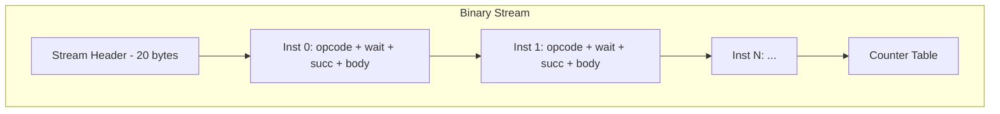

# 04 — Packet ABI

> The packet ABI is the binary wire format between the compiler and the runtime interpreter. Every compiled schedule is encoded as a stream of variable-length `#[repr(C)]` POD records that the GPU interpreter walks sequentially.

---

## Design Identity

**Module:** [`crates/packet/src/lib.rs`](../../crates/packet/src/lib.rs)  
**Header:** [`include/packet.h`](../../include/packet.h)  
**Version:** v5

The packet format is the **contract** between the Rust compiler and the C/CUDA/HIP runtime. Both sides must agree on layout, endianness, and semantics. The format is defined once in Rust and verified by Lean checkpoint E (wire round-trip).

---

## Stream Layout



### Stream Header (20 bytes)

```
┌──────────┬─────────┬────────────┬────────────┬──────────────┬─────────────┬──────────┐
│ magic(4) │ ver(2)  │ bucket(2)  │ n_inst(4)  │ n_counter(4) │ plan_gen(2) │ flags(2) │
└──────────┴─────────┴────────────┴────────────┴──────────────┴─────────────┴──────────┘
```

| Field | Type | Value |
|-------|------|-------|
| `magic` | `u32` | `0x494E5650` — `"INVP"`, so the bytes on disk read `50 56 4E 49` little-endian |
| `version` | `u16` | 5 (current); `MIN_VERSION` 2 is still decodable |
| `bucket_id` | `u16` | Shape bucket index |
| `n_inst` | `u32` | Number of instructions in stream |
| `n_counter` | `u32` | Number of counters in table |
| `plan_gen` | `u16` | Generation counter for cache invalidation |
| `flags` | `u16` | Stream flags |

> Corrected 2026-07-29. This table read `magic = b"PLOW"` and ordered the fields
> `magic, ver, bucket, plan_gen(4), n_inst, n_counter`. Neither matched
> `Program::to_bytes`/`decode` in `crates/packet/src/lib.rs`, which is the only
> implementation and therefore the spec: the magic is `0x494E5650` and
> `plan_gen` is a `u16` that comes *after* the two counts, beside `flags`.
> Anything written against the old table would have failed at the magic check.

### Instruction Record

```
┌──────────┬─────────┬──────────┬─────────┬──────────────────────────┐
│ opcode(2)│ n_wait  │ n_succ   │ wait[]  │ succ[]  │ body (variable)│
└──────────┴─────────┴──────────┴─────────┴──────────────────────────┘
```

Each instruction is 4-byte aligned. Variable-length body follows the counter arrays.

---

## Opcode Encoding

```rust
pub struct Opcode(u16);
```

The opcode is a **structured u16** with packed fields:

```
┌─────────────────────────────────────────────┐
│ 15 14 13 12 │ 11 10 9 8 │ 7 6 5 4 3 2 1 0  │
│   family    │  variant  │     flags         │
└─────────────────────────────────────────────┘
```

| Bits | Field | Meaning |
|------|-------|---------|
| 15:12 | `family` | Op family: Dma=0, Gemm=1, Flash=2, Row=3, Token=4, Layout=5, Rdma=6 |
| 11:8 | `variant` | Within-family variant (e.g. Flash: prefill=0, decode=1) |
| 7:0 | `flags` | Family-specific flags (reduce, activation, quantization) |

### Design Decision: Structured u16 Opcode

**Chosen:** Single u16 with bit-packed family/variant/flags.

**Alternatives:**
1. Flat enum (match on ~50 variants)
2. (u8 family, u8 subcode) pair
3. String-based opcode names

**Rationale:**
- Single 16-bit load + shift/mask gives instant dispatch without table lookup
- Family extraction is one shift: `op >> 12` → jump table index (7 entries)
- `is_reduce`, `is_prefill`, etc. are bitmask tests: branchless and fast
- The GPU interpreter hot loop needs O(1) decode — no string hashing, no secondary lookups
- 16 bits is the minimum that encodes the current ~40 variants with room for growth

**Counter-claim:** Fixed bit layout limits extensibility. Response: 4 bits of family (16 families) × 4 bits of variant (16 per family) × 8 flags = 16×16×256 = 65536 possible opcodes. Current usage: ~40. Growth headroom is >1000×.

---

## Body Types

### DmaBody (TMA / buffer_load)

```rust
pub struct DmaBody {
    pub src: u16,       // source buffer slot
    pub dst: u16,       // destination buffer slot
    pub bytes: u32,     // transfer size
    pub kind: u8,       // Read=0, Write=1, Prefetch=2
    pub access: u8,     // Streaming=0, Temporal=1
}
```

### GemmBody

```rust
pub struct GemmBody {
    pub m: u16, pub n: u16, pub k: u16,
    pub tile_m: u8, pub tile_n: u8, pub tile_k: u8,
    pub a_buf: u16, pub b_buf: u16, pub c_buf: u16,
    pub splits: u8,      // split-K factor
    pub bias: u16,       // bias buffer (0xFFFF = none)
    pub act: u8,         // activation function code
}
```

### FlashBody

```rust
pub struct FlashBody {
    pub q_buf: u16, pub k_buf: u16, pub v_buf: u16, pub o_buf: u16,
    pub seq_len: u32,
    pub head_dim: u16,
    pub n_heads: u16,
    pub tile_q: u8, pub tile_kv: u8,
    pub causal: u8,
}
```

### RowBody

```rust
pub struct RowBody {
    pub in_buf: u16, pub out_buf: u16,
    pub cols: u32,
    pub rows: u16,
    pub variant: u8,   // rmsnorm=0, softmax=1, rope=2, silu=3, ...
}
```

### TokenBody

```rust
pub struct TokenBody {
    pub kind: u8,       // sample=0, tokenize=1
    pub vocab: u32,
    pub buf_logits: u16,
    pub buf_token: u16,
    pub temperature: u16,  // fp16
    pub top_k: u16,
}
```

### LayoutBody

```rust
pub struct LayoutBody {
    pub in_buf: u16, pub out_buf: u16,
    pub bytes: u32,
    pub kind: u8,      // 0=contiguous copy, 1=strided gather/scatter
    pub rank: u8,
    pub elem_size: u8,
    pub shape: [u32; 4],
    pub in_stride: [u32; 4],
    pub out_stride: [u32; 4],
    pub in_base: u32,
    pub out_base: u32,
}
```

---

## Counter Table

Appended after all instructions:

```
┌────────┬──────────────┬───────┐
│ id(u16)│ threshold(u16)│scope(u8)│ pad(u8) │
└────────┴──────────────┴───────┘   (×n_counter)
```

Each counter is 6 bytes (padded to 8 for alignment). The runtime allocates one atomic integer per counter at startup.

---

## Program Encoding/Decoding

```rust
impl Program {
    pub fn to_bytes(&self) -> Vec<u8>;
    pub fn decode(b: &[u8]) -> Result<Program, &'static str>;
}
```

### Encoding Rules

1. All multi-byte fields are **little-endian** (matches x86 and GPU architectures)
2. Every instruction record starts at a **4-byte boundary**
3. Body bytes are appended directly after the counter arrays (no padding between)
4. The counter table starts at a 4-byte boundary after the last instruction

### Validation on Decode

- Magic mismatch → reject
- Version mismatch → reject  
- `n_inst` or `n_counter` > 100,000 → reject (DOS protection)
- Truncated body → reject
- Unknown opcode family → reject

---

## Design Decisions

### Decision: Variable-Length Records (not fixed 128-byte)

**Chosen:** Each instruction is as small as its body requires (8-64 bytes typically).

**Alternative:** Fixed-size 128-byte records for O(1) random access.

**Rationale:**
- DMA ops are 16 bytes; Layout ops are 64 bytes. Fixed 128B wastes 50-87% on small ops
- The interpreter processes sequentially (no random access needed)
- Smaller streams → better cache behavior on the GPU
- A typical Gemma-2B schedule has ~200 instructions → ~5KB variable vs ~25KB fixed

**Counter-claim:** Variable-length requires sequential parsing; can't jump to instruction N. Response: The interpreter never jumps — it walks linearly with counter-gated stalls. Random access is only needed for debugging (served by the JSON trace format instead).

### Decision: POD repr(C) Layout (not protobuf/flatbuffers)

**Chosen:** Bare `#[repr(C)]` structs written directly.

**Alternatives:**
1. Protocol Buffers (schema evolution, language-neutral)
2. FlatBuffers (zero-copy, random access)
3. MessagePack (compact, self-describing)

**Rationale:**
- The GPU interpreter is a C function: it casts byte pointers to structs directly — zero deserialization cost
- Both producer (Rust) and consumer (C) enforce the same `repr(C)` layout via shared header
- Schema evolution is handled by version number: incompatible change → bump version, reject old
- The format is internal (compiler→runtime on same machine) — no cross-language interop needed

**Counter-claim:** No schema evolution; breaking changes require full recompile. Response: This is intentional. The .pkt format is a compiled artifact (like .o files) — it's never stored long-term or sent across machines. Version mismatch → recompile.

### Decision: Counter IDs as u16 Arrays (not bitfield)

**Chosen:** Each instruction carries explicit `wait[n_wait]` and `succ[n_succ]` counter ID arrays.

**Alternative:** Fixed-size bitmask (e.g. 64-bit mask covering counters 0-63).

**Rationale:**
- Typical instruction waits on 1-3 counters — explicit IDs are 2-6 bytes
- A 64-bit bitmask covers only 64 counters; large models need >200
- Variable-length arrays handle the 95th percentile (1-2 waits) efficiently while supporting the rare case (10+ waits on a Join node)

---

## Runtime Consumption

The runtime interpreter in [`runtime/common/interp.c`](../../runtime/common/interp.c) walks the stream:

```c
for (uint32_t i = 0; i < hdr->n_inst; i++) {
    const Inst* inst = &stream[cursor];
    
    // Wait on all counters in wait list
    for (int w = 0; w < inst->n_wait; w++)
        counter_wait(pool, inst->wait[w]);
    
    // Dispatch based on opcode family
    dispatch(inst->opcode, &inst->body);
    
    // Signal all counters in succ list
    for (int s = 0; s < inst->n_succ; s++)
        counter_signal(pool, inst->succ[s]);
    
    cursor += inst_size(inst);
}
```

This tight loop is the entirety of the runtime's control flow. The compiler has already decided everything — the interpreter is purely mechanical.
