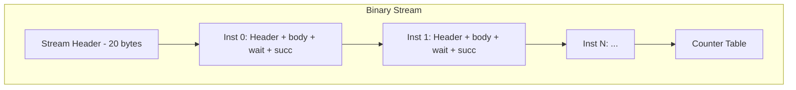

# 04 — Packet ABI

> The packet ABI is the binary wire format between the compiler and the runtime interpreter. Every compiled schedule is encoded as a stream of variable-length `#[repr(C)]` POD records that the GPU interpreter walks sequentially.

---

## Design Identity

**Module:** [`crates/packet/src/lib.rs`](../../crates/packet/src/lib.rs)  
**Header:** [`include/packet.h`](../../include/packet.h)  
**Version:** v5

The packet format is the **contract** between the Rust compiler and the C/CUDA/HIP runtime. Both sides must agree on layout, endianness, and semantics. The format is defined once in Rust and verified by Lean checkpoint E (wire round-trip).

---

## Stream Layout



### Stream Header (20 bytes)

```
┌──────────┬─────────┬────────────┬────────────┬──────────────┬─────────────┬──────────┐
│ magic(4) │ ver(2)  │ bucket(2)  │ n_inst(4)  │ n_counter(4) │ plan_gen(2) │ flags(2) │
└──────────┴─────────┴────────────┴────────────┴──────────────┴─────────────┴──────────┘
```

| Field | Type | Value |
|-------|------|-------|
| `magic` | `u32` | `0x494E5650` — `"INVP"`, so the bytes on disk read `50 56 4E 49` little-endian |
| `version` | `u16` | 5 (current); `MIN_VERSION` 2 is still decodable |
| `bucket_id` | `u16` | Shape bucket index |
| `n_inst` | `u32` | Number of instructions in stream |
| `n_counter` | `u32` | Number of counters in table |
| `plan_gen` | `u16` | Generation counter for cache invalidation |
| `flags` | `u16` | Stream flags |

> The field order and types above match `Program::to_bytes` / `Program::decode`
> in `crates/packet/src/lib.rs`, which is the sole implementation and therefore
> the spec: `plan_gen` is a `u16` following the two counts, beside `flags`.

### Instruction Record

Each record is a fixed [`Header`] followed by its opcode-specific body, then the
wait and successor counter-id arrays:

```
┌────────────────────┬──────────────────┬──────────────┬──────────────┐
│ Header (12 bytes)  │ body (variable)  │ wait[u32×n]  │ succ[u32×n]  │
└────────────────────┴──────────────────┴──────────────┴──────────────┘
```

The [`Header`] (`#[repr(C)]`, 12 bytes, 4-byte aligned) is:

| Field | Type | Meaning |
|-------|------|---------|
| `opcode` | `u16` | Structured opcode (see below) |
| `resource` | `u8` | `ResourceKind`: `Sm=0, Dma=1, Dpu=2, Host=3` |
| `unit` | `u8` | Resource-unit index |
| `index` | `u16` | Per-record ordering index |
| `wait_len` | `u16` | Number of wait counter ids that follow the body |
| `succ_len` | `u16` | Number of successor counter ids that follow `wait` |
| `_pad` | `u16` | Explicit padding (keeps the struct a 4-byte multiple) |

The body comes **before** the `wait`/`succ` arrays, not after. Each record is
4-byte aligned; every body is a 4-byte multiple with explicit padding, so a
kernel can `reinterpret_cast` the body at its record offset as an aligned device
load. `wait_len`/`succ_len` are `u16` as of v3 (v2 used `u8`, an 8-byte header —
still decodable).

---

## Opcode Encoding

```rust
#[repr(transparent)]
pub struct Opcode(pub u16);
```

The opcode is a **structured u16**, `Opcode::new(backend, family, variant)`:

```
┌─────────────────────────────────────────────┐
│ 15 14 13 12 │ 11 10 9 8 │ 7 6 5 4 3 2 1 0  │
│   backend   │  family   │     variant       │
└─────────────────────────────────────────────┘
```

| Bits | Field | Meaning |
|------|-------|---------|
| 15:12 | `backend` | `Generic=0, CUDA=1, ROCm=2, CPU=3` (`BACKEND_*`) |
| 11:8 | `family` | Op family — selects which body struct to cast |
| 7:0 | `variant` | Kernel variant within a family (dtype, epilogue, tile-config) |

Families (`FAMILY_*` on `Opcode`):

| Value | Family | Body struct |
|-------|--------|-------------|
| 0 | `Control` | none (`Body::Host`) |
| 1 | `Dma` | `DmaBody` (variant `0=tma_load`, `1=tma_store`) |
| 2 | `Rdma` | `RdmaBody` |
| 3 | `Gemm` | `GemmBody` |
| 4 | `Flash` | `FlashBody` |
| 5 | `Row` | `RowBody` |
| 6 | `Layout` | `LayoutBody` |
| 7 | `Token` | `TokenBody` (sample/tokenize) |

The scheduler emits **generic** opcodes (backend `0`); the runtime loader
rewrites the backend nibble per active arch and resolves each generic opcode to
a concrete `(backend, family, variant)` against the active backend's dispatch
table. The variant byte is identical across backends. Well-known opcode
constants (`Opcode::GEMM = 0x0300`, `Opcode::FLASH = 0x0400`,
`Opcode::TMA_LOAD = 0x0100`, `Opcode::SAMPLE_BATCH = 0x0704`, …) are defined on
`Opcode`.

### Design Decision: Structured u16 Opcode

**Chosen:** Single u16 with bit-packed backend/family/variant.

**Alternatives:**
1. Flat enum (match on ~50 variants)
2. (u8 family, u8 subcode) pair
3. String-based opcode names

**Rationale:**
- Single 16-bit load + shift/mask gives instant dispatch without table lookup
- Family extraction is one shift+mask: `(op >> 8) & 0xF` → body-dispatch index
- The backend nibble lets the same variant byte name a CUDA, ROCm, or CPU kernel, so one flat namespace unifies all three without opcode exhaustion
- The GPU interpreter hot loop needs O(1) decode — no string hashing, no secondary lookups

**Counter-claim:** Fixed bit layout limits extensibility. Response: 4 bits of backend × 4 bits of family (16 families) × 8 bits of variant (256 per family) = 65536 possible opcodes. Growth headroom is large; families 7..15 are reserved for future ops.

---

## Body Types

Each body is `#[repr(C)]`, largest-field-first with explicit padding so its size
is a 4-byte multiple with no implicit padding. The C mirrors live in
[`include/packet.h`](../../include/packet.h). Sizes below are the ABI contract
asserted by the crate's `record_layout_is_c_compatible` test.

### DmaBody (TMA load / store) — 12 bytes

```rust
pub struct DmaBody {
    pub bytes: u32,     // transfer size
    pub tensor: u32,    // tensor handle (TENSOR_NONE = 0xFFFFFFFF)
    pub slot: u16,      // address-map slot
    pub kind: u8,       // BufKind tag; KIND_UNSPECIFIED = 0xFF if unresolved
    pub access: u8,     // ACCESS_READ = 0, ACCESS_WRITE = 1
}
```

Load vs store is carried by the opcode variant (`0 = tma_load`, `1 = tma_store`),
not a body field.

### RdmaBody — 8 bytes

```rust
pub struct RdmaBody {
    pub bytes: u32,
    pub src_unit: u8,
    pub dst_unit: u8,
    pub _pad: u16,
}
```

### GemmBody — 32 bytes

```rust
pub struct GemmBody {
    pub coord0: u32, pub coord1: u32,   // tile coordinate
    pub m: u32, pub n: u32, pub k: u32,
    pub bm: u16, pub bn: u16, pub bk: u16,
    pub out: u16,       // output slot
    pub tmem: u16,      // tensor-memory slot (SLOT_NONE = 0xFFFF)
    pub _pad: u16,
}
```

The kernel variant (dtype/epilogue) lives in the `Header` opcode byte, not the
body payload.

### FlashBody — 28 bytes

```rust
pub struct FlashBody {
    pub coord0: u32, pub coord1: u32,
    pub seq_q: u32, pub seq_kv: u32,
    pub head_dim: u16,
    pub bq: u16, pub bkv: u16,
    pub heads: u16,
    pub out: u16,
    pub tmem: u16,
}
```

### RowBody — 20 bytes

```rust
pub struct RowBody {
    pub coord: u32,
    pub rows: u32,
    pub feat: u32,
    pub br: u16,        // row-block size
    pub out: u16,
    pub operands: u8,   // operand count (e.g. residual-add = 2)
    pub _pad: [u8; 3],
}
```

Reduce (RMSNorm/softmax) vs pointwise/fused is a property of the opcode variant
(`Opcode::variant_is_reduce`), not a body field; `RowBody` is identical either
way.

### TokenBody — 16 bytes

```rust
pub struct TokenBody {
    pub in_slot: u16,   // e.g. logits slot
    pub out_slot: u16,  // e.g. tokens slot
    pub kind: u8,       // TOKEN_* (sample greedy/stochastic, tokenize, ...)
    pub _pad: u8,
    pub vocab: u32,     // logit width
    pub arg: u32,       // op-specific (e.g. batch width for SAMPLE_BATCH)
}
```

Per-request sampling params (temperature, top-k, …) travel through the
indirection table, not this body.

### LayoutBody (v4+) — 88 bytes

```rust
pub const LAYOUT_MAX_RANK: usize = 6;

pub struct LayoutBody {
    pub kind: u8,       // 0 = contiguous copy, 1 = strided gather/scatter
    pub rank: u8,
    pub elem_size: u8,  // per-element byte count
    pub _pad0: u8,
    pub out: u16,       // output slot
    pub _pad1: u16,
    pub shape: [u32; LAYOUT_MAX_RANK],
    pub in_stride: [u32; LAYOUT_MAX_RANK],   // in elements
    pub out_stride: [u32; LAYOUT_MAX_RANK],  // in elements
    pub in_base: u32,
    pub out_base: u32,
}
```

Streams at version ≤ 3 carried a bare 4-byte tile coordinate (`LayoutBodyLegacy`),
decoded into an empty copy descriptor for back-compat; it is never emitted.

`Body::Control`/`Body::Host` (family 0) has no body bytes.

---

## Counter Table

The counter table is appended after all instruction records. Each entry is a
`Counter` (`#[repr(C)]`, 12 bytes, 4-byte aligned):

```rust
pub struct Counter {
    pub id: u32,
    pub threshold: u32,
    pub scope: u8,      // 0 intra-SM, 1 intra-GPU, 2 cross-unit
    pub _pad: [u8; 3],
}
```

`decode` rejects any wait/succ id that is `>=` the largest counter id in the
table + 1: the runtime sizes its atomic pool from the table and dereferences ids
unchecked on the hot path, so a stale/corrupt id would be an out-of-bounds atomic.

---

## Program Encoding/Decoding

```rust
impl Program {
    pub fn to_bytes(&self) -> Vec<u8>;
    pub fn decode(b: &[u8]) -> Result<Program, &'static str>;
}
```

### Encoding Rules

1. All multi-byte fields are **little-endian** (matches x86 and GPU architectures)
2. Every instruction record starts at a **4-byte boundary**
3. Within a record, bytes are laid out `Header, body, wait[], succ[]` — the body precedes the counter-id arrays
4. The counter table follows the last instruction record

### Validation on Decode

`Program::decode` returns `Result<Program, &'static str>` and never panics or
reads out of bounds on a malformed stream:

- Magic mismatch → reject (`"bad magic"`)
- Version outside `MIN_VERSION..=VERSION` (2..=5) → reject (`"bad version"`)
- `n_inst` / `n_counter` are bounded by the remaining buffer length rather than pre-reserved, so an oversized count over-reads nothing
- Truncated header / body / counter-id array / counter table → reject
- A wait/succ id outside the counter table's id range → reject (`"counter id out of range"`)

An unknown opcode family (other than `Control`) decodes as `Body::Host` with a
zero-length body rather than being rejected.

---

## Design Decisions

### Decision: Variable-Length Records (not fixed 128-byte)

**Chosen:** Each record is only as large as its `Header` (12 B) + body + counter-id arrays require.

**Alternative:** Fixed-size records for O(1) random access.

**Rationale:**
- Body sizes range widely: `RdmaBody` is 8 B, `DmaBody` 12 B, `RowBody` 20 B, `FlashBody` 28 B, `GemmBody` 32 B, `LayoutBody` 88 B. A fixed record sized for the largest wastes most of it on the common small ops
- The interpreter processes sequentially (no random access needed)
- Smaller streams → better cache behavior on the GPU

**Counter-claim:** Variable-length requires sequential parsing; can't jump to instruction N. Response: The interpreter never jumps — it walks linearly with counter-gated stalls. Random access is only needed for debugging (served by the JSON trace format instead).

### Decision: POD repr(C) Layout (not protobuf/flatbuffers)

**Chosen:** Bare `#[repr(C)]` structs written directly.

**Alternatives:**
1. Protocol Buffers (schema evolution, language-neutral)
2. FlatBuffers (zero-copy, random access)
3. MessagePack (compact, self-describing)

**Rationale:**
- The GPU interpreter is a C function: it casts byte pointers to structs directly — zero deserialization cost
- Both producer (Rust) and consumer (C) enforce the same `repr(C)` layout via shared header
- Schema evolution is handled by version number: incompatible change → bump version, reject old
- The format is internal (compiler→runtime on same machine) — no cross-language interop needed

**Counter-claim:** No schema evolution; breaking changes require full recompile. Response: This is intentional. The .pkt format is a compiled artifact (like .o files) — it's never stored long-term or sent across machines. Version mismatch → recompile.

### Decision: Counter IDs as u32 Arrays (not bitfield)

**Chosen:** Each record carries explicit `wait[wait_len]` and `succ[succ_len]` arrays of `u32` counter ids after its body.

**Alternative:** Fixed-size bitmask (e.g. 64-bit mask covering counters 0-63).

**Rationale:**
- Typical instruction waits on 1-3 counters — explicit ids are a handful of `u32`s
- A 64-bit bitmask covers only 64 counters; large models need far more
- `wait_len`/`succ_len` are `u16`, so a record can carry many waits (a Join node) when needed

---

## Runtime Consumption

The runtime interpreter in [`runtime/common/interp.c`](../../runtime/common/interp.c)
walks the stream. Each record is processed by casting its `Header`, then its
family-specific body, then reading its `wait_len`/`succ_len` counter-id arrays:

```
for each record:
    wait until every counter in wait[] reaches its threshold
    dispatch on Header.opcode family, casting the body struct
    signal (atomic-add) every counter in succ[]
```

This tight loop is the entirety of the runtime's control flow. The compiler has already decided everything — the interpreter is purely mechanical.

> **Note:** The variable-length wire stream is host-decoded once into a fixed-stride
> device ISA (`crates/packet/src/dev.rs`, mirrored by `runtime/common/dev_isa.h`)
> before the persistent kernel runs; the GPU never parses the wire format. That
> device ISA is a separate layer from the packet ABI described here.
