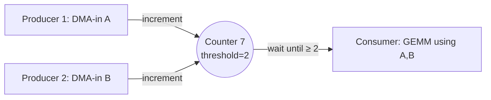
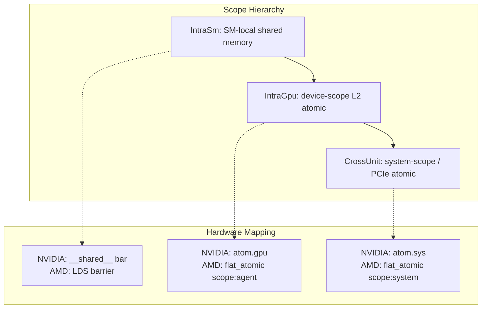
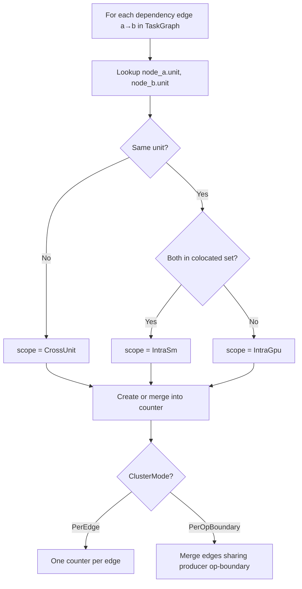
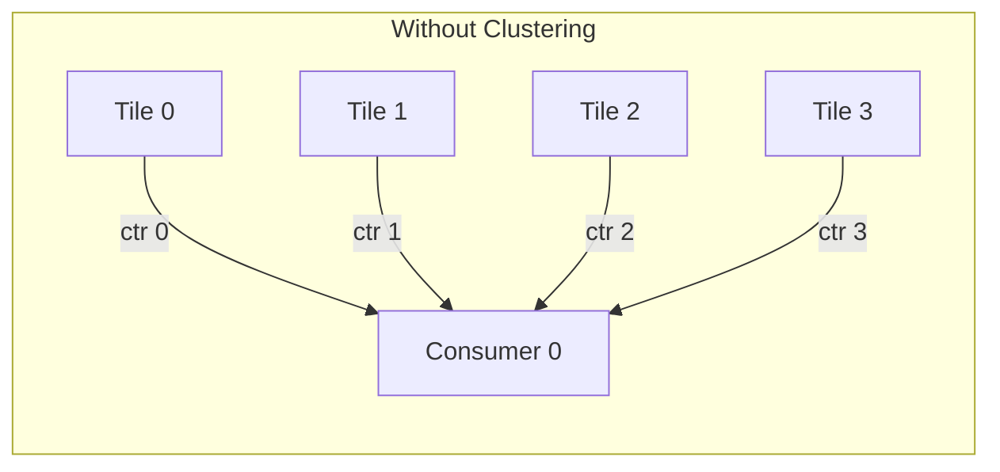

# 05 — Counter Coordination System

> Counters are the universal synchronization primitive: a single atomic integer that producers increment and consumers poll. All coordination — within an SM, across SMs, across GPUs — uses this one mechanism at different scope tiers.

---

## Core Concept



A counter is:
- An **atomic integer**, initialized to 0
- **Producers** increment it on completion (one atomic add per producer)
- **Consumers** spin-wait until value ≥ threshold
- **Threshold** = number of producers that must complete before consumer proceeds

This is the entire runtime coordination model. No kernel launches, no stream synchronization, no CPU intervention.

---

## Scope Tiers

```rust
pub enum Scope {
    IntraSm,    // shared-memory barrier (~4 cycles)
    IntraGpu,   // L2/device-scope atomic (~40 cycles)
    CrossUnit,  // system-scope atomic (~200-500 cycles)
}
```



### Scope Selection Algorithm

The compiler assigns scope based on placement:

```
if producer.sm == consumer.sm:
    scope = IntraSm           # ~4 cycles (shared-memory barrier)
elif producer.unit == consumer.unit:
    scope = IntraGpu          # ~40 cycles (L2 atomic)
else:
    scope = CrossUnit         # ~200-500 cycles (system atomic)
```

### Design Decision: Three Tiers (not two, not four)

**Chosen:** Three scope levels mapping to hardware visibility domains.

**Alternatives:**
1. Two tiers (SM-local + global)
2. Four tiers (SM + GPC + GPU + system)
3. Single tier (always system-scope)

**Rationale:**
- Three tiers match the actual hardware memory hierarchy on both NVIDIA and AMD
- `IntraSm` is 10× cheaper than `IntraGpu` — worth specializing
- `IntraGpu` is 5-10× cheaper than `CrossUnit` — worth specializing
- A fourth "GPC-scope" tier exists on hardware (NVIDIA DSM fabric) but doesn't have a distinct atomic instruction — it's emulated via placement + IntraSm atomics
- Single-tier would waste 10-50× cycles on same-SM dependencies (the common case)

**Counter-claim:** Three tiers add complexity to the counter determination algorithm. Response: The determination is a simple function of placement (3 `if` branches). The 10× latency savings justify the minimal complexity.

---

## Counter Determination Algorithm

**Module:** [`crates/schedule/src/passes.rs`](../../crates/schedule/src/passes.rs) — `build_counters()`

### Input
- `TaskGraph` with data-dependency edges
- `placement: HashMap<usize, UnitId>` (node → unit)
- `colocated: HashSet<usize>` (nodes sharing an SM)
- `cluster_mode: ClusterMode`

### Algorithm



### Clustering (Pass D)

Multiple dependency edges can share one counter when:
1. They cross the **same op boundary** (e.g. all tiles of GEMM-A → all tiles of GEMM-B)
2. They have the **same scope**
3. The consumer only needs to know "all N producers finished" (threshold = N)



```mermaid
flowchart LR
    subgraph With Clustering - threshold=4
        T0[Tile 0] -->|inc| CTR((Counter 0<br/>thr=4))
        T1[Tile 1] -->|inc| CTR
        T2[Tile 2] -->|inc| CTR
        T3[Tile 3] -->|inc| CTR
        CTR -->|wait ≥ 4| C0[Consumer 0]
    end
```

**Effect:** A 132-SM H100 running a GEMM that tiles into 132 compute tasks → 1 counter (threshold=132) instead of 132 individual counters.

### ClusterMode

```rust
pub enum ClusterMode {
    PerEdge,         // one counter per DAG edge (maximum precision)
    PerOpBoundary,   // merge same-boundary edges (default, fewer counters)
}
```

**Default:** `PerOpBoundary` — reduces counter count by 10-100× on typical models while preserving all necessary ordering.

---

## Post-Schedule Passes

### Counter Elimination (§8.1)

**Module:** [`crates/schedule/src/counter_elim.rs`](../../crates/schedule/src/counter_elim.rs)

**Insight:** If all producers and consumers of a counter are on the **same resource** and producers appear **before** consumers in that resource's FIFO stream order, the counter is redundant — stream ordering already enforces the dependency.

```
A counter is redundant iff:
  1. All producers and all consumers are on the same ResourceId
  2. max(producer.stream_position) < min(consumer.stream_position)
```

**Lean backing:** `Plow.Protocol.resourceOrdered ⊆ happensBefore`

**Typical savings:** 20-40% counter reduction.

### Scope Narrowing (§8.2)

**Module:** [`crates/schedule/src/scope_narrow.rs`](../../crates/schedule/src/scope_narrow.rs)

**Insight:** `build_counters` conservatively assigns `IntraGpu` when nodes aren't in the pre-schedule colocated set. After scheduling, some of these turn out to be on the same SM. Downgrading from `IntraGpu` (~40 cycles) to `IntraSm` (~4 cycles) is pure win.

```
For each IntraGpu counter:
  if all_producers_and_consumers_on_same_sm(placement):
    downgrade to IntraSm
```

**Safety:** Scope is a memory-visibility attribute, not a happens-before property. Narrowing only weakens the memory barrier; it never changes which tasks wait on which counters. The narrowing is safe iff all endpoints actually share an SM — which the pass verifies.

---

## Design Decisions

### Decision: Counters over CUDA Events/Streams

**Chosen:** Bare atomic integers with spin-wait.

**Alternatives:**
1. CUDA streams + events (`cudaEventRecord` / `cudaStreamWaitEvent`)
2. CUDA graphs (hardware-scheduled dependency DAG)
3. Cooperative group barriers

**Rationale:**
- **Vendor-neutral:** Atomic integers work identically on NVIDIA, AMD, CPU
- **No CPU involvement:** CUDA events require CPU to record/wait; counters are GPU-only
- **Granularity:** Events are per-stream (coarse); counters are per-tile (fine)
- **Latency:** An L2 atomic increment is ~40 cycles; a CUDA event record requires a round-trip to the driver (~2-5μs)
- **Composability:** N producers → threshold=N naturally; events need N separate waits

**Counter-claim: Spin-wait wastes GPU cycles.** Response: The interpreter is a persistent kernel occupying dedicated warps. Those warps would otherwise be idle (no other work to do). Spinning on an atomic is functionally equivalent to yielding to a hardware scheduler — except with zero scheduling overhead.

**Counter-claim: No priority/preemption.** Response: Correct — counters enforce the statically-determined order. Preemption would mean the runtime overrides the compiler's globally-optimal schedule, which is strictly worse. For multi-tenant scenarios, preemption happens at the tenant level (swap the entire packet stream), not individual tiles.

### Decision: Threshold Semantics (not binary signal)

**Chosen:** Counter with threshold N; consumer proceeds when value ≥ N.

**Alternative:** Binary signal (set/clear) per dependency.

**Rationale:**
- One counter + threshold=N replaces N binary signals (10-100× fewer atomics)
- Natural fit for clustered dependencies: "all tiles of op A complete" = one counter
- The threshold is known at compile time → embedded directly in the packet stream

### Decision: No Counter Recycling (within one stream)

**Chosen:** Counters are allocated per-schedule and never reused within a single packet stream.

**Alternative:** Recycle counters whose lifetime ended (smaller counter pool).

**Rationale:**
- Counter lifetimes can overlap in complex graphs → recycling requires coloring (graph coloring on the counter interference graph)
- Typical model uses 50-300 counters → well within L2 cache
- Simplicity > pool size: no reclamation bugs, no lifetime-tracking overhead
- Across requests (multiple forward passes), the pool is reset to zero (free recycling at request boundaries)

---

## Pool Sizing

```
pool_size = max(counters_needed_across_all_buckets)
```

- Allocated once at runtime startup as a contiguous `uint32_t[]` array
- Placed in device memory (L2-cached) for `IntraGpu` / `CrossUnit`
- `IntraSm` counters use shared memory (per-SM, separate from the pool)
- Typical pool: 256-1024 entries (1-4 KB)

---

## Runtime Implementation

### NVIDIA (CUDA)

```c
// IntraSm: shared memory barrier
__shared__ uint32_t sm_counters[MAX_SM_CTRS];

void counter_signal_sm(int id) {
    atomicAdd_block(&sm_counters[id], 1);
}
void counter_wait_sm(int id, uint32_t thr) {
    while (atomicAdd_block(&sm_counters[id], 0) < thr) { /* spin */ }
}

// IntraGpu: device-scope atomic
void counter_signal_gpu(int id) {
    atomicAdd(&pool[id], 1);  // device scope (default)
}
void counter_wait_gpu(int id, uint32_t thr) {
    while (atomicAdd(&pool[id], 0) < thr) { /* spin */ }
}

// CrossUnit: system-scope atomic
void counter_signal_sys(int id) {
    atomicAdd_system(&pool[id], 1);
}
```

### AMD (HIP)

```c
// IntraSm: LDS barrier
__attribute__((address_space(3))) uint32_t sm_counters[MAX_SM_CTRS];

void counter_signal_sm(int id) {
    __atomic_fetch_add(&sm_counters[id], 1, __ATOMIC_RELAXED);
    __builtin_amdgcn_fence(__ATOMIC_RELEASE, "workgroup");
}

// IntraGpu: agent-scope flat atomic
void counter_signal_gpu(int id) {
    __hip_atomic_fetch_add(&pool[id], 1, __ATOMIC_RELAXED, __HIP_MEMORY_SCOPE_AGENT);
}
```

---

## Wavefront Clustering

For very large tile counts (e.g. 1024 tiles across 132 SMs), having every tile increment the same counter creates **atomic contention**. Wavefront clustering (design §7.4) groups tiles into wavefronts:

```
Wavefront 0: tiles [0..32)   → counter A (threshold=32)
Wavefront 1: tiles [32..64)  → counter B (threshold=32)
...
Final:       counters A,B,C,D → counter Z (threshold=4)
```

This creates a **two-level counter tree** that reduces atomic contention from O(N) to O(√N) at the cost of one extra level of indirection.

**Current status:** Wavefront clustering is planned but not yet implemented. Current models (≤70B parameters) have at most ~200 tiles per op boundary, which fits within single-counter contention limits on modern L2 caches.
