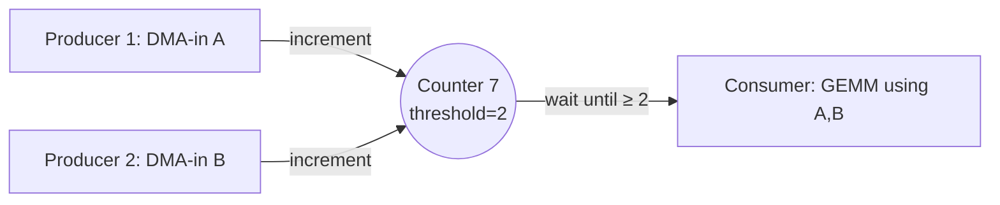
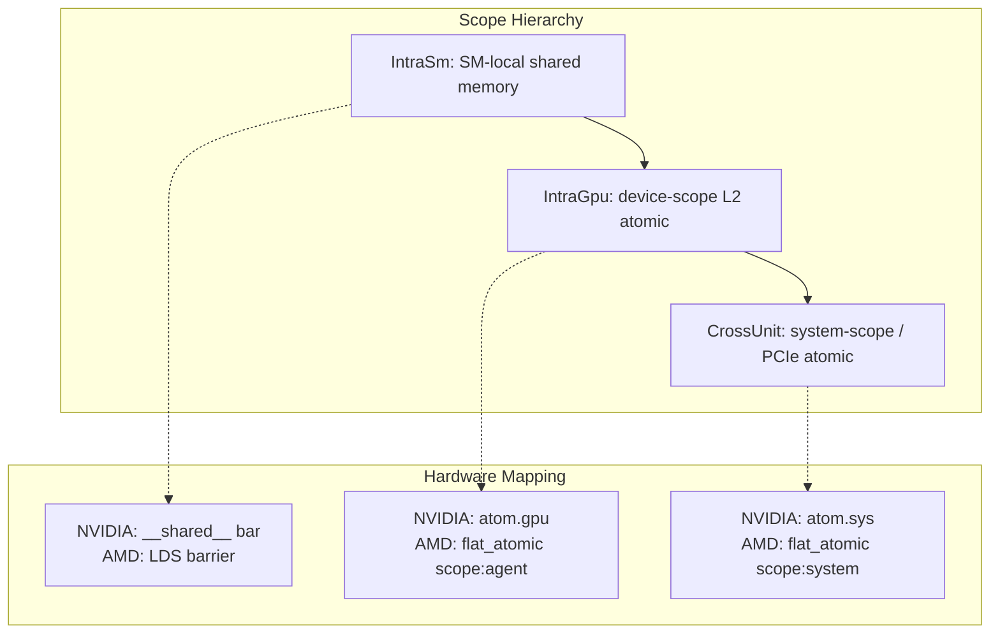
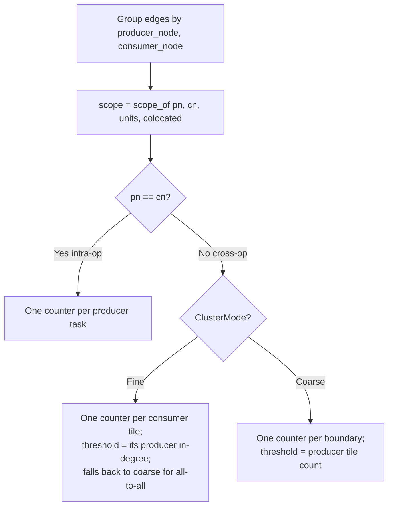
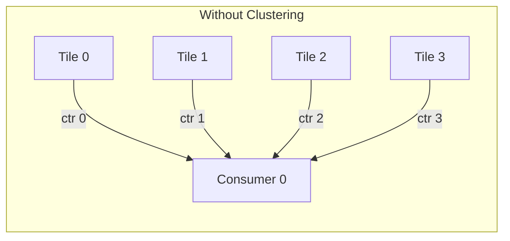

# 05 — Counter Coordination System

> Counters are the universal synchronization primitive: a single atomic integer that producers increment and consumers poll. All coordination — within an SM, across SMs, across GPUs — uses this one mechanism at different scope tiers.

---

## Core Concept



A counter is:
- An **atomic integer**, initialized to 0
- **Producers** increment it on completion (one atomic add per producer)
- **Consumers** spin-wait until value ≥ threshold
- **Threshold** = number of producers that must complete before consumer proceeds

This is the entire runtime coordination model. No kernel launches, no stream synchronization, no CPU intervention.

---

## Scope Tiers

```rust
#[repr(u8)]
pub enum Scope {
    IntraSm = 0,    // within one SM/CU — shared-memory barrier
    IntraGpu = 1,   // across SMs on one GPU — L2/device-scope atomic
    CrossUnit = 2,  // across devices — system-scope atomic on mapped memory
}
```

Defined in `crates/packet/src/lib.rs` and shared by the compiler
(`schedule::passes`) and runtime (`plowrt::exec::counters`) so both agree on the
scope semantics. The wire `Counter.scope` field is this enum as a `u8`. Cycle
costs quoted below are order-of-magnitude estimates, not measured constants.



### Scope Selection Algorithm

The compiler assigns scope in `scope_of` (`crates/schedule/src/passes.rs`) from
the producer node `pn`, consumer node `cn`, their unit assignments, and the
`colocated` set:

```
if unit(pn) != unit(cn):
    scope = CrossUnit         # different device/unit (system atomic)
elif pn == cn and pn in colocated:
    scope = IntraSm           # same node, pinned to one SM (shared-memory barrier)
else:
    scope = IntraGpu          # same unit otherwise (L2 atomic)
```

`IntraSm` requires an **intra-node** edge (`pn == cn`) whose node is pinned to a
single SM; same-unit edges that are not both are `IntraGpu`. The post-schedule
scope-narrowing pass (below) downgrades further `IntraGpu` → `IntraSm` once real
placement is known.

### Design Decision: Three Tiers (not two, not four)

**Chosen:** Three scope levels mapping to hardware visibility domains.

**Alternatives:**
1. Two tiers (SM-local + global)
2. Four tiers (SM + GPC + GPU + system)
3. Single tier (always system-scope)

**Rationale:**
- Three tiers match the actual hardware memory hierarchy on both NVIDIA and AMD
- `IntraSm` is 10× cheaper than `IntraGpu` — worth specializing
- `IntraGpu` is 5-10× cheaper than `CrossUnit` — worth specializing
- A fourth "GPC-scope" tier exists on hardware (NVIDIA DSM fabric) but doesn't have a distinct atomic instruction — it's emulated via placement + IntraSm atomics
- Single-tier would waste 10-50× cycles on same-SM dependencies (the common case)

**Counter-claim:** Three tiers add complexity to the counter determination algorithm. Response: The determination is a simple function of placement (3 `if` branches). The 10× latency savings justify the minimal complexity.

---

## Counter Determination Algorithm

**Module:** [`crates/schedule/src/passes.rs`](../../crates/schedule/src/passes.rs) — `build_counters()`

Signature:

```rust
pub fn build_counters(
    tg: &TaskGraph,
    units: &HashMap<usize, costmodel::UnitId>,   // node → unit
    colocated: &HashSet<usize>,                  // nodes pinned to one SM
    mode: crate::config::ClusterMode,
) -> (Vec<Counter>, Vec<Vec<usize>>, Vec<Vec<usize>>)  // counters, wait_of, succ_of
```

The `Counter` here is the schedule-side struct (`id: usize, threshold, scope,
producer_node, consumer_node`), later lowered to the wire `packet::Counter`.

### Algorithm

Edges are grouped by `(producer_node, consumer_node)`. Each group's scope is
`scope_of(pn, cn, units, colocated)`. The counter layout within a group depends
on whether it is an intra-op boundary (`pn == cn`) and on the `ClusterMode`:



### Clustering

On a cross-op boundary in `Coarse` mode, all edges collapse to one counter
whose threshold is the producer tile count — the consumer only needs to know
"all N producers finished". Intra-op boundaries (a node's own
`DMA-in → compute → DMA-out` staging chain, `pn == cn`) always emit one counter
per producer task in both modes, since coarse-merging a node against itself would
self-depend.



```mermaid
flowchart LR
    subgraph With Clustering - threshold=4
        T0[Tile 0] -->|inc| CTR((Counter 0<br/>thr=4))
        T1[Tile 1] -->|inc| CTR
        T2[Tile 2] -->|inc| CTR
        T3[Tile 3] -->|inc| CTR
        CTR -->|wait ≥ 4| C0[Consumer 0]
    end
```

**Effect:** A 132-SM H100 running a GEMM that tiles into 132 compute tasks → 1 counter (threshold=132) instead of 132 individual counters.

### ClusterMode

```rust
pub enum ClusterMode {
    Coarse,   // one counter per cross-op boundary (threshold = tile count)
    Fine,     // one counter per consumer tile (default)
}
```

Defined in `crates/schedule/src/config.rs`.

- **`Fine`** (default): one counter per consumer tile on cross-op boundaries, so a consumer fires as soon as *its* specific producer tiles finish (threshold = that tile's in-degree). Falls back to coarse for all-to-all boundaries with no fine structure. Maximum pipelining and deadlock-free.
- **`Coarse`**: one counter per boundary (threshold = producer tile count). Fewer counters, but the all-wait-all semantics can deadlock at realistic tile counts unless the scheduler avoids placing a consumer before its coarse-counter producers on the same resource.

---

## Post-Schedule Passes

### Counter Elimination (§8.1)

**Module:** [`crates/schedule/src/counter_elim.rs`](../../crates/schedule/src/counter_elim.rs) — `eliminate_redundant_counters()`

**Insight:** If all producers and consumers of a counter are on the **same resource** and producers appear **before** consumers in that resource's FIFO stream order, the counter is redundant — stream ordering already enforces the dependency.

```
A counter is redundant iff:
  1. All producers and all consumers are on the same ResourceId
  2. max(producer.stream_position) < min(consumer.stream_position)
```

The eliminated counter's id is removed from `counters` and from every packet's
`wait`/`succ` list; remaining ids are not renumbered (the emitter tolerates gaps).

**Lean backing:** the `.resource` constructor of `Plow.Protocol.happensBefore`
lifts `resourceOrdered` into `happensBefore` (`WellFormed.resForward`), so a
resource-ordered edge is already a happens-before edge.

**Typical savings:** 20-40% counter reduction.

### Scope Narrowing (§8.2)

**Module:** [`crates/schedule/src/scope_narrow.rs`](../../crates/schedule/src/scope_narrow.rs) — `narrow_scopes()`

**Insight:** `build_counters` conservatively assigns `IntraGpu` when nodes aren't in the pre-schedule colocated set. After scheduling, some of these turn out to be on the same SM. Downgrading from `IntraGpu` (~40 cycles) to `IntraSm` (~4 cycles) is pure win.

```
For each IntraGpu counter:
  if all_producers_and_consumers_on_same_sm(placement):
    downgrade to IntraSm
```

**Safety:** Scope is a memory-visibility attribute, not a happens-before property. Narrowing only weakens the memory barrier; it never changes which tasks wait on which counters. The narrowing is safe iff all endpoints actually share an SM — which the pass verifies.

---

## Design Decisions

### Decision: Counters over CUDA Events/Streams

**Chosen:** Bare atomic integers with spin-wait.

**Alternatives:**
1. CUDA streams + events (`cudaEventRecord` / `cudaStreamWaitEvent`)
2. CUDA graphs (hardware-scheduled dependency DAG)
3. Cooperative group barriers

**Rationale:**
- **Vendor-neutral:** Atomic integers work identically on NVIDIA, AMD, CPU
- **No CPU involvement:** CUDA events require CPU to record/wait; counters are GPU-only
- **Granularity:** Events are per-stream (coarse); counters are per-tile (fine)
- **Latency:** An L2 atomic increment is ~40 cycles; a CUDA event record requires a round-trip to the driver (~2-5μs)
- **Composability:** N producers → threshold=N naturally; events need N separate waits

**Counter-claim: Spin-wait wastes GPU cycles.** Response: The interpreter is a persistent kernel occupying dedicated warps. Those warps would otherwise be idle (no other work to do). Spinning on an atomic is functionally equivalent to yielding to a hardware scheduler — except with zero scheduling overhead.

**Counter-claim: No priority/preemption.** Response: Correct — counters enforce the statically-determined order. Preemption would mean the runtime overrides the compiler's globally-optimal schedule, which is strictly worse. For multi-tenant scenarios, preemption happens at the tenant level (swap the entire packet stream), not individual tiles.

### Decision: Threshold Semantics (not binary signal)

**Chosen:** Counter with threshold N; consumer proceeds when value ≥ N.

**Alternative:** Binary signal (set/clear) per dependency.

**Rationale:**
- One counter + threshold=N replaces N binary signals (10-100× fewer atomics)
- Natural fit for clustered dependencies: "all tiles of op A complete" = one counter
- The threshold is known at compile time → embedded directly in the packet stream

### Decision: No Counter Recycling (within one stream)

**Chosen:** Counters are allocated per-schedule and never reused within a single packet stream.

**Alternative:** Recycle counters whose lifetime ended (smaller counter pool).

**Rationale:**
- Counter lifetimes can overlap in complex graphs → recycling requires coloring (graph coloring on the counter interference graph)
- Typical model uses 50-300 counters → well within L2 cache
- Simplicity > pool size: no reclamation bugs, no lifetime-tracking overhead
- Across requests (multiple forward passes), the pool is reset to zero (free recycling at request boundaries)

---

## Pool Sizing and Placement

The host-side pool is `CounterPool` in
[`crates/plowrt/src/exec/counters.rs`](../../crates/plowrt/src/exec/counters.rs).
It is sized from the program's counter table (`max(id) + 1`) and built over a
raw base pointer into a backend-allocated region.

- Each cell is an **`AtomicU64`**, occupying a full cache line: `CELL_STRIDE = 64` bytes, matching the device ABI `struct counter { u64 value; u8 pad[56]; }`. The stride isolates cells so signalling one counter doesn't ping-pong a neighbour's cache line.
- Load uses `Acquire`, add uses `AcqRel`, pairing a consumer's read with a producer's release so the consumer sees the gated buffer writes.

Placement is scope-driven (see the module header for detail):

- **IntraSm** — SM/CU shared memory (device-only; never touched by the host).
- **IntraGpu** — device-global HBM, device-scope atomics between SMs.
- **CrossUnit** — host-pinned, device-mapped memory, system-scope atomics over PCIe; the same region has both a host pointer and a GPU-visible device pointer.

Managed/unified memory (`cuMemAllocManaged`) is deliberately *not* used for hot
counters — page migration would thrash the atomic traffic.

---

## Runtime Implementation

The device-side kernel signals and waits on the same cells. The snippets below
are illustrative of the per-scope atomic each backend emits; the on-device
counter width and stride are backend-specific (the AMD device path strides
counters by `CTR_STRIDE = 32` u32 words per `crates/packet/src/dev.rs`).

### NVIDIA (CUDA)

```c
// IntraSm: shared memory barrier
__shared__ uint32_t sm_counters[MAX_SM_CTRS];

void counter_signal_sm(int id) {
    atomicAdd_block(&sm_counters[id], 1);
}
void counter_wait_sm(int id, uint32_t thr) {
    while (atomicAdd_block(&sm_counters[id], 0) < thr) { /* spin */ }
}

// IntraGpu: device-scope atomic
void counter_signal_gpu(int id) {
    atomicAdd(&pool[id], 1);  // device scope (default)
}
void counter_wait_gpu(int id, uint32_t thr) {
    while (atomicAdd(&pool[id], 0) < thr) { /* spin */ }
}

// CrossUnit: system-scope atomic
void counter_signal_sys(int id) {
    atomicAdd_system(&pool[id], 1);
}
```

### AMD (HIP)

```c
// IntraSm: LDS barrier
__attribute__((address_space(3))) uint32_t sm_counters[MAX_SM_CTRS];

void counter_signal_sm(int id) {
    __atomic_fetch_add(&sm_counters[id], 1, __ATOMIC_RELAXED);
    __builtin_amdgcn_fence(__ATOMIC_RELEASE, "workgroup");
}

// IntraGpu: agent-scope flat atomic
void counter_signal_gpu(int id) {
    __hip_atomic_fetch_add(&pool[id], 1, __ATOMIC_RELAXED, __HIP_MEMORY_SCOPE_AGENT);
}
```

---

## Wavefront Clustering

For very large tile counts (e.g. 1024 tiles across 132 SMs), having every tile increment the same counter creates **atomic contention**. Wavefront clustering groups tiles into wavefronts:

```
Wavefront 0: tiles [0..32)   → counter A (threshold=32)
Wavefront 1: tiles [32..64)  → counter B (threshold=32)
...
Final:       counters A,B,C,D → counter Z (threshold=4)
```

This creates a **two-level counter tree** that reduces atomic contention from O(N) to O(√N) at the cost of one extra level of indirection.

**Deviation from implementation:** This is design intent only. `build_counters`
produces a flat, single-level counter per boundary; there is no two-level
counter tree in the scheduler. Current models have at most a few hundred tiles
per op boundary, which fits within single-counter contention limits.
