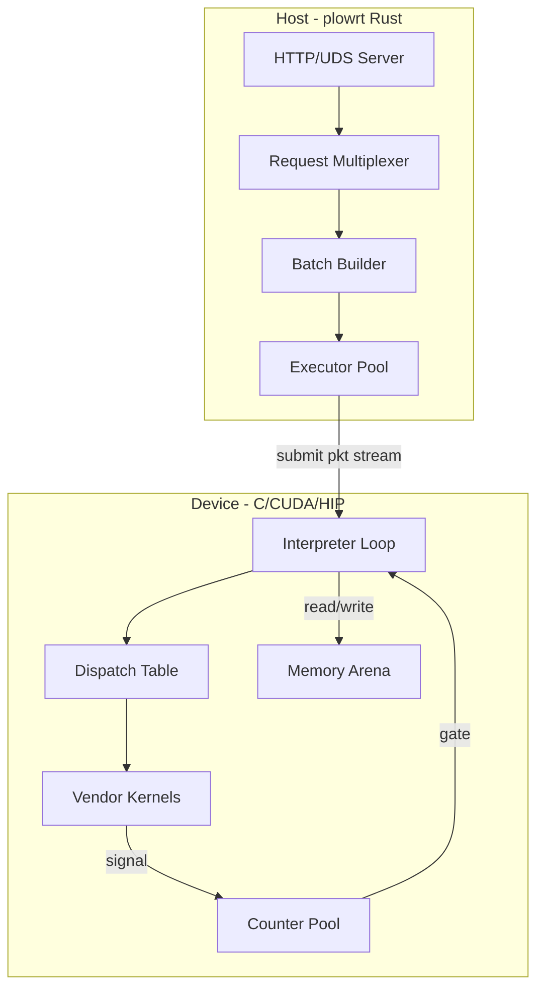
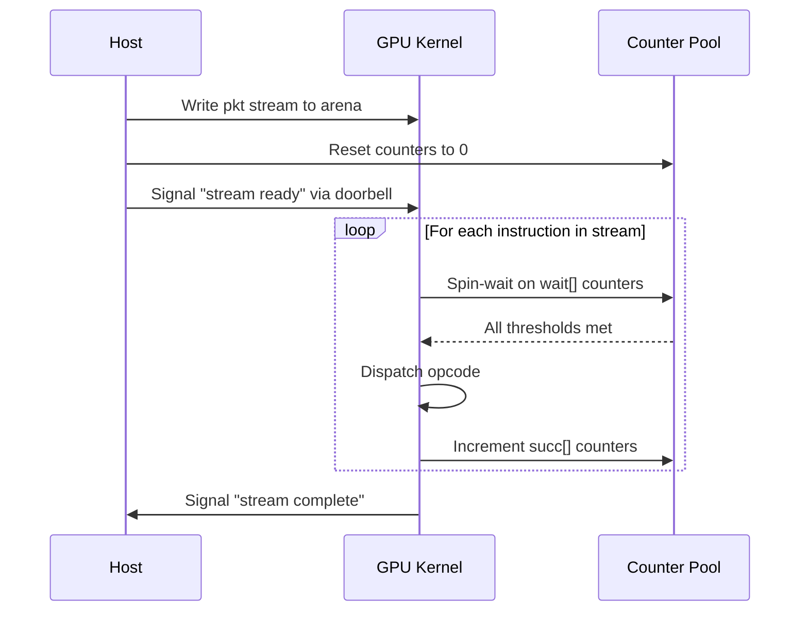
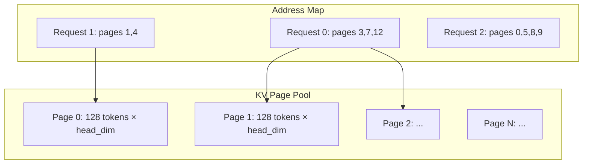

# 06 — Runtime

> The production GPU paths use counter-gated persistent or segmented device
> interpreters over pre-compiled packet streams. CPU/reference and backend
> paths are not identical, and DPU compute is a target rather than a current
> general tensor backend.

---

## Architecture Overview



---

## Execution Model: Persistent Kernel

The GPU runs a **single persistent kernel** that never exits. It occupies a dedicated set of warps per SM and processes packet streams sequentially:



### Why Persistent Kernel

**Target default:** one persistent device launch for a compatible packet
profile. Segmented execution may use several device launches when operations
require incompatible occupancy/resource classes.

**Alternatives:**
1. Per-op kernel launch (standard CUDA/HIP model)
2. CUDA Graphs (compiled launch sequence)
3. Dynamic parallelism (device-side launch)

**Rationale:**
- Per-op launch costs ~2-5μs per kernel × 200 ops = 400-1000μs overhead per forward pass. For batch-1 decode where total compute is ~2ms, this is 20-50% overhead
- CUDA Graphs are vendor-specific (no AMD equivalent) and can't handle dynamic shapes without graph rebuild
- Persistent execution removes per-op host launches; segmented profiles still pay bounded segment transitions
- The entire control flow lives in the counter DAG — no CPU decisions in the critical path

**Counter-claim: Persistent kernels waste SM occupancy.** Response: this must be
measured on the complete interpreter object. The worst dispatch arm can set
registers, shared-memory union size, occupancy, and instruction footprint for
all other arms; no universal “<3%” bound is currently established.

**Counter-claim: Debugging is harder.** Response: Correct — persistent kernels don't hit standard profiling boundaries. Mitigation: the `simulate` subcommand replays the schedule on CPU with full visibility; the trace exporter generates Chrome-compatible timelines.

### Target: Resource-Compatible Interpreter Profiles

The tuning architecture groups executable kernels into a small number of
profiles such as dense decode, MoE decode, dense prefill, MoE prefill, latent
attention, and recurrent Mamba. Each profile is qualified as a complete object
for registers, spills, shared memory, occupancy, packet fetch, dispatch, gates,
and successor fanout. Transitions remain device/counter controlled where
possible. This prevents an unused high-resource kernel from poisoning a lean
decode path while preserving the packet ABI.

---

## Segmented Dispatch: Per-Wave-Class Execution

A single persistent kernel has **one launch configuration**, and occupancy (waves/SIMD) is fixed at
launch — it cannot change on-device. But different ops want different occupancy: on CDNA4, flash
prefill at `FA_DC=256` (no QK^T recompute) needs a 4-wave workgroup (1 wave/SIMD = 512 registers),
while the GEMM and the latency-bound norms need 8 waves (2 waves/SIMD for HBM-latency hiding).
Measured: flash is **−38%** at 4 waves, but a *global* 4-wave prefill loses 38% on the GEMM and 4–8×
on the norms — a wash. The two demands are irreconcilable within one launch.

**Segmented dispatch** resolves this: the packet program is executed as a **sequence of launches**,
one per maximal run of same-occupancy ops, each on the code object built for that occupancy. It is an
MPK-style counter-gated megakernel *within* a wave class, with host-driven boundaries *between*
classes. Measured: **−11% (8k) / −12% (16k) prefill**, the only configuration that beats the uniform
8-wave baseline. Decode is entirely 8-wave, so it stays a single launch (unchanged).

### Mechanism

- **Compiler** (see [03 — Scheduler](03-scheduler.md#wave-class-segmentation)) tags every op with a
  wave class and cuts a segment at each class transition in topological order. Each stream entry
  carries its `seg` id (the reused `PlowStreamEnt` pad slot).
- **Interpreter** gains one line at the top of the packet loop: `if (e.seg != prog.cur_seg) continue;`
  — a skipped entry costs a branch, no gate/exec/signal. The kernel is built once per wave class
  (`plow_interp_gfx950` at 8 waves; `plow_interp_flash_gfx950` at 4 waves / `FA_DC=256`); each skips
  the other's segments. `cur_seg` is a per-launch kernel argument.
- **Host** relaunches once per segment on the matching code object at the matching thread count.
  Counters are zeroed **once** per program, not per segment.

### Why it fires ahead, not wait-per-segment

All of a program's segment packets are enqueued **up front** — the host does not wait between them:

- Each launch takes its own slot in the **kernarg ring** (size = queue depth = 1024), so it snapshots
  its own `cur_seg`; ~120 segments fit with 8× headroom.
- Every dispatch packet sets the **AQL barrier bit** + agent-scope acquire/release fences, so the
  GPU's packet processor chains segment k+1 the instant k's completion signal fires — **no host
  round-trip between segments**. The host drains once at the end (the shared `done` signal returns to
  0 when all launches retire).

The barrier bit is a **correctness** requirement, not just ordering: consecutive segments have
different occupancy, and two different-occupancy grids cannot co-reside on the same CUs (the
oversubscription deadlock — see [dev_isa.h](../../runtime/common/dev_isa.h)). The barrier forces
segment k to *vacate* the CUs before k+1 grabs them. The residual per-boundary cost is therefore a
full-machine **drain-and-refill** (~0.5 ms × ~120 boundaries), which cannot overlap away — it is the
price of per-region occupancy, and the reason segmented lands at −11% rather than the −15% ceiling
that assumes zero boundary cost.

### Soundness

Segmentation is a partition of the **topologically-ordered** stream (the no-deadlock invariant, see
[05 — Counter System](05-counter-system.md)). Intra-segment edges gate through counters as before.
A cross-segment edge A(seg i)→B(seg j>i) clears because A ran in an earlier launch, the queue barrier
retired it, and its counter **persists** (counters reset once, not per segment). This is the identical
argument the prefill→decode code-object hand-off already relies on.

### Future: firing chunks ahead

Chunked prefill (a prompt longer than one bucket runs as `ceil(n/C)` chunks) currently drains once per
chunk between `RUNSEG` calls. Because chunks also serialize on the AQL barrier bit, they could be
queued ahead too — a **runtime launch decision keyed on the pkt buckets** (the DP that picks the chunk
sizes already knows the full launch sequence up front), removing the inter-chunk host wait. Small
relative to the ~120 segment boundaries, and it does not touch the interpreter.

---

## Interpreter

**Module:** [`runtime/common/interp.c`](../../runtime/common/interp.c) + [`runtime/common/interp.h`](../../runtime/common/interp.h)

`interp.c` is the **host serial reference** interpreter for a `.pkt` stream — it
walks instructions in issue order, gates each on its wait-counter thresholds, and
increments successor counters on completion. It runs the CPU golden kernels to
execute a whole program (used by `simulate` and by tests). The on-device
persistent-kernel interpreters live under `runtime/nvidia/` (`interp_sm120.cu`,
`interp_sm90a.cu`) and `runtime/amd/interp.hip`.

### Core Loop

The real signature and body (paraphrased from `plow_interp_run`):

```c
// Returns 0 ok; -1 missing kernel; -2 unsatisfied wait (bad order);
// -3 decode error; -4 non-control inst missing its binding.
int plow_interp_run(const uint8_t* buf, size_t len, const dispatch_table* dt,
                    kctx* ctx, const PlowBinding* bindings, uint32_t n_bindings) {
    PlowInst insts[...]; uint32_t n_insts, n_counters;
    const PlowCounter* counters;
    plow_decode(buf, len, insts, ..., &n_insts, &counters, &n_counters, ...);

    for (uint32_t i = 0; i < n_insts; i++) {
        const PlowInst* in = &insts[i];

        // Gate: every wait counter must have reached its threshold.
        // (In a valid issue order a serial walk already satisfies this.)
        for (uint8_t w = 0; w < in->wait_len; w++) {
            uint32_t cid = in->wait[w];
            uint32_t thr = threshold_of(counters, n_counters, cid);
            if (cid >= ctx->n_counters || ctx->counters[cid] < thr) return -2;
        }

        // Bind operands; every family except CONTROL needs a binding.
        ctx->bind = (bindings && in->index < n_bindings) ? &bindings[in->index] : NULL;
        if (plow_op_family(in->opcode) != PLOW_FAMILY_CONTROL && !ctx->bind) return -4;

        // Dispatch: one masked lookup in dt->fn[opcode & 0x0FFF].
        if (dt_dispatch(dt, in->opcode, in->body, ctx) != 0) return -1;

        // Signal: bump every successor counter.
        for (uint8_t s = 0; s < in->succ_len; s++) {
            uint32_t cid = in->succ[s];
            if (cid < ctx->n_counters) ctx->counters[cid]++;
        }
    }
    return 0;
}
```

The host reference walks a valid issue order, so its "gate" is a *check* (returns
`-2` on violation) rather than a spin-wait. The device interpreters spin on the
same counter thresholds — that is the persistent-kernel behavior the sequence
diagram above depicts.

### Dispatch Table

**Module:** [`runtime/common/dispatch.h`](../../runtime/common/dispatch.h) + [`runtime/common/dispatch.c`](../../runtime/common/dispatch.c)

Every kernel — golden or performant, any backend, any family — has the same C
entry shape, so the dispatch table is one flat array of function pointers
indexed by the opcode's low 12 bits (`family << 8 | variant`), not a struct of
named per-family slots:

```c
// runtime/common/kernel.h — the one entry shape every kernel implements.
// `body` casts to the family struct; `ctx` carries slots/tensors/binding.
typedef void (*kernel_fn)(const void* body, kctx* ctx);

// runtime/common/dispatch.h
#define PLOW_OP_SLOTS 4096            // 16 families × 256 variants
typedef struct dispatch_table {
    kernel_fn fn[PLOW_OP_SLOTS];
} dispatch_table;

static inline int plow_op_index(uint16_t opcode) { return opcode & 0x0FFF; }
```

Kernels are bound per backend at registration time (`dt_register`). Dispatch is
`dt_dispatch(dt, opcode, body, ctx)` → one masked index (`opcode & 0x0FFF`) into
`fn[]`; it returns `-1` if no kernel is registered for the opcode. The `kctx`
supplies operand handles, counters, and the current instruction's binding —
there is no `arena` argument.

---

## Backend Implementations

### NVIDIA Backend

**Directory:** [`runtime/nvidia/`](../../runtime/nvidia/)

| File | Kernel |
|------|--------|
| `gemm.cu` | WGMMA-based GEMM (Hopper/Blackwell TMA path) |
| `flash.cu` | Flash attention (TMA + async copy) |
| `row.cu` | Row-wise ops: RMSNorm, SiLU, Softmax, RoPE |
| `dma.cu` | TMA bulk copy |
| `layout.cu` | Strided gather/scatter via TMA |
| `gemma_sm120.cu` | Consumer-Blackwell (`sm_120`) warp-`mma.sync` Gemma-family GEMM |

Registration files:
- `register_hopper.cu` — Hopper H100 (`sm_90a`), wgmma path
- `register_blackwell.cu` — datacenter Blackwell B200 (`sm_100a`), tcgen05 path
- `register_rtx6000.cu` — RTX PRO 6000 Blackwell / GB202 consumer Blackwell (`sm_120a`), wires the `sm_120` warp-`mma.sync` Gemma kernels from `gemma_sm120.cu`

Each table registers the golden f32 kernels as the correctness-oracle fallback and overlays the performant bf16 kernels that exist for that arch.

### AMD Backend

**Directory:** [`runtime/amd/`](../../runtime/amd/)

| File | Kernel |
|------|--------|
| `mfma.hip` | MFMA-based GEMM (MI300/MI350) |
| `flash.hip` | Flash attention (buffer_load path) |
| `row.hip` | Row-wise ops via VALU |
| `interp.hip` | Device-side interpreter (HSA dispatch) |
| `hsa_backend.c` | HSA queue submission |

Registration:
- `register_mi300.hip` — MI300 (`gfx942` / CDNA3)

The AMD op headers (`op_*.h`) branch on CDNA3 (`gfx942`) vs CDNA4 (`gfx950`) via `amd_arch.h`; several perf paths and the device interpreter target `gfx950`.

### CPU Backend

**Directory:** [`runtime/cpu/`](../../runtime/cpu/)

| File | Purpose |
|------|---------|
| `gemm.c` | Reference GEMM (loop nest) |
| `flash.c` | Reference attention |
| `row.c` | Row-wise ops |
| `dma.c` | memcpy (no-op for unified memory) |
| `control.c` | Interpreter host loop |

The CPU backend serves dual purpose:
1. **Simulation:** `plowrt simulate` uses it for correctness testing without GPU
2. **Host coordination:** DPU-like tasks (RDMA control, host-side KV management)

---

## Memory Architecture

### Arena Layout

The runtime allocates a single contiguous arena per device at startup:

```
┌──────────────────────────────────────────────────────┐
│ Counter Pool │ Packet Stream │ Weight Region │ KV Region │ Activation Scratch │
└──────────────────────────────────────────────────────┘
```

All addresses in the packet stream are **offsets into this arena** — the compiler
emits a `PlowMemMap` of slot→offset entries and the runtime resolves each to
`arena_base + offset` (`plow_memmap_resolve`). Only the map plus the chosen
`arena_base` bind the layout to physical memory.

**Module:** [`runtime/common/memmap.h`](../../runtime/common/memmap.h) + [`runtime/common/memmap.c`](../../runtime/common/memmap.c)

**Deviation from implementation:** The single contiguous-arena diagram describes
the compiler-computed static layout resolved by `memmap.c`. The Rust host
(`crates/plowrt/src/memory/`) does not manage KV/prefix as a slice of that one
arena — it adds dedicated allocators on top: `BlockAllocator` (paged KV blocks),
`GrowablePool` (per-`(kv,head)` growable KV slabs), the RadixAttention
`PrefixCache`, and the VMM-backed prefix path (`vmm.rs`). The static regions
(counters, packet stream, weights, activation scratch) follow the arena/offset
model; dynamic KV does not.

### KV Cache Paging



KV cache uses **page-table indirection** (à la vLLM/PagedAttention). In the host
(`crates/plowrt/src/memory/kv.rs`):
- A `BlockAllocator` carves the KV region into fixed-size blocks (`KvPaging::block_bytes`) and hands out `BlockId`s from a LIFO free list
- Each sequence owns a `PageTable` (logical token window → physical `BlockId`s), appended to as it grows and **never reallocated**
- Growth for decode is applied via an `UPDATE_INDIRECTION` OOB message that writes the new block's physical address into an indirection slot (there is no `inject_kv_growable_entry` symbol)
- Prefix sharing is a separate `PrefixCache` (RadixAttention / automatic prefix caching) over a `GrowablePool`, in `memory/prefix.rs` — a shared prefix resolves to a strided set of per-`(layer,kv,head)` runs, not one block

### Design Decision: Arena (not per-tensor malloc)

**Chosen:** Single arena with compiler-computed offsets.

**Alternative:** Per-tensor `cudaMalloc` / `hipMalloc` with runtime pointer management.

**Rationale:**
- One allocation at startup → zero allocation overhead during inference
- Compiler knows all tensor sizes → optimal packing (no fragmentation)
- Address map entries are simple (base + offset) → fast pointer arithmetic on GPU
- No memory allocator on the critical path

**Counter-claim:** Wastes memory for sparse/dynamic workloads. Response: For transformer inference, tensor sizes are known at compile time per bucket. Dynamic shapes (variable sequence length) are handled by compiling multiple buckets with different arena sizes.

---

## Host Runtime (plowrt)

**Module:** [`crates/plowrt/src/main.rs`](../../crates/plowrt/src/main.rs)

### Subcommands

The `Cmd` enum in `main.rs` defines these subcommands:

```
plowrt serve    --assets <dir>... [--port 8080] [--socket <path>]
                [--executors 8] [--trace] [--max-hold-ms 8.0] [--slo-ms 250.0]
plowrt simulate --assets <dir> [--bucket <phase:batch:seq> | --all-buckets]
                [--math dry|golden] [--log <path>] [--chrome <path>]
plowrt devices  [--tp ...]           # multi-GPU bring-up / peer-visibility, no model
plowrt amd-bench / amd-block         # AMD (gfx950) engine + block A/B (needs --features hsa)
plowrt disasm   <blob>               # offline device-blob disassembly, no GPU
```

#### `serve` — Production HTTP Server

- Async Rust: `tokio` runtime, `axum` router, `hyper` used directly to serve the same router over a Unix domain socket alongside the TCP listener
- `--assets` takes one or more compiled-model directories; `--port` for TCP, `--socket` for an optional parallel UDS listener
- `--executors` sets the CPU reference-backend thread count; `--trace` records a per-packet timeline dumpable at `GET /trace`
- `--max-hold-ms` / `--slo-ms` tune the request muxer (batch-formation hold and admission SLO)
- OpenAI-compatible router; manages request lifecycle: tokenize → schedule bucket → submit → decode → respond

#### `simulate` — Dry-Run Validator

- Uses the CPU backend (no GPU required); `--assets` is a single compiled-model directory
- `--math dry` walks the stream with counter semantics only; `--math golden` also runs the f32 reference numerics (there is no `f16`/`f32` dtype selector)
- `--bucket <phase:batch:seq>` restricts to one bucket; `--all-buckets` runs every bucket in the bundle
- `--log` writes the per-packet log (default stdout); `--chrome` writes a Chrome-trace JSON

### Design Decision: Separate Compile and Serve

**Chosen:** `plowc` produces artifacts; `plowrt` consumes them. Separate binaries.

**Alternative:** Monolithic binary that JITs on first request.

**Rationale:**
- Compilation takes seconds to minutes (egglog saturation + scheduling)
- Serving must respond in milliseconds
- Separation enables: pre-compilation in CI, artifact caching, binary deployment without compiler deps
- Different resource profiles: compiler is CPU-heavy; server is GPU-heavy

---

## Multi-Tenancy (Planned)

### Tenant Model

Each tenant gets:
- Isolated counter pool region
- Dedicated arena partition
- Priority-weighted scheduling slot

### Switching

Tenant switch = swap the packet stream pointer + reset counters. The persistent kernel doesn't restart — it simply starts interpreting the new stream.

### Isolation

- Counter pools are disjoint (tenant A can't signal tenant B's counters)
- Arena regions are non-overlapping (hardware page protection where available)
- Watchdog timer detects stalled tenants (counter progress monitoring)

**Deviation from implementation:** None of this is built. There is no
per-tenant counter-pool isolation, arena partitioning, or tenant-switch path in
`crates/plowrt/`. Multi-*model* switching (`--drain-timeout-ms`, S1 switching)
exists, but it swaps whole engines, not per-tenant regions on a shared kernel.

---

## Error Handling

### Failure Modes

| Failure | Detection | Recovery |
|---------|-----------|----------|
| Counter deadlock | Watchdog timeout (no counter progress for N ms) | Kill stream, signal host |
| Kernel crash | Hardware exception / ECC error | Restart persistent kernel |
| OOM | Arena allocation fails at startup | Reject model, suggest smaller bucket |
| Stream corruption | Decode validation (magic/version check) | Reject stream |

### Watchdog Architecture

The intended design: a host thread monitors counter-pool progress —

- Snapshots counter values every 100ms
- If no counter has advanced → potential deadlock
- After 3 consecutive stalls → force-terminate the stream
- Report includes: last-advanced counter ID, waiting instruction index

A simple progress check, not a complex deadlock detector. The compiler's formal
verification (Lean checkpoint D) proves deadlock-freedom for well-formed streams,
so the watchdog is only intended to catch hardware faults.

**Deviation from implementation:** No standalone watchdog thread exists in
`crates/plowrt/` today. The pieces that exist are a compiler cycle estimate that
would feed a progress curve and a `CANCEL` OOB message that can unwedge a stuck
stream; the periodic-snapshot monitor above is not yet built.
