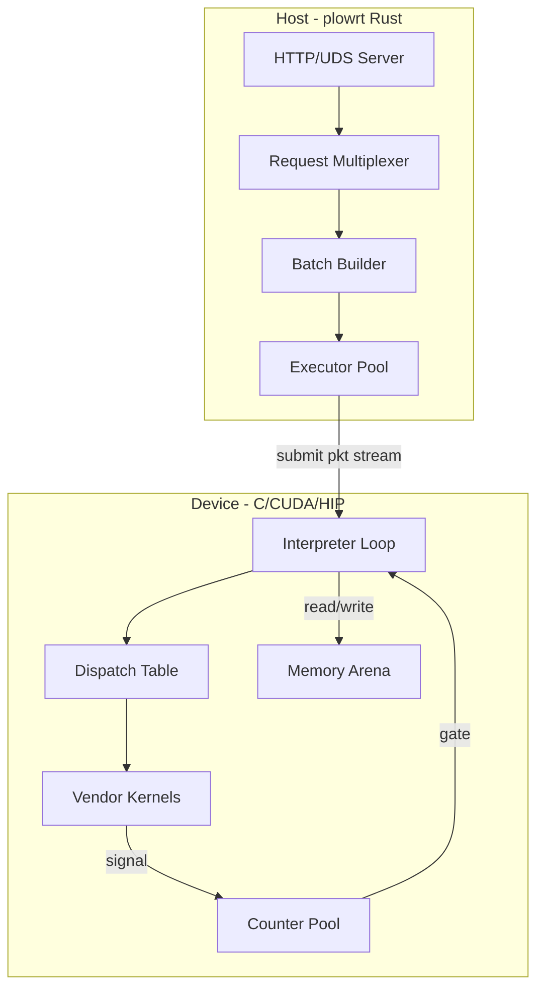
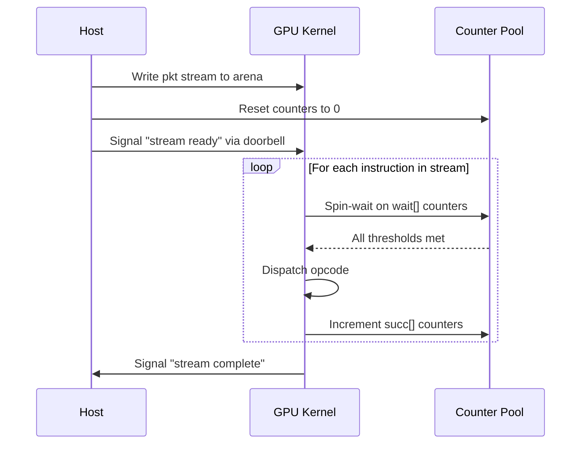
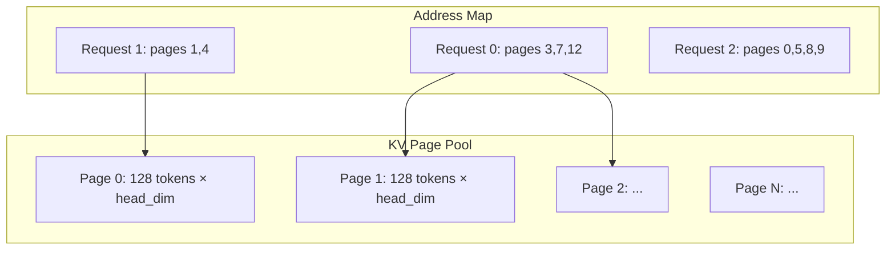

# 06 — Runtime

> The production GPU paths use counter-gated persistent or segmented device
> interpreters over pre-compiled packet streams. CPU/reference and backend
> paths are not identical, and DPU compute is a target rather than a current
> general tensor backend.

---

## Architecture Overview



---

## Execution Model: Persistent Kernel

The GPU runs a **single persistent kernel** that never exits. It occupies a dedicated set of warps per SM and processes packet streams sequentially:



### Why Persistent Kernel

**Target default:** one persistent device launch for a compatible packet
profile. Segmented execution may use several device launches when operations
require incompatible occupancy/resource classes.

**Alternatives:**
1. Per-op kernel launch (standard CUDA/HIP model)
2. CUDA Graphs (compiled launch sequence)
3. Dynamic parallelism (device-side launch)

**Rationale:**
- Per-op launch costs ~2-5μs per kernel × 200 ops = 400-1000μs overhead per forward pass. For batch-1 decode where total compute is ~2ms, this is 20-50% overhead
- CUDA Graphs are vendor-specific (no AMD equivalent) and can't handle dynamic shapes without graph rebuild
- Persistent execution removes per-op host launches; segmented profiles still pay bounded segment transitions
- The entire control flow lives in the counter DAG — no CPU decisions in the critical path

**Counter-claim: Persistent kernels waste SM occupancy.** Response: this must be
measured on the complete interpreter object. The worst dispatch arm can set
registers, shared-memory union size, occupancy, and instruction footprint for
all other arms; no universal “<3%” bound is currently established.

**Counter-claim: Debugging is harder.** Response: Correct — persistent kernels don't hit standard profiling boundaries. Mitigation: the `simulate` subcommand replays the schedule on CPU with full visibility; the trace exporter generates Chrome-compatible timelines.

### Target: Resource-Compatible Interpreter Profiles

The tuning architecture groups executable kernels into a small number of
profiles such as dense decode, MoE decode, dense prefill, MoE prefill, latent
attention, and recurrent Mamba. Each profile is qualified as a complete object
for registers, spills, shared memory, occupancy, packet fetch, dispatch, gates,
and successor fanout. Transitions remain device/counter controlled where
possible. This prevents an unused high-resource kernel from poisoning a lean
decode path while preserving the packet ABI.

---

## Segmented Dispatch: Per-Wave-Class Execution

A single persistent kernel has **one launch configuration**, and occupancy (waves/SIMD) is fixed at
launch — it cannot change on-device. But different ops want different occupancy: on CDNA4, flash
prefill at `FA_DC=256` (no QK^T recompute) needs a 4-wave workgroup (1 wave/SIMD = 512 registers),
while the GEMM and the latency-bound norms need 8 waves (2 waves/SIMD for HBM-latency hiding).
Measured: flash is **−38%** at 4 waves, but a *global* 4-wave prefill loses 38% on the GEMM and 4–8×
on the norms — a wash. The two demands are irreconcilable within one launch.

**Segmented dispatch** resolves this: the packet program is executed as a **sequence of launches**,
one per maximal run of same-occupancy ops, each on the code object built for that occupancy. It is an
MPK-style counter-gated megakernel *within* a wave class, with host-driven boundaries *between*
classes. Measured: **−11% (8k) / −12% (16k) prefill**, the only configuration that beats the uniform
8-wave baseline. Decode is entirely 8-wave, so it stays a single launch (unchanged).

### Mechanism

- **Compiler** (see [03 — Scheduler](03-scheduler.md#wave-class-segmentation)) tags every op with a
  wave class and cuts a segment at each class transition in topological order. Each stream entry
  carries its `seg` id (the reused `PlowStreamEnt` pad slot).
- **Interpreter** gains one line at the top of the packet loop: `if (e.seg != prog.cur_seg) continue;`
  — a skipped entry costs a branch, no gate/exec/signal. The kernel is built once per wave class
  (`plow_interp_gfx950` at 8 waves; `plow_interp_flash_gfx950` at 4 waves / `FA_DC=256`); each skips
  the other's segments. `cur_seg` is a per-launch kernel argument.
- **Host** relaunches once per segment on the matching code object at the matching thread count.
  Counters are zeroed **once** per program, not per segment.

### Why it fires ahead, not wait-per-segment

All of a program's segment packets are enqueued **up front** — the host does not wait between them:

- Each launch takes its own slot in the **kernarg ring** (size = queue depth = 1024), so it snapshots
  its own `cur_seg`; ~120 segments fit with 8× headroom.
- Every dispatch packet sets the **AQL barrier bit** + agent-scope acquire/release fences, so the
  GPU's packet processor chains segment k+1 the instant k's completion signal fires — **no host
  round-trip between segments**. The host drains once at the end (the shared `done` signal returns to
  0 when all launches retire).

The barrier bit is a **correctness** requirement, not just ordering: consecutive segments have
different occupancy, and two different-occupancy grids cannot co-reside on the same CUs (the
oversubscription deadlock — see [dev_isa.h](../../runtime/common/dev_isa.h)). The barrier forces
segment k to *vacate* the CUs before k+1 grabs them. The residual per-boundary cost is therefore a
full-machine **drain-and-refill** (~0.5 ms × ~120 boundaries), which cannot overlap away — it is the
price of per-region occupancy, and the reason segmented lands at −11% rather than the −15% ceiling
that assumes zero boundary cost.

### Soundness

Segmentation is a partition of the **topologically-ordered** stream (the no-deadlock invariant, see
[05 — Counter System](05-counter-system.md)). Intra-segment edges gate through counters as before.
A cross-segment edge A(seg i)→B(seg j>i) clears because A ran in an earlier launch, the queue barrier
retired it, and its counter **persists** (counters reset once, not per segment). This is the identical
argument the prefill→decode code-object hand-off already relies on.

### Future: firing chunks ahead

Chunked prefill (a prompt longer than one bucket runs as `ceil(n/C)` chunks) currently drains once per
chunk between `RUNSEG` calls. Because chunks also serialize on the AQL barrier bit, they could be
queued ahead too — a **runtime launch decision keyed on the pkt buckets** (the DP that picks the chunk
sizes already knows the full launch sequence up front), removing the inter-chunk host wait. Small
relative to the ~120 segment boundaries, and it does not touch the interpreter.

---

## Interpreter

**Module:** [`runtime/common/interp.c`](../../runtime/common/interp.c) + [`runtime/common/interp.h`](../../runtime/common/interp.h)

### Core Loop

```c
void plow_interp_run(
    const uint8_t* stream,    // packet bytes
    uint32_t*      counters,  // counter pool
    void*          arena,     // device memory arena
    const Device*  dev        // dispatch table
) {
    StreamHeader* hdr = (StreamHeader*)stream;
    uint8_t* cursor = stream + sizeof(StreamHeader);
    
    for (uint32_t i = 0; i < hdr->n_inst; i++) {
        Inst* inst = (Inst*)cursor;
        
        // Phase 1: Wait on dependencies
        for (uint16_t w = 0; w < inst->n_wait; w++) {
            uint16_t ctr_id = inst->wait[w];
            uint16_t threshold = counter_table[ctr_id].threshold;
            while (atomic_load(&counters[ctr_id]) < threshold) {
                // spin (optionally with backoff)
            }
        }
        
        // Phase 2: Dispatch
        dispatch(dev, inst->opcode, inst->body, arena);
        
        // Phase 3: Signal successors
        for (uint16_t s = 0; s < inst->n_succ; s++) {
            atomic_fetch_add(&counters[inst->succ[s]], 1);
        }
        
        cursor += inst_size(inst);
    }
}
```

### Dispatch Table

**Module:** [`runtime/common/dispatch.c`](../../runtime/common/dispatch.c)

```c
typedef void (*KernelFn)(const void* body, void* arena);

typedef struct Device {
    KernelFn gemm;
    KernelFn flash;
    KernelFn row;
    KernelFn dma;
    KernelFn layout;
    KernelFn token;
    KernelFn rdma;
} Device;
```

The dispatch table is populated at registration time per backend. The interpreter indexes by `opcode.family()` (one shift + lookup).

---

## Backend Implementations

### NVIDIA Backend

**Directory:** [`runtime/nvidia/`](../../runtime/nvidia/)

| File | Kernel |
|------|--------|
| `gemm.cu` | WGMMA-based GEMM (Hopper/Blackwell TMA path) |
| `flash.cu` | Flash attention (TMA + async copy) |
| `row.cu` | Row-wise ops: RMSNorm, SiLU, Softmax, RoPE |
| `dma.cu` | TMA bulk copy |
| `layout.cu` | Strided gather/scatter via TMA |
| `gemma_sm120.cu` | Blackwell tcgen05 GEMM path |

Registration files:
- `register_hopper.cu` — H100 (SM 9.0)
- `register_blackwell.cu` — B200 (SM 12.0)
- `register_rtx6000.cu` — Ada (SM 8.9)

### AMD Backend

**Directory:** [`runtime/amd/`](../../runtime/amd/)

| File | Kernel |
|------|--------|
| `mfma.hip` | MFMA-based GEMM (MI300/MI350) |
| `flash.hip` | Flash attention (buffer_load path) |
| `row.hip` | Row-wise ops via VALU |
| `interp.hip` | Device-side interpreter (HSA dispatch) |
| `hsa_backend.c` | HSA queue submission |

Registration:
- `register_mi300.hip` — MI300X (gfx942)

### CPU Backend

**Directory:** [`runtime/cpu/`](../../runtime/cpu/)

| File | Purpose |
|------|---------|
| `gemm.c` | Reference GEMM (loop nest) |
| `flash.c` | Reference attention |
| `row.c` | Row-wise ops |
| `dma.c` | memcpy (no-op for unified memory) |
| `control.c` | Interpreter host loop |

The CPU backend serves dual purpose:
1. **Simulation:** `plowrt simulate` uses it for correctness testing without GPU
2. **Host coordination:** DPU-like tasks (RDMA control, host-side KV management)

---

## Memory Architecture

### Arena Layout

The runtime allocates a single contiguous arena per device at startup:

```
┌──────────────────────────────────────────────────────┐
│ Counter Pool │ Packet Stream │ Weight Region │ KV Region │ Activation Scratch │
└──────────────────────────────────────────────────────┘
```

All addresses in the packet stream are **offsets into this arena** — the compiler resolves absolute layout, and the runtime just adds the arena base pointer.

**Module:** [`runtime/common/memmap.c`](../../runtime/common/memmap.c)

### KV Cache Paging



KV cache uses **page-table indirection** (à la vLLM/PagedAttention):
- Fixed-size pages (128 or 256 tokens × head_dim)
- Per-request page list in the address map
- Growable entries for decode phase (added via `inject_kv_growable_entry`)
- Block pool with prefix-cache sharing

### Design Decision: Arena (not per-tensor malloc)

**Chosen:** Single arena with compiler-computed offsets.

**Alternative:** Per-tensor `cudaMalloc` / `hipMalloc` with runtime pointer management.

**Rationale:**
- One allocation at startup → zero allocation overhead during inference
- Compiler knows all tensor sizes → optimal packing (no fragmentation)
- Address map entries are simple (base + offset) → fast pointer arithmetic on GPU
- No memory allocator on the critical path

**Counter-claim:** Wastes memory for sparse/dynamic workloads. Response: For transformer inference, tensor sizes are known at compile time per bucket. Dynamic shapes (variable sequence length) are handled by compiling multiple buckets with different arena sizes.

---

## Host Runtime (plowrt)

**Module:** [`crates/plowrt/src/main.rs`](../../crates/plowrt/src/main.rs)

### Subcommands

```
plowrt serve [--addr 0.0.0.0:8080] [--uds /path/to/sock]
plowrt simulate --model <path> [--math f16|f32] [--log trace.json]
```

#### `serve` — Production HTTP Server

- Async Rust (tokio + hyper)
- Unix domain socket or TCP
- Loads compiled `.pkt` artifacts + weight manifest
- Manages request lifecycle: tokenize → schedule bucket → submit → decode → respond

#### `simulate` — Dry-Run Validator

- Uses CPU backend (no GPU required)
- Replays packet stream with counter semantics
- Validates: no deadlocks, all dependencies honored, correct memory access patterns
- Outputs Chrome trace for visualization

### Design Decision: Separate Compile and Serve

**Chosen:** `plowc` produces artifacts; `plowrt` consumes them. Separate binaries.

**Alternative:** Monolithic binary that JITs on first request.

**Rationale:**
- Compilation takes seconds to minutes (egglog saturation + scheduling)
- Serving must respond in milliseconds
- Separation enables: pre-compilation in CI, artifact caching, binary deployment without compiler deps
- Different resource profiles: compiler is CPU-heavy; server is GPU-heavy

---

## Multi-Tenancy (Planned)

### Tenant Model

Each tenant gets:
- Isolated counter pool region
- Dedicated arena partition
- Priority-weighted scheduling slot

### Switching

Tenant switch = swap the packet stream pointer + reset counters. The persistent kernel doesn't restart — it simply starts interpreting the new stream.

### Isolation

- Counter pools are disjoint (tenant A can't signal tenant B's counters)
- Arena regions are non-overlapping (hardware page protection where available)
- Watchdog timer detects stalled tenants (counter progress monitoring)

---

## Error Handling

### Failure Modes

| Failure | Detection | Recovery |
|---------|-----------|----------|
| Counter deadlock | Watchdog timeout (no counter progress for N ms) | Kill stream, signal host |
| Kernel crash | Hardware exception / ECC error | Restart persistent kernel |
| OOM | Arena allocation fails at startup | Reject model, suggest smaller bucket |
| Stream corruption | Decode validation (magic/version check) | Reject stream |

### Watchdog Architecture

A host thread monitors counter-pool progress:
- Snapshots counter values every 100ms
- If no counter has advanced → potential deadlock
- After 3 consecutive stalls → force-terminate the stream
- Report includes: last-advanced counter ID, waiting instruction index

This is implemented as a simple progress check — not a complex deadlock detector. The compiler's formal verification (Lean checkpoint D) proves deadlock-freedom for well-formed streams; the watchdog catches hardware faults and cosmic rays.
