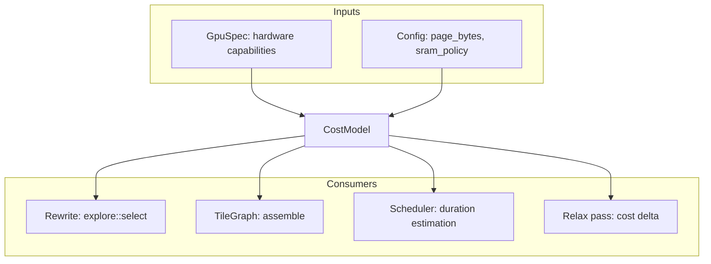
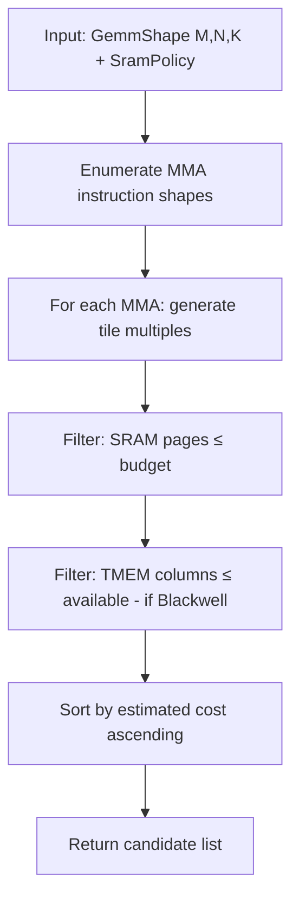

# 07 — Cost Model

> The cost model is the shared oracle that both the rewriting half (tile selection) and the scheduling half (duration estimation) query. It encapsulates all hardware-specific knowledge behind a vendor-neutral interface.

---

## Role in the System



**Module:** [`crates/costmodel/src/lib.rs`](../../crates/costmodel/src/lib.rs)

---

## Core Interface

```rust
pub struct CostModel<'a> {
    pub spec: &'a GpuSpec,
    pub sram: SramModel,   // paged SRAM budget (available bytes / page size)
    pub elem_bytes: u64,   // staged operand element size (2 for bf16/f16)
    pub buffering: u64,    // SRAM buffering depth (2 = double-buffer)
    pub mma_dtype: MmaDtype, // matrix-engine operand dtype
    pub split_k_max: u64,  // max split-K factor for small-M decode GEMMs
}

impl<'a> CostModel<'a> {
    // Construction: `new` subtracts the kernel reservation; `with_available`
    // takes an explicit post-reservation budget.
    pub fn new(spec: &'a GpuSpec, page_bytes: u64) -> CostModel<'a>;
    pub fn with_available(spec: &'a GpuSpec, available_bytes: u64, page_bytes: u64) -> CostModel<'a>;

    // GEMM tile enumeration and costing
    pub fn candidates(&self, g: GemmShape, policy: SramPolicy) -> Vec<TileShape>;
    pub fn gemm_cost(&self, g: GemmShape, tile: TileShape) -> Cycles;
    pub fn best_tile(&self, g: GemmShape, policy: SramPolicy) -> Option<(TileShape, Cycles)>;

    // Flash attention tile enumeration and costing
    pub fn flash_candidates(&self, a: AttnShape, policy: SramPolicy) -> Vec<FlashTile>;
    pub fn flash_cost(&self, a: AttnShape, tile: FlashTile) -> Cycles;
    pub fn best_flash_tile(&self, a: AttnShape, policy: SramPolicy) -> Option<(FlashTile, Cycles)>;

    // Row-wise op tiles
    pub fn best_row_tile(&self, r: RowShape, policy: SramPolicy) -> Option<(RowTile, Cycles)>;

    // Utility
    pub fn passes(&self, tile: TileShape) -> u64;
    pub fn sram_pages(&self, tile: TileShape) -> u64;
}
```

The paged SRAM budget lives in `sram: SramModel` (available bytes divided by
page size), not in bare `pages` / `available_pages` fields.

---

## Tile Shape Model

**Module:** [`crates/costmodel/src/tile.rs`](../../crates/costmodel/src/tile.rs)

### GEMM Tiles

```rust
pub struct TileShape {
    pub bm: u32,    // tile rows (M-dimension block)
    pub bn: u32,    // tile cols (N-dimension block)
    pub bk: u32,    // reduction block (K-dimension)
    pub splits: u32, // split-K factor
}
```

A GEMM `[M, K] × [K, N] → [M, N]` is decomposed into tiles of size `[bm, bk] × [bk, bn] → [bm, bn]`:
- **Passes** = `ceil(M/bm) × ceil(N/bn) × ceil(K/bk)` ÷ splits
- **SRAM pages** = pages needed to hold A-tile (`bm×bk`) + B-tile (`bk×bn`) + C-accumulator (`bm×bn`)

### Flash Tiles

```rust
pub struct FlashTile {
    pub bq: u32,    // query block size
    pub bkv: u32,   // key/value block size
}
```

### Row Tiles

```rust
pub struct RowTile {
    pub rows_per_tile: u32,
}
```

---

## Candidate Enumeration

The [`candidates()`](../../crates/costmodel/src/lib.rs) function generates all legal tile shapes for a given problem:



### Legal Tile Constraints

A tile shape is legal iff:
1. `bm` is a multiple of the MMA instruction's M (e.g. 16 for WGMMA)
2. `bn` is a multiple of the MMA instruction's N (e.g. 16/32/64/128/256)
3. `bk` is a multiple of the MMA instruction's K (e.g. 16 for fp16)
4. Total SRAM demand ≤ `available_pages × page_bytes`
5. For Blackwell: TMEM accumulator columns ≤ device TMEM capacity

### SramPolicy

```rust
pub enum SramPolicy {
    Streaming,   // minimal SRAM: just enough for one tile-step
    Resident,    // hold output in SRAM for consumer
}
```

`Streaming` allows smaller tiles (more parallelism); `Resident` demands larger budgets but avoids HBM round-trips for handoffs.

---

## Cost Function

### GEMM Cost Model

```
gemm_cost(shape, tile) =
    passes × per_pass_cycles

passes = ceil(M / bm) × ceil(N / bn) × ceil(K / (bk × splits))

per_pass_cycles = max(
    mma_cycles(bm, bn, bk),      // compute bound
    load_a_cycles(bm, bk),        // memory bound (A tile)
    load_b_cycles(bk, bn),        // memory bound (B tile)
)
```

The cost is **max of compute and memory** — modeling the pipeline overlap where TMA loads and MMA execution run concurrently.

### Flash Attention Cost Model

```
flash_cost(attn, tile) =
    ceil(seq_q / bq) × ceil(seq_kv / bkv) × per_block_cycles

per_block_cycles = max(
    mma_cycles(bq, head_dim, bkv),
    load_kv_cycles(bkv, head_dim),
)
```

### Row-Op Cost Model

```
row_cost(shape, tile) =
    ceil(rows / rows_per_tile) × per_tile_cycles

per_tile_cycles ∝ cols × ops_per_element
```

Row ops (RMSNorm, SiLU, Softmax) are memory-bound: cost is proportional to data volume.

---

## Hardware Specification

**Module:** [`crates/hwspec/`](../../crates/hwspec/src/lib.rs)

### GpuSpec

```rust
pub struct GpuSpec {
    pub name: &'static str,
    pub vendor: Vendor,
    pub arch: Arch,
    pub compute_cap: (u32, u32),   // CUDA compute capability (or vendor equiv)
    pub sm_count: u32,
    pub sm: SmSpec,                // per-SM shared_mem, tmem, MMA capability
    pub dsm: Option<DsmGrouping>,
    pub l2: Bytes,
    pub mem: MemorySpec,          // HBM bandwidth/capacity
    pub copy_engines: u32,        // async DMA engines
    pub interconnect: Option<Interconnect>,
    pub chiplet: Option<ChipletGrouping>,
    pub l2_partitioning: Option<L2Partitioning>,
    pub clock_boost: Hertz,
}
```

Per-SM shared memory and TMEM live inside `SmSpec` (`spec.sm.shared_mem`,
`spec.sm.tmem`); HBM bandwidth lives inside `MemorySpec` (`spec.mem`).

### Registry

```rust
// Const hardware descriptors
pub const H100_SXM5: GpuSpec = GpuSpec { ... };
pub const B200: GpuSpec = GpuSpec { ... };
pub const RTX_5090: GpuSpec = GpuSpec { ... };
pub const RTX_6000_PRO: GpuSpec = GpuSpec { ... };
pub const RTX_4090: GpuSpec = GpuSpec { ... };
pub const MI300X: GpuSpec = GpuSpec { ... };
pub const MI350X: GpuSpec = GpuSpec { ... };
```

All descriptors are collected in `hwspec::registry::ALL`.

**Files:**
- [`crates/hwspec/src/nvidia/h100.rs`](../../crates/hwspec/src/nvidia/h100.rs) — H100 SXM5
- [`crates/hwspec/src/nvidia/blackwell.rs`](../../crates/hwspec/src/nvidia/blackwell.rs) — B200, RTX 5090, RTX 6000 Pro
- [`crates/hwspec/src/nvidia/ada.rs`](../../crates/hwspec/src/nvidia/ada.rs) — RTX 4090
- [`crates/hwspec/src/amd/mi300.rs`](../../crates/hwspec/src/amd/mi300.rs) — MI300X, MI325X
- [`crates/hwspec/src/amd/mi350.rs`](../../crates/hwspec/src/amd/mi350.rs) — MI350X, MI355X
- [`crates/hwspec/src/registry.rs`](../../crates/hwspec/src/registry.rs) — `ALL` descriptor list

---

## SoC Topology

**Module:** [`crates/costmodel/src/unit.rs`](../../crates/costmodel/src/unit.rs)

```rust
pub struct Soc<'a> {
    pub units: Vec<Unit<'a>>,
    pub memory: MemoryModel,   // unified vs discrete address space
}

pub struct Unit<'a> {
    pub id: UnitId,
    pub kind: UnitKind,        // Gpu | Npu | Cpu
    pub weight: f64,           // relative throughput; regions sized ∝ weight
    pub cm: CostModel<'a>,
}
```

A `Soc` models the full system:
- Single GPU → `Soc::single(spec, page_bytes)` (one unit, unified memory)
- Homogeneous multi-GPU → `Soc::homogeneous(...)`
- Heterogeneous → units with mixed `UnitKind` and per-unit `weight`

Today every unit is a GPU, so `partition_n` degenerates to one region covering
the whole op.

### Multi-Unit Partitioning

```rust
impl<'a> Soc<'a> {
    pub fn partition_n(&self, g: GemmShape) -> Vec<Region>;
}
```

Divides work along the N (output-feature) axis proportional to each unit's
`weight`. Each `Region` carries the assigned `unit`, its sub-`shape`, and the
`n_start` offset.

---

## Design Decisions

### Decision: Analytical Cold Start + Offline Calibration

**Chosen target:** use hardware-parameter estimates to enumerate and shortlist
only executable kernels, then replace estimates with matching offline
measurements when available. Production serving consumes a frozen AOT choice;
it does not explore speculative variants.

**Why both are required:**

- the analytical model permits cross-compilation and brings up new hardware
  before benchmark data exists;
- measurement captures cache behavior, bank conflicts, compiler codegen,
  occupancy cliffs, interpreter-wide register pressure, and dispatch costs that
  a simple roofline cannot predict reliably;
- a versioned tuning record remains deterministic when keyed by hardware,
  driver/toolchain, kernel hash, interpreter-profile hash, op signature, and
  workload mode;
- a missing exact measurement falls back to an architecture seed and then to
  the analytical model.

The model's job is relative shortlisting, not an unqualified performance proof.
No fixed “>90%” ranking-accuracy claim is made without a maintained validation
set. Lean may prove that the minimum supplied finite cost was selected, but it
cannot prove that a latency measurement predicts future hardware behavior.

The current function applies a conservative per-architecture default. The
target registry replaces this approximation with the measured resource
envelope of the complete interpreter profile. A tile is legal only if the
compiled profile, not an abstract architecture label, fits.

### Decision: Kernel Reservation Subtraction

**Chosen:** `available = spec.sm.shared_mem - kernel_reservation_bytes(arch)`, then paged into the SRAM budget.

```rust
pub fn kernel_reservation_bytes(arch: Arch) -> u64 {
    match arch {
        // Hopper: TMA descriptors + CTA barriers + smem_bar.
        Arch::Hopper => 4 * 1024,
        // Blackwell (consumer + datacenter): same TMA/barrier structure.
        Arch::Blackwell => 4 * 1024,
        // Ada Lovelace: no TMA; barriers + shared constants.
        Arch::AdaLovelace => 2 * 1024,
        // CDNA3 (MI300): LDS barrier slots + workgroup scratch.
        Arch::CdnaV3 => 4 * 1024,
        // CDNA4 (MI350): same fixed per-workgroup LDS cost as CDNA3.
        Arch::CdnaV4 => 4 * 1024,
    }
}
```

**Rationale:** The SM kernel reserves part of shared memory (barriers, TMA descriptors, LDS scratch) that is not available for operand tile staging. It is subtracted from `SmSpec.shared_mem` in the default [`CostModel::new`] path — otherwise the cost model would pick tiles that don't fit alongside the kernel's own footprint. The reservation is a fixed per-workgroup cost; it does not scale with LDS size, so it is a much smaller fraction on the larger CDNA4 (160 KiB LDS) part.

### Decision: Split-K for Small Batches

**Chosen:** `TileShape.splits > 1` decomposes the K-reduction across multiple thread blocks.

**Rationale:** Batch-1 decode produces tiny GEMMs (M=1, N=large, K=large). Without split-K, a single SM does all the K-reduction sequentially — wasting 131 other SMs. Split-K = 4..16 parallelizes the reduction, trading one extra reduction kernel for 4-16× more SM utilization.

**Heuristic:** `splits = min(K / bk, sm_count / (M/bm × N/bn))` — enough splits to fill the chip, but not so many that the reduction dominates.

### Decision: Capability-Gated TMEM Filtering

TMEM filtering applies only when the exact hardware specification reports
TMEM and the registered kernel uses it. Datacenter SM100 and consumer SM120
must not be treated as instruction-equivalent merely because both are
Blackwell-generation GPUs; the repository's SM120 probes show that SM100-only
block-scale/tcgen05 assumptions are not portable to SM120.

---

## Cross-Vendor Portability

The semantic rewrite rules and scheduler should remain vendor-neutral, but the
cost model is **not** the only portability boundary. Executable kernel
capabilities, layouts, precision contracts, interpreter resources, compiler
target, and calibration data are architecture-specific.

Porting to a new GPU requires:
1. add and validate its `GpuSpec` and compiler target;
2. register real reference and optimized kernel instantiations;
3. build a resource-qualified interpreter profile;
4. pass oracle, tail, memory-safety, packet, block, and model canaries;
5. seed calibration data and validate analytical ranking;
6. provide an explicit fallback or fail compilation for missing families.

The rewrite rules, scheduler, packet emitter, and Lean verifier should remain
unchanged only after this capability boundary is implemented.

---

## Dominance Filtering

**Module:** [`crates/costmodel/src/dominance.rs`](../../crates/costmodel/src/dominance.rs)

After candidate enumeration, **dominated** tiles are pruned:

```
Tile A dominates Tile B iff:
    cost(A) ≤ cost(B)  AND  sram_pages(A) ≤ sram_pages(B)
```

A dominated tile is never optimal — there's always a cheaper tile that uses less or equal SRAM. Pruning reduces the candidate set from O(100s) to O(10s), speeding up the egglog selection pass.
