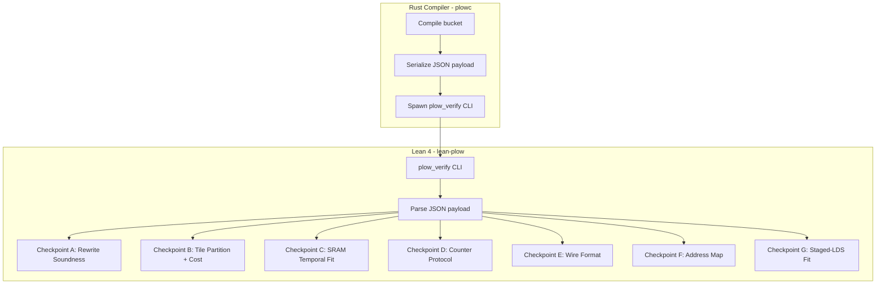
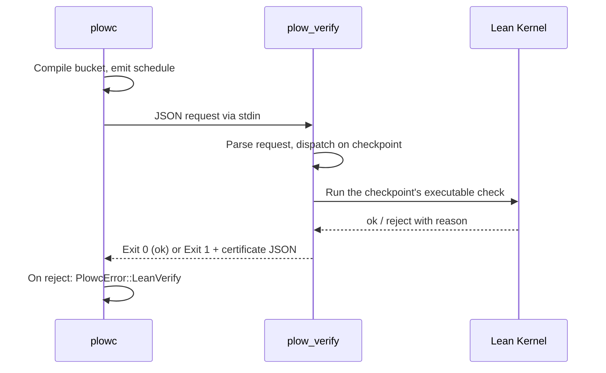

# 08 — Formal Verification

> Every compiled schedule can optionally pass through a Lean 4 verifier that checks seven correctness properties (checkpoints A–G). Failures reject the compilation — proving correctness once at compile time rather than testing every possible runtime interleaving.

---

## Architecture



**Rust client:** [`crates/lean_verify/`](../../crates/lean_verify/) — `call`, `require`, and `query` entry points in [`lib.rs`](../../crates/lean_verify/src/lib.rs), typed per-checkpoint wrappers under [`checkpoints/`](../../crates/lean_verify/src/checkpoints/) (feature-gated: `lean-verify`)  
**Compiler integration:** [`crates/schedule/src/lean_verify.rs`](../../crates/schedule/src/lean_verify.rs)  
**Lean project:** [`lean-plow/`](../../lean-plow/)  
**CLI binary:** `lean-plow/.lake/build/bin/plow_verify` (overridable via `PLOW_VERIFY_BIN`)

---

## The Checkpoints

Seven checkpoints (A–G) are dispatched by `runCheckpoint` in [`lean-plow/Main.lean`](../../lean-plow/Main.lean); each handler lives in [`Plow.CLI.Checkpoints`](../../lean-plow/Plow/CLI/Checkpoints.lean). The `checkpoint` field of the JSON request selects one. Beyond accept/reject checkpoints, the same CLI answers performance *queries* (`counter_granularity`, `lower_bound`) dispatched by `runQuery`.

The checkpoint IDs correspond to compile-pipeline stages: A Rewrite, B Assemble, C Collapse/Relax, D Schedule, E Emit, F Memory. G is a later addition (staged-LDS fit) that has no stage of its own — it re-checks an emit-time obligation.

### Checkpoint A — Rewrite Rule Soundness

**Property:** Every fusion rule the egglog engine fires (annotated `; rule: <name>` in `rules.egg`) preserves semantic equivalence.

**How:** Each rule fuses a composition of base ops into a single fused op. In Lean, every fused op unfolds — via `Plow.Rewrite.expand` — to exactly its unfused composition, and each rule's soundness is a definitional-equality (`rfl`) theorem `Plow.Rewrite.rule_*`. Example (the `gated-mlp-fuse` rule):

```lean
theorem rule_gated_mlp_fuse (g u : Op) (k : String) :
    expand (Op.SwiGLU g u k) =
      Op.Ew "mul" (Op.Act k (expand g)) (expand u) := rfl
```

**Module:** [`lean-plow/Plow/Rewrite.lean`](../../lean-plow/Plow/Rewrite.lean)

**What it proves:** The fused op is *definitionally* the unfused composition, so the two denote the same value. (The mini-IR is intentionally abstract: each op carries only the operand references from its egglog signature; the definitional-equality argument carries through unchanged if types/denotations are attached.)

**Verification:** The Rust side submits the list of fired rule names (`{"rules": [...]}`); `checkA` rejects any name not in the closed enumeration `Plow.Rewrite.soundRules`. That table holds one entry per `rule_*` theorem — 19 rules today, mirroring the `; rule:` annotations in `rules.egg`.

### Checkpoint B — Tile Partition Validity

**Property:** The tile decomposition covers the full GEMM shape with no gaps or overlaps, and per-tile work ≤ cost bound.

**Module:** [`lean-plow/Plow/TilePartition.lean`](../../lean-plow/Plow/TilePartition.lean)

**What it proves:** completeness of the tiling (`tile_partition_covers` — every in-range `(i, j)` lands in a tile) plus validity of the executable partition check (`check_sound`, backing the per-candidate `checkPartition`). The cost bound is enforced directly: for each candidate, `checkB` rejects when `tileCount · bm · bn · bk > cost_bound`.

```lean
theorem tile_partition_covers (g : Gemm) (t : Tile) (v : ValidPartition g t) : …

theorem check_sound (g : Gemm) (t : Tile) (h : checkPartition g t = .ok ()) : …
```

**Payload:** a list of tile candidates, each carrying its GEMM shape, tile shape, and a `cost_bound`. `checkB` runs `checkTileCandidate` over all of them (positive dims, each tile dim ≤ its GEMM dim, plus the cost bound).

### Checkpoint C — SRAM Temporal Fit

**Property:** Producer and consumer never hold their pages at the same time across a hand-off, so the shared page budget is never overcommitted.

**Module:** [`lean-plow/Plow/Sram.lean`](../../lean-plow/Plow/Sram.lean)

**What it proves:** The universal theorem `Plow.Sram.occupancy_le_of_temporal_fit` — when a hand-off is temporally disjoint (`producer_release ≤ consumer_acquire`) and each side fits the budget, occupancy at every cycle stays ≤ budget.

**Payload:** a budget plus a list of `Handoff` records (`producer_pages`, `consumer_pages`, `producer_release`, `consumer_acquire`, `consumer_release`). `checkC` re-checks each hand-off; a rejection names the first violating one.

**Note:** The Rust `sram_fit::analyze_temporal_fit` pass already filters candidates against this rule; the Lean check re-verifies it so the promotion story is closed by the universal theorem.

### Checkpoint D — Counter Protocol Correctness

**Property:** The counter-gated schedule enforces every data dependency in the TileGraph. No consumer can start before all its producers complete.

**Modules:** [`lean-plow/Plow/Protocol.lean`](../../lean-plow/Plow/Protocol.lean) (happens-before theory), [`lean-plow/Plow/Verify.lean`](../../lean-plow/Plow/Verify.lean) (the executable address-map verifier), [`lean-plow/Plow/Memory.lean`](../../lean-plow/Plow/Memory.lean) (`AddressMapSound`).

**Universal theorems (proved once in `Plow.Protocol`, applied to every schedule):**

```lean
-- The counter protocol's happens-before relation covers the dependency DAG
theorem protocol_covers_deps {tg : TaskGraph} (p : CounterProtocol tg)
    (wf : WellFormed p) :
    ∀ e ∈ tg.edges, happensBefore p e.1 e.2

-- Happens-before implies increasing schedule order (acyclicity ⇒ deadlock-free)
theorem happensBefore_acyclic {tg : TaskGraph} (p : CounterProtocol tg)
    (wf : WellFormed p) : …
```

`resourceOrdered` is a subset of `happensBefore` by construction — the `happensBefore.resource` constructor injects it directly. `Plow.Memory.AddressMapSound` (reclamation safety) factors through `protocol_covers_deps`.

**Handler:** `checkD` runs the executable verifier `verifyAddressMap` (via the stack-safe twin `Plow.CLI.FastCheckD`, since the reference recursion overflows on real ~590k-task schedules) *and* a reader/writer disjointness check. Together these establish the **strict** `AddressMapSound` guarantee, not just the loose form.

**Payload:** the `(TaskGraph, CounterProtocol, AddressMap)` bundle produced by `plowc` — the address-map entries plus the counter/resource ordering.

### Checkpoint E — Wire Format Round-Trip

**Property:** `decode(encode(frames)) = some frames`, and `encode(frames) = raw` — the encoding is lossless.

**Module:** [`lean-plow/Plow/Wire.lean`](../../lean-plow/Plow/Wire.lean)

**What it proves:** the universal framing invariant `Plow.Wire.decodeProgram_encodeProgram` — decode inverts encode on every well-formed program.

**Deviation from implementation:** The Lean model is *abstract, not byte-identical*. It proves the framing invariant every scheme (including packet's) must satisfy; it deliberately does not re-derive the actual `packet::Program::to_bytes` layout (MAGIC/VERSION header, per-body POD structs, length-prefixed wait/succ lists), which has its own round-trip test suite in `crates/packet`.

**Payload:** the `frames` plus the expected encoded `raw` bytes. `checkE` requires both `encode(frames) = raw` and `decode(raw) = some frames`, so schema drift on either side of the bridge is caught; rejection names the first diverging byte.

### Checkpoint F — Allocation Safety

**Property:** No two byte-overlapping address-map entries lack a bridging counter/resource ordering — i.e. the placed allocation is reclamation-safe.

**Modules:** [`lean-plow/Plow/Memory.lean`](../../lean-plow/Plow/Memory.lean), [`lean-plow/Plow/Verify.lean`](../../lean-plow/Plow/Verify.lean).

**Handler:** `checkF` runs the *same* verifier and disjointness check as `checkD` on the same `ScheduleRequest` bundle — F is conceptually "post-emit" verification of identical math (strict `AddressMapSound`). The Rust `call` helper caches the verdict by payload hash across the D/F pair so the second (expensive) spawn is free.

**Payload:** the same `(TaskGraph, CounterProtocol, AddressMap)` bundle as D.

### Checkpoint G — Staged-LDS Fit

**Property:** Every always-staged GEMV instance the emitter produces fits the decode object's LDS arena.

**Module:** [`lean-plow/Plow/LdsFit.lean`](../../lean-plow/Plow/LdsFit.lean)

**What it proves:** `Plow.LdsFit.fits_of_check_ok` — an accepted list contains no instance whose staged demand exceeds the arena. The always-staged family (`gemv_qkv_rows` / `gemv_glu_rows` in `op_gemm.h`) reads `x` only through LDS, so choosing the fused opcode is a promise that `rows·K + scratch` halves fit. Emitting past the fit reads garbage `x` and answers fluently-but-wrong; this checkpoint re-checks the emitter's fusion gate so a path that forgets it is rejected at emit.

**Payload:** the arena size (halves, supplied from `hwspec` by the Rust caller) plus one `StagedOp` record per staged instance (`op`, `idx`, `rows`, `k`, `scratch`). Rejection names the first violating instance. (This is the machine-checked half of the same host/device duplication defect class described in [14 — AMD Arch Divergence §5](14-amd-arch-divergence.md).)

---

## Verification Flow



### JSON-IPC Protocol

Every request wraps a checkpoint-specific payload under two top-level keys — `checkpoint` selects the handler, `payload` carries its data:

```json
{
  "checkpoint": "B",
  "payload": {
    "candidates": [
      {"gemm": {"m": 2048, "n": 4096, "k": 512},
       "tile": {"bm": 128, "bn": 128, "bk": 64},
       "cost_bound": 4294967296}
    ]
  }
}
```

The Lean CLI returns a `Certificate`: `ok` plus `notes` on success, or `ok: false` plus a `reason` on rejection. Exit code is 0 iff `ok`.

```json
{ "ok": true, "checkpoint": "B", "notes": "tile-partition + cost bound verified: 1 candidates" }
```

Performance queries use a `query` key instead and return a computed `answer` with a `certificate` string (see `Plow.CLI.Queries`).

---

## Lean Project Structure

Abbreviated (checkpoint-relevant modules; the tree also carries proof libraries — `Cost`, `CostBounds`, `KvPool`, `Prefetch`, `Wave`, `Layout`, `Row`, `Attn`, `SplitK`, `Weight`, `TransitiveReduction`, and the `*Perf` performance-query proofs):

```
lean-plow/
├── lakefile.lean          # Build configuration
├── lean-toolchain         # Lean version pin
├── Main.lean              # CLI entry point (plow_verify): runCheckpoint / runQuery
├── Plow.lean              # Module root (re-exports)
└── Plow/
    ├── Basic.lean         # Core definitions (TaskGraph, Op, …)
    ├── Rewrite.lean       # Checkpoint A: rule soundness (rule_*, soundRules)
    ├── TilePartition.lean # Checkpoint B: partition coverage + cost
    ├── Sram.lean          # Checkpoint C: SRAM temporal fit
    ├── Protocol.lean      # Checkpoint D: counter protocol / happens-before
    ├── Memory.lean        # Checkpoint D/F: AddressMapSound
    ├── Verify.lean        # Executable address-map verifier (D/F)
    ├── Wire.lean          # Checkpoint E: wire format round-trip
    ├── LdsFit.lean        # Checkpoint G: staged-LDS fit
    └── CLI/
        ├── Checkpoints.lean  # Per-checkpoint handlers (checkA … checkG)
        ├── FastCheckD.lean   # Stack-safe twin of verifyAddressMap (D/F)
        ├── Queries.lean      # Performance oracles (counter_granularity, lower_bound)
        ├── Payload.lean      # JSON deserialization
        └── Schema.lean       # Payload schema types + Certificate
```

---

## Design Decisions

### Decision: Lean 4 (not Coq, not Agda, not Z3)

**Chosen:** Lean 4 with `Decidable` instances for compile-time-checkable properties.

**Alternatives:**
1. Coq — more mature ecosystem, but slower kernel and worse metaprogramming
2. Agda — dependent types but no automation (manual proofs for everything)
3. Z3/SMT — fast for decidable fragments but can't prove universal theorems
4. Property-based testing (QuickCheck) — probabilistic, not proof

**Rationale:**
- Lean 4 has a native code compiler → `plow_verify` runs fast enough for CI (checkpoints D/F dominate; the client caches the shared D/F verdict so the pair costs one spawn)
- `Decidable` type class lets many properties be checked by computation, not proof construction
- The CLI model (serialize → invoke → parse result) decouples Lean from Rust without FFI
- Lean's metaprogramming (`macro`, `elab`) enables auto-generating proof obligations from the JSON payload
- The Lean community is small but active in formal verification of programs (vs Coq's math focus)

**Counter-claim: Lean 4 is immature.** Response: The proofs are foundational (arithmetic, set theory, induction on finite structures). They don't depend on unstable library features — just `Nat`, `List`, `Fin`, and basic tactics. Lean 4's kernel is trustworthy for this fragment.

**Counter-claim: Formal verification is overkill.** Response: GPU coordination bugs manifest as silent data corruption (wrong tokens) or hangs (deadlock). They're not caught by unit tests because they depend on timing. A proof eliminates the entire class — permanently, for all inputs. The cost is writing the theorem once; the benefit is never debugging a counter race again.

### Decision: Universal Theorems + Per-Instance Application

**Chosen:** Prove general theorems (e.g. "any well-formed counter graph is deadlock-free") once; apply them to each compiled schedule by checking the preconditions.

**Alternative:** Prove each individual schedule correct from scratch.

**Rationale:**
- Universal theorems are proved once and amortized across all compilations
- Per-instance verification reduces to checking preconditions (is this schedule well-formed?) — which is decidable and fast
- Adding a new model/bucket doesn't require new proofs — just new instances of existing theorems

### Decision: JSON-IPC (not FFI, not linked library)

**Chosen:** Lean CLI invoked via `std::process::Command` with JSON over stdin/stdout.

**Alternative:** Link Lean as a shared library into the Rust compiler via C FFI.

**Rationale:**
- Complete isolation: Lean segfault doesn't crash the compiler
- Simple deployment: `plow_verify` is a separate binary, versioned independently
- Feature-gatable: `#[cfg(feature = "lean-verify")]` makes Lean entirely optional
- Cross-platform: JSON-IPC works on any OS; FFI bindings are platform-specific
- Debuggable: `cat payload.json | plow_verify` for manual testing

**Counter-claim: Process spawn overhead.** Response: each invocation is a fork + exec. The client streams stdin from a helper thread while draining stdout (checkpoint-D payloads scale with task count and would otherwise deadlock on full pipes), and caches the identical D/F verdict so only one of the pair spawns. Total overhead stays negligible against the scheduler's runtime (seconds).

### Decision: Opt-In Verification (not mandatory)

**Chosen:** Lean verification is controlled by `Options::lean_verify`, and the whole client is gated behind the `lean-verify` cargo feature. Default: off. When a caller runs the gate by default, only `VerifyError::is_binary_unusable` (no runnable `plow_verify` here) is downgraded to a warning; every rejection is a hard failure.

**Rationale:**
- Lean toolchain is not universally installed (requires `elan` + `lake build`)
- Development iteration speed matters: most edits don't affect proven properties
- CI always runs it; developers run it before merge
- The scheduler's built-in `schedule::verify::verify_schedule` (Rust, fast, no external deps) catches the common cases; Lean is the gold-standard backup

---

## Test Coverage

Integration tests verify the Lean pipeline end-to-end (in `crates/plowc/tests/`, compiled under `--features lean-verify` and `#[ignore]`d since they need the `plow_verify` binary):

| Test | File | What it checks |
|------|------|---------------|
| Positive | [`lean_verify.rs`](../../crates/plowc/tests/lean_verify.rs) | Every bucket of a valid schedule is accepted |
| Negative | [`lean_verify_negative.rs`](../../crates/plowc/tests/lean_verify_negative.rs) | Intentionally broken schedule is rejected |
| Rewrite | [`lean_verify_rewrite.rs`](../../crates/plowc/tests/lean_verify_rewrite.rs) | Fired rule names match the sound-rules table |
| Tile partition | [`lean_verify_tile_partition.rs`](../../crates/plowc/tests/lean_verify_tile_partition.rs) | Partition coverage + cost bound per candidate |
| Wire | [`lean_verify_wire.rs`](../../crates/plowc/tests/lean_verify_wire.rs) | Round-trip for sample programs |
| SRAM fit | [`lean_verify_sram_fit.rs`](../../crates/plowc/tests/lean_verify_sram_fit.rs) | Hand-offs fit the shared page budget |
| Schema | [`lean_verify_schema.rs`](../../crates/plowc/tests/lean_verify_schema.rs) | Payload schema matches Lean parser |
| Growable KV | [`lean_verify_growable_kv.rs`](../../crates/plowc/tests/lean_verify_growable_kv.rs) | Growable KV entries pass the D/F address-map check |
| LDS fit (G) | [`lean_verify_lds_fit.rs`](../../crates/plowc/tests/lean_verify_lds_fit.rs) | Staged GEMV instances fit the decode LDS arena (task-9 shape rejected) |
| Disabled | [`lean_verify_disabled.rs`](../../crates/plowc/tests/lean_verify_disabled.rs) | Build without the feature reports the correct error |

The `lean_verify` crate also carries its own [`end_to_end.rs`](../../crates/lean_verify/tests/end_to_end.rs).
