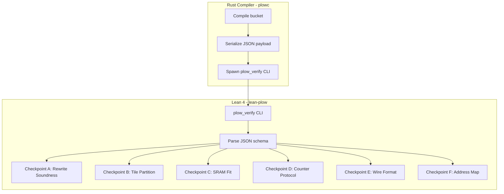
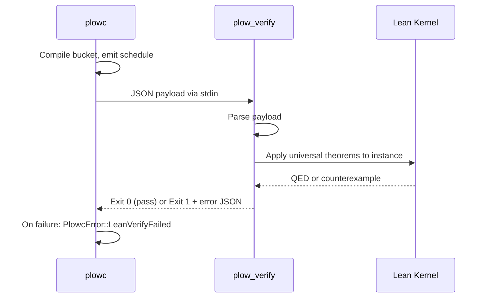

# 08 — Formal Verification

> Every compiled schedule can optionally pass through Lean 4 theorem provers that verify six correctness properties. Failures reject the compilation — proving correctness once at compile time rather than testing every possible runtime interleaving.

---

## Architecture



**Rust module:** [`crates/schedule/src/lean_verify.rs`](../../crates/schedule/src/lean_verify.rs) (feature-gated: `lean-verify`)  
**Lean project:** [`lean-plow/`](../../lean-plow/)  
**CLI binary:** `lean-plow/.lake/build/bin/plow_verify`

---

## The Six Checkpoints

### Checkpoint A — Rewrite Rule Soundness

**Property:** Every fusion rule in `rules.egg` preserves semantic equivalence.

**How:** Each rule `(rewrite (LHS ?args) (RHS ?args))` has a corresponding Lean theorem:

```lean
theorem gemm_silu_fuse_sound (a b : Tensor) :
    silu (gemm a b) = gemm_silu a b
```

**Module:** [`lean-plow/Plow/Rewrite.lean`](../../lean-plow/Plow/Rewrite.lean)

**What it proves:** The fused form produces bit-identical output to the unfused form (under IEEE 754 associativity relaxation where annotated).

**Verification:** The compiler parses `rules.egg`, extracts rule names, and checks that every name has a corresponding Lean theorem in the catalog.

### Checkpoint B — Tile Partition Validity

**Property:** The tile decomposition covers the full GEMM shape with no gaps or overlaps, and per-tile work ≤ cost bound.

**Module:** [`lean-plow/Plow/TilePartition.lean`](../../lean-plow/Plow/TilePartition.lean)

**What it proves:**
```lean
theorem partition_covers (M N K bm bn bk : Nat) :
    (∀ i j, i < M → j < N → ∃ tile ∈ partition, (i, j) ∈ tile.region)

theorem partition_disjoint (M N K bm bn bk : Nat) :
    (∀ t1 t2 ∈ partition, t1 ≠ t2 → t1.region ∩ t2.region = ∅)
```

**Payload:** The compiler sends `(M, N, K, bm, bn, bk, splits)` per GEMM; Lean verifies the arithmetic.

### Checkpoint C — SRAM Temporal Fit

**Property:** No SM's page pool is overcommitted at any point in the schedule.

**Module:** [`lean-plow/Plow/Sram.lean`](../../lean-plow/Plow/Sram.lean)

**What it proves:** For every cycle `t` and SM `s`, the sum of live pages ≤ `pages_per_sm`.

**Payload:** Per-SM page allocation timeline (task → [alloc_start, free_end, pages]).

**Note:** This is opt-in and expensive for large schedules. The scheduler's `PagePool` already enforces this invariant; the Lean check is a defense-in-depth double-check.

### Checkpoint D — Counter Protocol Correctness

**Property:** The counter-gated schedule enforces every data dependency in the TileGraph. No consumer can start before all its producers complete.

**Module:** [`lean-plow/Plow/Protocol.lean`](../../lean-plow/Plow/Protocol.lean)

**Universal theorems (proved once, applied to every schedule):**

```lean
-- The counter protocol's happens-before relation covers the dependency DAG
theorem protocol_covers_deps :
    ∀ edge ∈ dag.edges, happensBefore schedule edge.src edge.dst

-- Resource ordering is a subset of happens-before
theorem resourceOrdered_sub_happensBefore :
    resourceOrdered schedule ⊆ happensBefore schedule

-- Well-formed schedules are deadlock-free
theorem WellFormed.no_deadlock :
    ∀ s : Schedule, WellFormed s → ¬Deadlock s
```

**Payload:** The counter graph (counter ID → producers × consumers × threshold × scope) + placement map.

### Checkpoint E — Wire Format Round-Trip

**Property:** `Program.decode(Program.to_bytes(p)) == Ok(p)` for the specific compiled program.

**Module:** [`lean-plow/Plow/Wire.lean`](../../lean-plow/Plow/Wire.lean)

**What it proves:** The binary encoding/decoding is lossless — no field gets silently truncated or misaligned.

**Payload:** The encoded `.pkt` bytes + the expected decoded `Program` structure.

### Checkpoint F — Address Map Validity

**Property:** All memory allocations in the address map are:
1. Non-overlapping (no two buffers share bytes)
2. Within the arena bounds
3. Properly aligned

**Module:** [`lean-plow/Plow/Memory.lean`](../../lean-plow/Plow/Memory.lean)

**Payload:** The full `MemoryMap` JSON (per-buffer offset, size, alignment).

---

## Verification Flow



### JSON-IPC Protocol

The Rust compiler serializes a checkpoint-specific JSON payload:

```json
{
  "checkpoint": "B",
  "bucket_id": 3,
  "gemms": [
    {"m": 2048, "n": 4096, "k": 512, "bm": 128, "bn": 128, "bk": 64, "splits": 1}
  ]
}
```

The Lean CLI returns structured results:

```json
{
  "status": "pass",
  "checkpoint": "B",
  "theorems_applied": ["partition_covers", "partition_disjoint"],
  "time_ms": 42
}
```

---

## Lean Project Structure

```
lean-plow/
├── lakefile.lean          # Build configuration
├── lean-toolchain         # Lean version pin
├── Main.lean              # CLI entry point (plow_verify)
├── Plow.lean              # Module root
└── Plow/
    ├── Basic.lean         # Core definitions (Tensor, Op, Schedule)
    ├── Rewrite.lean       # Checkpoint A: rule soundness theorems
    ├── TilePartition.lean # Checkpoint B: partition coverage
    ├── Sram.lean          # Checkpoint C: SRAM temporal fit
    ├── Protocol.lean      # Checkpoint D: counter protocol
    ├── Wire.lean          # Checkpoint E: wire format
    ├── Memory.lean        # Checkpoint F: address map
    ├── Verify.lean        # Top-level verification orchestrator
    ├── Cost.lean          # Cost bound proofs
    ├── CostBounds.lean    # Parametric cost theorems
    ├── KvPool.lean        # KV cache allocation proofs
    ├── Prefetch.lean      # Prefetch ordering proofs
    ├── Wave.lean          # Wavefront clustering proofs
    ├── Layout.lean        # Layout transformation proofs
    ├── Row.lean           # Row-op correctness
    ├── Attn.lean          # Attention correctness
    ├── SplitK.lean        # Split-K reduction correctness
    └── CLI/
        ├── Checkpoints.lean  # Checkpoint dispatch
        ├── Payload.lean      # JSON deserialization
        └── Schema.lean       # Payload schema types
```

---

## Design Decisions

### Decision: Lean 4 (not Coq, not Agda, not Z3)

**Chosen:** Lean 4 with `Decidable` instances for compile-time-checkable properties.

**Alternatives:**
1. Coq — more mature ecosystem, but slower kernel and worse metaprogramming
2. Agda — dependent types but no automation (manual proofs for everything)
3. Z3/SMT — fast for decidable fragments but can't prove universal theorems
4. Property-based testing (QuickCheck) — probabilistic, not proof

**Rationale:**
- Lean 4 has a native code compiler → `plow_verify` runs in ~50ms per checkpoint (fast enough for CI)
- `Decidable` type class lets many properties be checked by computation, not proof construction
- The CLI model (serialize → invoke → parse result) decouples Lean from Rust without FFI
- Lean's metaprogramming (`macro`, `elab`) enables auto-generating proof obligations from the JSON payload
- The Lean community is small but active in formal verification of programs (vs Coq's math focus)

**Counter-claim: Lean 4 is immature.** Response: The proofs are foundational (arithmetic, set theory, induction on finite structures). They don't depend on unstable library features — just `Nat`, `List`, `Fin`, and basic tactics. Lean 4's kernel is trustworthy for this fragment.

**Counter-claim: Formal verification is overkill.** Response: GPU coordination bugs manifest as silent data corruption (wrong tokens) or hangs (deadlock). They're not caught by unit tests because they depend on timing. A proof eliminates the entire class — permanently, for all inputs. The cost is writing the theorem once; the benefit is never debugging a counter race again.

### Decision: Universal Theorems + Per-Instance Application

**Chosen:** Prove general theorems (e.g. "any well-formed counter graph is deadlock-free") once; apply them to each compiled schedule by checking the preconditions.

**Alternative:** Prove each individual schedule correct from scratch.

**Rationale:**
- Universal theorems are proved once and amortized across all compilations
- Per-instance verification reduces to checking preconditions (is this schedule well-formed?) — which is decidable and fast
- Adding a new model/bucket doesn't require new proofs — just new instances of existing theorems

### Decision: JSON-IPC (not FFI, not linked library)

**Chosen:** Lean CLI invoked via `std::process::Command` with JSON over stdin/stdout.

**Alternative:** Link Lean as a shared library into the Rust compiler via C FFI.

**Rationale:**
- Complete isolation: Lean segfault doesn't crash the compiler
- Simple deployment: `plow_verify` is a separate binary, versioned independently
- Feature-gatable: `#[cfg(feature = "lean-verify")]` makes Lean entirely optional
- Cross-platform: JSON-IPC works on any OS; FFI bindings are platform-specific
- Debuggable: `cat payload.json | plow_verify` for manual testing

**Counter-claim: Process spawn overhead.** Response: ~2ms per invocation (fork + exec). With 6 checkpoints × 4 buckets = 24 invocations, total overhead is ~50ms — negligible compared to the scheduler's runtime (seconds).

### Decision: Opt-In Verification (not mandatory)

**Chosen:** Lean verification is controlled by `--lean-verify` flag. Default: off.

**Rationale:**
- Lean toolchain is not universally installed (requires `elan` + `lake build`)
- Development iteration speed matters: most edits don't affect proven properties
- CI always runs it; developers run it before merge
- The scheduler's built-in `verify::verify_schedule()` (Rust, fast, no external deps) catches the common cases; Lean is the gold-standard backup

---

## Test Coverage

Integration tests verify the Lean pipeline end-to-end:

| Test | File | What it checks |
|------|------|---------------|
| Positive | [`lean_verify.rs`](../../crates/plowc/tests/lean_verify.rs) | All checkpoints pass for a valid schedule |
| Negative | [`lean_verify_negative.rs`](../../crates/plowc/tests/lean_verify_negative.rs) | Intentionally broken schedule is rejected |
| Rewrite | [`lean_verify_rewrite.rs`](../../crates/plowc/tests/lean_verify_rewrite.rs) | Rule catalog matches Lean theorems |
| Tile partition | [`lean_verify_tile_partition.rs`](../../crates/plowc/tests/lean_verify_tile_partition.rs) | Partition coverage for all tile shapes |
| Wire | [`lean_verify_wire.rs`](../../crates/plowc/tests/lean_verify_wire.rs) | Round-trip for sample programs |
| SRAM fit | [`lean_verify_sram_fit.rs`](../../crates/plowc/tests/lean_verify_sram_fit.rs) | Page pool never overflows |
| Schema | [`lean_verify_schema.rs`](../../crates/plowc/tests/lean_verify_schema.rs) | Payload schema matches Lean parser |
| Growable KV | [`lean_verify_growable_kv.rs`](../../crates/plowc/tests/lean_verify_growable_kv.rs) | KV growth entries pass address-map check |
