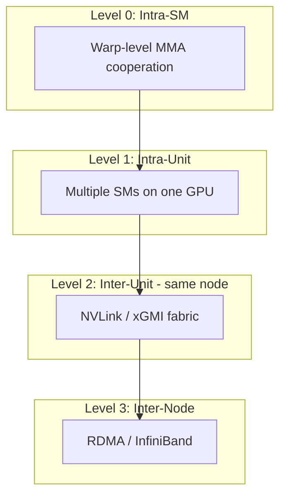
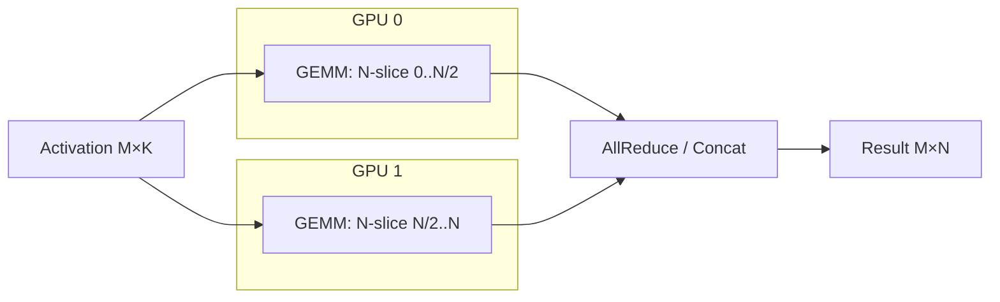
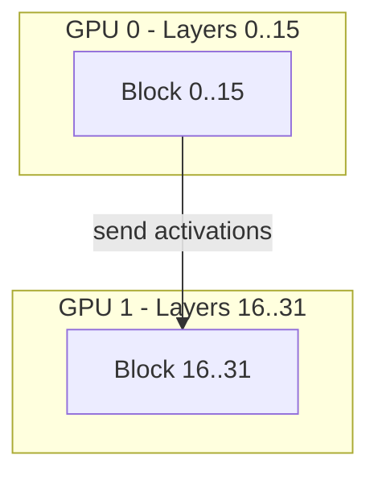
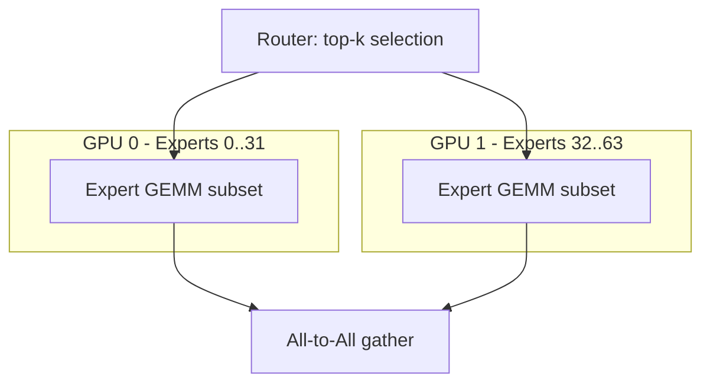
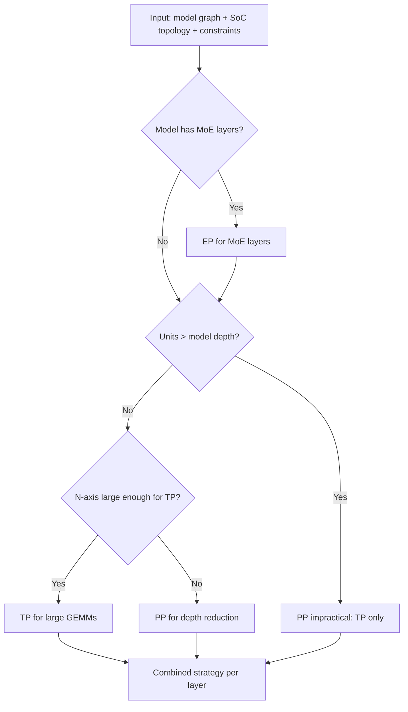

# 09 — Multi-GPU & Parallelism

> Multi-GPU support extends the single-GPU compiler path with a pre-pass that decides parallelism strategy, partitions the tile graph across units, and adds cross-unit counter scopes and collective operations.

---

## Parallelism Hierarchy



Plow models all four levels, but the compiler currently targets Levels 0-2 (within one node). Level 3 (inter-node) is planned via DPU-routed RDMA.

---

## Parallelism Strategies

**Module:** [`crates/plowc/src/lib.rs`](../../crates/plowc/src/lib.rs:60) — `Parallel` enum

```rust
pub enum Parallel {
    Single,           // One GPU
    Tensor(usize),    // TP: partition N across N units
    Pipeline(usize),  // PP: partition layers across units
    Expert(usize),    // EP: partition MoE experts across units
}
```

### Tensor Parallelism (TP)



**How it works:**
1. The N-axis of every GEMM is divided across units proportional to throughput
2. Each unit computes its slice independently (same A matrix, sliced B matrix)
3. A `Join` node collects partial results:
   - For column-parallel: concatenation (no reduction needed)
   - For row-parallel: all-reduce (sum partial products)

**Implementation:** `Soc::partition_n()` divides work; `assemble()` creates per-unit regions + Join nodes; the scheduler places Join on the unit that owns the consumer.

### Pipeline Parallelism (PP)



**How it works:**
1. Transformer blocks are partitioned across units (layers 0..L/2 on GPU 0, L/2..L on GPU 1)
2. Only boundary activations cross units (hidden_size × batch tensor per boundary)
3. Each unit compiles and schedules its blocks independently
4. A `CrossUnit` counter gates the inter-unit transfer

**Status:** Planned. Current implementation compiles all blocks to one unit.

### Expert Parallelism (EP)



**How it works:**
1. MoE layers route tokens to experts; experts are distributed across units
2. Each unit computes only its assigned experts
3. All-to-All communication redistributes results
4. The routing decision determines which tokens go where (dynamic at runtime)

**Status:** Schema support exists (`plow-asset::Experts`, `ExpertLayer`); compilation path planned.

---

## The Parallelism Planner

**Design §9.2:** Before tile assembly, a pre-pass decides the strategy:



### Strategy Selection Heuristic

| Condition | Strategy | Rationale |
|-----------|----------|-----------|
| Single unit | `Single` | No parallelism needed |
| N ≥ 4096 × n_units | `Tensor(n)` | N-axis large enough to partition without waste |
| N < 4096 × n_units | `Pipeline(n)` | Small N = TP gives too-small slices |
| MoE model | `Expert(n)` + TP/PP hybrid | Experts are naturally shardable |

---

## Cross-Unit Communication

### Counter Scope: CrossUnit

When a dependency crosses unit boundaries:
- Producer on GPU 0 signals `counter[id]` with system-scope atomic
- Consumer on GPU 1 spin-polls the same counter with system-scope load
- Counter pool is in **unified/system memory** (visible from all units)

### Handoff Kinds for Multi-Unit

| Scenario | HandoffKind | Data Movement |
|----------|-------------|---------------|
| Unified memory (NVLink) | `Barrier` | Fence only — consumer reads producer's output directly |
| Peer-to-peer (NVLink) | `P2p` | Consumer issues direct read over fabric |
| Discrete memory | `Rdma` | DPU copies from producer's HBM to consumer's HBM |

### Bandwidth Modeling

Cross-unit transfers consume interconnect bandwidth, modeled as a `BandwidthSet`:

```rust
// In ResourceState:
link: Vec<BandwidthSet>,  // one per link (e.g., NVLink 0, NVLink 1, ...)
```

The scheduler checks `bandwidth_set.capacity_ok(start, end, weight, limit)` before placing a cross-unit DMA, preventing link saturation.

---

## Static Layout Across Phases

### The Weight Layout Insight (Design §10)

```mermaid
flowchart LR
    subgraph Prefill - large M
        PF[Tile: bm=128, bn=128, bk=64]
    end
    subgraph Decode - M=1
        DC[Tile: bm=1, bn=128, bk=64]
    end

    W[Weight layout: K×N tiled as bk×bn blocks] --> PF
    W --> DC
```

**Key insight:** Weight layout depends on `(bn, bk)` but **not** on `bm`. Both prefill (large M) and decode (M=1) can share the same weight layout as long as they agree on `(bn, bk)`.

**Consequence:** Weights are laid out once per `(model, vendor, bn, bk)` — not per bucket. This eliminates redundant weight copies and enables sharing weights across prefill/decode buckets.

### KV Cache Layout

KV cache uses **page-table indirection** (design §10.6):
- Pages have a fixed token capacity (128 or 256)
- Layout within a page is the same across prefill and decode
- Only the page count (and thus address-map entries) varies per request
- `Growable` entries in the memory map accommodate dynamic page allocation

---

## Design Decisions

### Decision: TP as Outer Wrapper (not interleaved TP+PP)

**Chosen:** Tensor parallelism is applied uniformly to every GEMM in the model. PP partitions blocks across units.

**Alternative:** Interleaved TP+PP where some layers use TP and others use PP within the same forward pass.

**Rationale:**
- Uniform TP keeps the single-GPU compiler path clean — it just sees `n_units=1`
- The partition logic is in `Soc::partition_n()`, which naturally handles N/1 = full N for single-unit
- Interleaved strategies create heterogeneous communication patterns that complicate counter scoping
- For 2-8 GPU systems (the common case), pure TP with all-reduce is simpler and often faster than TP+PP

**Counter-claim: TP all-reduce creates a bubble.** Response: With NVLink-connected GPUs, all-reduce for a 4096-dim vector takes ~5μs. The GEMM that produced it took ~100μs. The bubble is 5% — acceptable. For large models where the bubble grows, PP becomes attractive — hence the `Parallel::Pipeline` option.

### Decision: N-Axis Partitioning (not M-axis, not K-axis)

**Chosen:** GEMM is split along N across units.

**Alternatives:**
1. Split along M (each unit handles a subset of batch rows)
2. Split along K (each unit does partial reduction, then all-reduce)

**Rationale:**
- N-axis split produces **independent** partial results (no reduction needed for column-parallel)
- M-axis split requires all units to have the full weight matrix (defeats the memory saving of TP)
- K-axis split requires an all-reduce to sum partial products — same communication as N-split but with mandatory reduction (strictly worse for column-parallel layers)
- N-axis aligns with the standard Megatron-LM TP strategy (proven at scale)

### Decision: Collectives as Tile Graph Nodes (not library calls)

**Chosen:** All-reduce/all-gather operations appear as `TileNode::Compute { kind: Join }` in the graph.

**Alternative:** Black-box NCCL/RCCL library calls outside the scheduler's visibility.

**Rationale:**
- Making collectives visible to the scheduler enables overlap: the scheduler can start independent compute while the collective runs
- Counter-gated: the collective waits on its input tiles and signals its consumers — same mechanism as any other node
- Vendor-neutral: the Join node's implementation is backend-specific, but its scheduling properties are uniform
- Debuggable: the collective appears in traces, simulation, and formal verification

**Counter-claim: NCCL is highly optimized for multi-GPU collective patterns.** Response: For now, Plow's collectives are simple point-to-point copies (the common case for 2-8 GPU TP is a ring or tree all-reduce that decomposes into pairwise transfers). If profiling shows NCCL outperforms, the Join node's kernel implementation can delegate to NCCL internally — the scheduling abstraction doesn't change.

---

## Cross-Vendor Multi-GPU

The multi-GPU system is designed for heterogeneous topologies:

| Topology | Counter Scope | Transfer Mechanism |
|----------|---------------|-------------------|
| 2×H100 NVLink | CrossUnit (system atomic) | P2p read over NVLink |
| 4×MI300 xGMI | CrossUnit (system atomic) | P2p read over Infinity Fabric |
| H100 + CPU | CrossUnit (system atomic) | PCIe DMA |
| Multi-node | CrossUnit (RDMA) | DPU-routed RDMA |

The cost model's `Soc` abstraction handles mixed units:

```rust
let soc = Soc {
    units: vec![
        SocUnit { spec: &H100_SXM, sm_range: 0..132 },
        SocUnit { spec: &H100_SXM, sm_range: 132..264 },
    ],
};
```

---

## Implementation Status

| Feature | Status | Notes |
|---------|--------|-------|
| `Parallel::Single` | ✅ Complete | Default path |
| `Parallel::Tensor(n)` | ✅ Complete | N-axis partitioning, Join nodes, cross-unit counters |
| Multi-unit `Soc` | ✅ Complete | `partition_n`, per-unit placement |
| `CrossUnit` counter scope | ✅ Complete | System-scope atomics |
| `HandoffKind::Barrier` | ✅ Complete | Unified memory fence |
| `HandoffKind::P2p` | ✅ Complete | Direct fabric read |
| `Parallel::Pipeline` | 🔲 Planned | Block partitioning across units |
| `Parallel::Expert` | 🔲 Planned | Schema exists, compilation path needed |
| `HandoffKind::Rdma` | 🔲 Planned | DPU integration |
| Multi-node (Level 3) | 🔲 Planned | Requires DPU runtime |
| Wavefront clustering for cross-unit | 🔲 Planned | Contention reduction |
