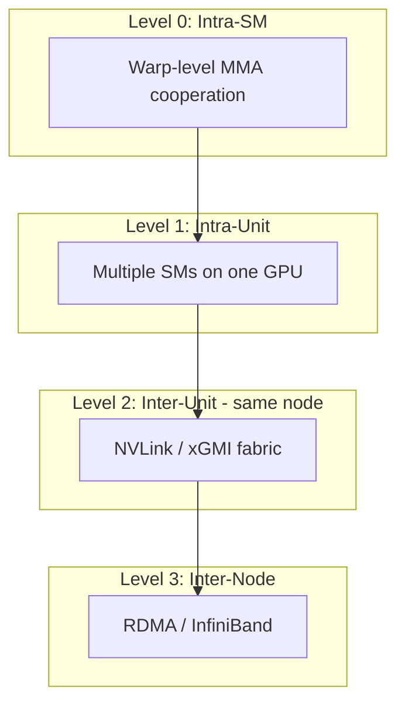
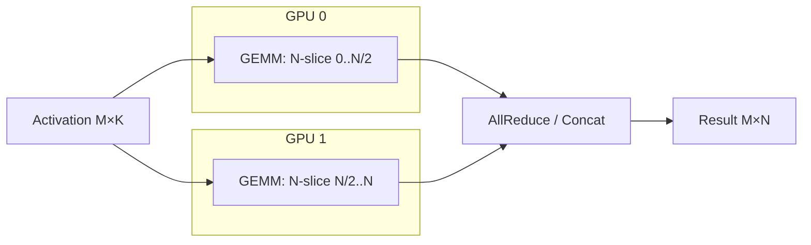
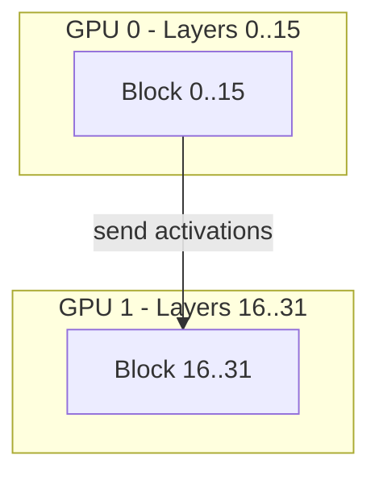
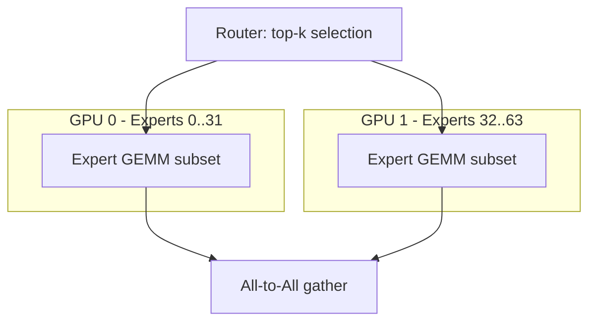
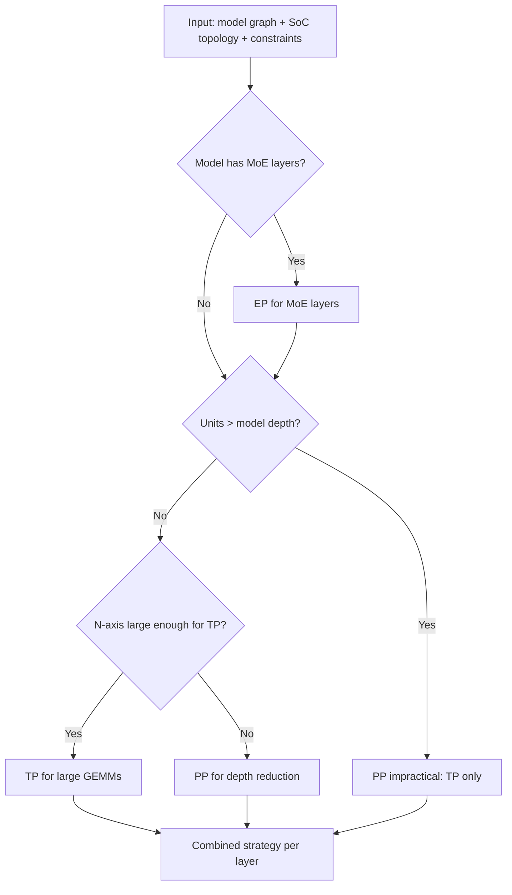

# 09 — Multi-GPU & Parallelism

> Multi-GPU support extends the single-GPU compiler path with a pre-pass that decides parallelism strategy, partitions the tile graph across units, and adds cross-unit counter scopes and collective operations.

---

## Parallelism Hierarchy



Plow models all four levels, but the compiler currently targets Levels 0-2 (within one node). Level 3 (inter-node) is planned via DPU-routed RDMA.

---

## Parallelism Strategies

**Module:** [`crates/plowc/src/lib.rs`](../../crates/plowc/src/lib.rs) — `Parallel` enum

`Parallel` is the `--parallel` CLI selector: unit variants, no payload. The GPU
count is carried separately by `--num-gpus` (`Options::num_gpus`).

```rust
pub enum Parallel {
    Tp, // tensor-parallel: split each GEMM along N across the GPUs (wired today)
    Dp, // data-parallel: replicate the model, shard the batch (not yet implemented)
    Pp, // pipeline-parallel: split layers across GPUs (not yet implemented)
    Ep, // expert-parallel: shard MoE experts across GPUs (not yet implemented)
}
```

There is no `Single` variant — a single GPU is `--num-gpus 1` with any strategy;
`build_soc` returns `Soc::single` when `num_gpus <= 1`. `Tp` is the default and
the only strategy `build_soc` accepts today; `Dp`/`Pp`/`Ep` are rejected with
`PlowcError::Parallelism` ("… is not yet implemented (only tensor-parallel)").

A separate derivation helper (`crates/plowc/src/parallel.rs`) computes a
`ParallelConfig { tp, pp, ep, dp }` (all `u32`, product = device count) from a
`ModelSpec` and per-device HBM via `derive_parallel`, with `validate` checking
divisibility/fit. That is the auto-sizing path; the `Parallel` enum above is the
user-facing strategy selector.

### Tensor Parallelism (TP)



**How it works:**
1. The N-axis of every GEMM is divided across units proportional to throughput
2. Each unit computes its slice independently (same A matrix, sliced B matrix)
3. A `Join` node collects partial results:
   - For column-parallel: concatenation (no reduction needed)
   - For row-parallel: all-reduce (sum partial products)

**Implementation:** `Soc::partition_n` (in [`crates/costmodel/src/unit.rs`](../../crates/costmodel/src/unit.rs)) splits a GEMM along N into per-unit `Region`s, each sized ∝ its unit's throughput `weight` and rounded to that unit's MMA-N granularity; the tile-graph builder ([`crates/rewrite/src/tilegraph.rs`](../../crates/rewrite/src/tilegraph.rs)) emits a `Compute::Join` that concatenates the per-region slices on unit 0. A single-unit `Soc` degenerates to one region covering all of N (today's single-GPU path).

### Pipeline Parallelism (PP)



**How it works:**
1. Transformer blocks are partitioned across units (layers 0..L/2 on GPU 0, L/2..L on GPU 1)
2. Only boundary activations cross units (hidden_size × batch tensor per boundary)
3. Each unit compiles and schedules its blocks independently
4. A `CrossUnit` counter gates the inter-unit transfer

**Status:** Not implemented. `Parallel::Pp` is rejected by `build_soc`; the current implementation compiles all blocks to one unit.

**Deviation from implementation:** The design describes device-level PP. In code, `crates/plowc/src/parallel.rs` also carries a `pp` field on `ParallelConfig` and `derive_parallel` will compute `pp > 1` when weights still overflow after TP+EP, but no compilation path consumes it — the value is advisory only.

### Expert Parallelism (EP)



**How it works:**
1. MoE layers route tokens to experts; experts are distributed across units
2. Each unit computes only its assigned experts
3. All-to-All communication redistributes results
4. The routing decision determines which tokens go where (dynamic at runtime)

**Status:** Not implemented as cross-unit EP. Schema types exist (`plow_asset::Experts`, `plow_asset::ExpertLayer`) and single-unit MoE is compiled/served, but `Parallel::Ep` is rejected by `build_soc`; expert sharding across units is future work.

---

## The Parallelism Planner

Before tile assembly, a pre-pass decides the strategy:



### Strategy Selection Heuristic

`derive_parallel` ([`crates/plowc/src/parallel.rs`](../../crates/plowc/src/parallel.rs)) picks a `ParallelConfig { tp, pp, ep, dp }` whose product equals the device count. The order it applies:

| Step | Field set | Rationale |
|------|-----------|-----------|
| Single device (`num_devices <= 1`) | `tp=pp=ep=dp=1` | No parallelism needed |
| Smallest TP that fits weights + KV + activations in 75% of HBM | `tp` (∈ {1,2,4,8}, must divide `heads` and `inter`) | N-axis partition without waste |
| MoE model, devices left after TP | `ep` (largest divisor of `n_experts`) | Experts are naturally shardable |
| Weights still overflow after TP·EP | `pp` (⌈overflow⌉, capped by layers / devices) | Depth reduction |
| Remainder | `dp = num_devices / (tp·pp·ep)` | Batch replication |

**Deviation from implementation:** `derive_parallel` produces `tp`/`pp`/`ep`/`dp` factors, but only `tp` (via `--num-gpus` + `Parallel::Tp`) is honored by the compile path today; `dp`/`pp`/`ep` are computed but not yet compiled (`build_soc` rejects the non-`Tp` strategies). The thresholds above (75% HBM headroom, TP candidate set) are the code's actual heuristic, not the "N ≥ 4096 × n_units" rule of thumb this section previously described.

---

## Cross-Unit Communication

### Counter Scope: CrossUnit

When a dependency crosses unit boundaries:
- Producer on GPU 0 signals `counter[id]` with system-scope atomic
- Consumer on GPU 1 spin-polls the same counter with system-scope load
- Counter pool is in **unified/system memory** (visible from all units)

### Handoff Kinds for Multi-Unit

| Scenario | HandoffKind | Data Movement |
|----------|-------------|---------------|
| Unified memory (NVLink) | `Barrier` | Fence only — consumer reads producer's output directly |
| Peer-to-peer (NVLink) | `P2p` | Consumer issues direct read over fabric |
| Discrete memory | `Rdma` | DPU copies from producer's HBM to consumer's HBM |

`HandoffKind` ([`crates/rewrite/src/tilegraph.rs`](../../crates/rewrite/src/tilegraph.rs)) also carries the intra-unit variants `Hbm`, `SramSameSm`, `Dsm`, and `L2Local`; the three above are the cross-unit realizations chosen by the `collapse` pass.

### Bandwidth Modeling

Cross-unit transfers consume interconnect bandwidth, modeled by a `BandwidthSet` ([`crates/schedule/src/interval.rs`](../../crates/schedule/src/interval.rs)):

```rust
// In the scheduler's ResourceState (crates/schedule/src/resource.rs):
link: BandwidthSet,  // one aggregate interconnect capacity, not per-link
```

The scheduler calls `ResourceState::link_ok` — which delegates to `BandwidthSet::capacity_ok(start, end, weight, limit)` — before placing a cross-unit DMA, preventing link saturation. `link_next_feasible` / `reserve_link` complete the reservation API.

**Deviation from implementation:** The model tracks a single aggregate interconnect budget, not a `Vec` of per-link (NVLink 0, NVLink 1, …) budgets.

---

## Static Layout Across Phases

### The Weight Layout Insight (Design §10)

```mermaid
flowchart LR
    subgraph Prefill - large M
        PF[Tile: bm=128, bn=128, bk=64]
    end
    subgraph Decode - M=1
        DC[Tile: bm=1, bn=128, bk=64]
    end

    W[Weight layout: K×N tiled as bk×bn blocks] --> PF
    W --> DC
```

**Key insight:** Weight layout depends on `(bn, bk)` but **not** on `bm`. Both prefill (large M) and decode (M=1) can share the same weight layout as long as they agree on `(bn, bk)`.

**Consequence:** Weights are laid out once per `(model, vendor, bn, bk)` — not per bucket. This eliminates redundant weight copies and enables sharing weights across prefill/decode buckets.

### KV Cache Layout

KV cache uses **page-table indirection** (design §10.6):
- Pages have a fixed token capacity (128 or 256)
- Layout within a page is the same across prefill and decode
- Only the page count (and thus address-map entries) varies per request
- `Growable` entries in the memory map accommodate dynamic page allocation

---

## Design Decisions

### Decision: TP as Outer Wrapper (not interleaved TP+PP)

**Chosen:** Tensor parallelism is applied uniformly to every GEMM in the model. PP partitions blocks across units.

**Alternative:** Interleaved TP+PP where some layers use TP and others use PP within the same forward pass.

**Rationale:**
- Uniform TP keeps the single-GPU compiler path clean — it just sees `n_units=1`
- The partition logic is in `Soc::partition_n()`, which naturally handles N/1 = full N for single-unit
- Interleaved strategies create heterogeneous communication patterns that complicate counter scoping
- For 2-8 GPU systems (the common case), pure TP with all-reduce is simpler and often faster than TP+PP

**Counter-claim: TP all-reduce creates a bubble.** Response: With NVLink-connected GPUs, all-reduce for a 4096-dim vector takes ~5μs. The GEMM that produced it took ~100μs. The bubble is 5% — acceptable. For large models where the bubble grows, PP becomes attractive — hence the `Parallel::Pp` option (not yet implemented).

### Decision: N-Axis Partitioning (not M-axis, not K-axis)

**Chosen:** GEMM is split along N across units.

**Alternatives:**
1. Split along M (each unit handles a subset of batch rows)
2. Split along K (each unit does partial reduction, then all-reduce)

**Rationale:**
- N-axis split produces **independent** partial results (no reduction needed for column-parallel)
- M-axis split requires all units to have the full weight matrix (defeats the memory saving of TP)
- K-axis split requires an all-reduce to sum partial products — same communication as N-split but with mandatory reduction (strictly worse for column-parallel layers)
- N-axis aligns with the standard Megatron-LM TP strategy (proven at scale)

### Decision: Collectives as Tile Graph Nodes (not library calls)

**Chosen:** All-reduce/all-gather operations appear as `Compute::Join` nodes in the tile graph (`crates/rewrite/src/tilegraph.rs`).

**Alternative:** Black-box NCCL/RCCL library calls outside the scheduler's visibility.

**Rationale:**
- Making collectives visible to the scheduler enables overlap: the scheduler can start independent compute while the collective runs
- Counter-gated: the collective waits on its input tiles and signals its consumers — same mechanism as any other node
- Vendor-neutral: the Join node's implementation is backend-specific, but its scheduling properties are uniform
- Debuggable: the collective appears in traces, simulation, and formal verification

**Counter-claim: NCCL is highly optimized for multi-GPU collective patterns.** Response: For now, Plow's collectives are simple point-to-point copies (the common case for 2-8 GPU TP is a ring or tree all-reduce that decomposes into pairwise transfers). If profiling shows NCCL outperforms, the Join node's kernel implementation can delegate to NCCL internally — the scheduling abstraction doesn't change.

---

## Cross-Vendor Multi-GPU

The multi-GPU system is designed for heterogeneous topologies:

| Topology | Counter Scope | Transfer Mechanism |
|----------|---------------|-------------------|
| 2×H100 NVLink | CrossUnit (system atomic) | P2p read over NVLink |
| 4×MI300 xGMI | CrossUnit (system atomic) | P2p read over Infinity Fabric |
| H100 + CPU | CrossUnit (system atomic) | PCIe DMA |
| Multi-node | CrossUnit (RDMA) | DPU-routed RDMA |

The cost model's `Soc` abstraction ([`crates/costmodel/src/unit.rs`](../../crates/costmodel/src/unit.rs)) handles mixed units — each `Unit` carries a `UnitKind` (`Gpu`/`Npu`/`Cpu`), a throughput `weight`, and its own `CostModel`, over a `MemoryModel { unified }`:

```rust
pub struct Soc<'a> {
    pub units: Vec<Unit<'a>>,     // each: { id, kind, weight, cm }
    pub memory: MemoryModel,      // { unified: bool }
}
```

Today every unit is a GPU (`Soc::single` / `Soc::homogeneous`); the heterogeneous-unit path (mixing NPU/CPU) is scaffolding for future work.

---

## Implementation Status

| Feature | Status | Notes |
|---------|--------|-------|
| Single GPU (`--num-gpus 1`) | ✅ Complete | Default path; `Soc::single` |
| `Parallel::Tp` | ✅ Complete | N-axis partitioning, `Compute::Join` nodes, cross-unit counters |
| Multi-unit `Soc` | ✅ Complete | `partition_n`, per-unit placement |
| `CrossUnit` counter scope | ✅ Complete | System-scope atomics (`packet::Scope`) |
| `HandoffKind::Barrier` | ✅ Complete | Unified memory fence |
| `HandoffKind::P2p` | ✅ Complete | Direct fabric read |
| `derive_parallel` sizing helper | ✅ Complete | Emits `tp/pp/ep/dp`; only `tp` is consumed downstream |
| `Parallel::Pp` | 🔲 Not implemented | Rejected by `build_soc`; block partitioning across units is future work |
| `Parallel::Ep` | 🔲 Not implemented | Rejected by `build_soc`; schema types exist, cross-unit sharding needed |
| `Parallel::Dp` | 🔲 Not implemented | Rejected by `build_soc` |
| `HandoffKind::Rdma` | 🔲 Not implemented | DPU integration |
| Multi-node (Level 3) | 🔲 Not implemented | Requires DPU runtime |
| Wavefront clustering for cross-unit | 🔲 Not implemented | Contention reduction |
