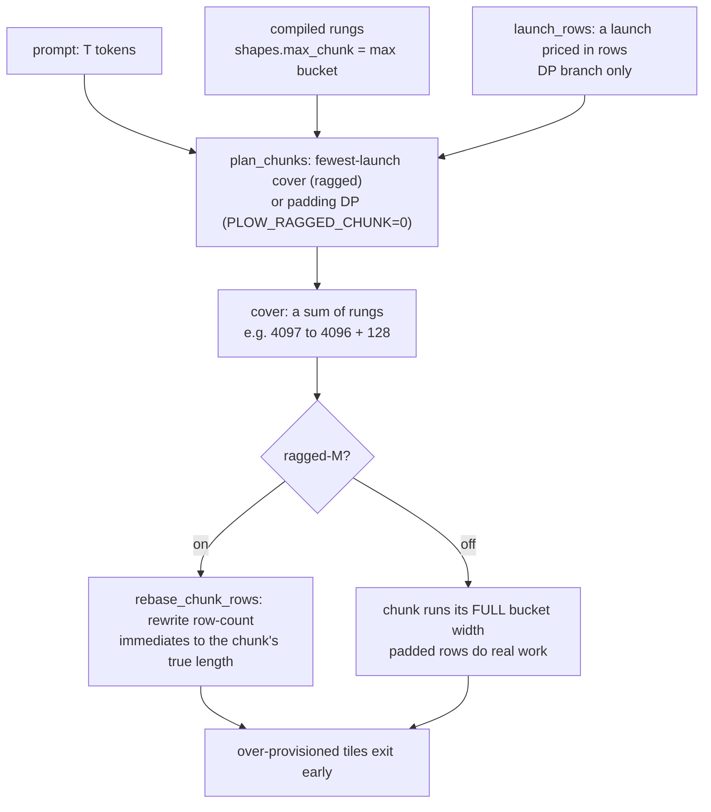

# 13 — Prefill Chunking: the Bucket Ladder and the Ragged Tail

> plow compiles a *program per prompt shape*, so a prompt must be covered by a sum of pre-compiled
> rungs. A prompt that does not land on a rung boundary pays a whole extra pass for its remainder.
> This chapter explains why the ladder exists, what the remainder costs *structurally*, why the
> obvious fixes do not work, and what does.
>
> Measurements live in `perf-data/plow-gfx942/`; this chapter states the design and cites them.

---

## Role in the System



**Modules:**
[`crates/plowrt/src/exec/amd.rs`](../../crates/plowrt/src/exec/amd.rs) — `plan_chunks`, `LAUNCH_ROWS`, `rebase_chunk_rows` ·
[`crates/plowrt/src/config.rs`](../../crates/plowrt/src/config.rs) — `ragged_chunk`, `launch_rows` ·
[`crates/devgen/src/mla.rs`](../../crates/devgen/src/mla.rs) — `glm_prefill_buckets`

---

## 1. Why there is a ladder at all

plow is ahead-of-time compiled. A prefill program is a packet stream with tile counts, CU
assignments, loop trip counts and counter thresholds **baked in at emit time**. The row count is
part of the program's identity, not an argument to it. So the emitter produces one program per
*rung* — for GLM-5.2 the ladder is `[128, 512, 1024, 2048, 4096, 8192]` — and the runtime covers a
prompt with a sum of rungs.

This is the direct consequence of the decision that buys plow its main advantages. Because shapes
are known at compile time there is no per-op launch, work can be placed on named CUs, and
dependencies are resolved by counters rather than stream ordering. The cost is **shape
quantisation**: the runtime cannot ask for an arbitrary number of rows unless the programs are built
to accept one.

A launch-based engine has the mirror-image tradeoff. vLLM's scheduler works on a *token budget* —
`num_new_tokens = min(num_new_tokens, token_budget)`, where `max_num_batched_tokens` is a maximum
rather than a quantum — so a 4097-token prompt runs as one step of exactly 4097 tokens. It can do
that because its kernels are shape-generic library calls taking M at runtime, and it pays for it
with a launch per op per layer. **Neither design is strictly better; they fail in different places,
and this chapter is about where ours fails.**

---

## 2. The structural fact: a pass has a large row-invariant cost

A prefill pass over the model's layers costs nearly the same whether it carries 128 rows or 1024.
The dominant term is narrow-M GEMM dispatch: at tiny M the matrix multiplies are latency- and
dispatch-bound. On GLM-5.2 / gfx942 the row-invariant share of a 128-row tail chunk is **~85%**.

Two consequences follow, and both are design constraints rather than tuning observations:

* **One extra token past a rung boundary costs most of a whole pass.** A remainder is not cheap
  because it is small.
* **The tail is not flat in T.** The tail chunk's flash attends over `c0 + tail` KV, so a remainder
  gets *dearer* the deeper into the prompt it sits. A cost model that treats the launch as a
  constant is wrong in a direction that matters.

**Only the sub-`max_chunk` case is addressable.** Past the widest rung a prompt needs more than one
pass however the remainder is handled; that launch is **structural, not waste**.

---

## 3. The planner, and why repricing cannot fix the tail

`plan_chunks` (delegating to `plan_chunks_cfg`) has **two branches**, keyed on the
`ragged` flag, both returning the cover largest-first (ragged chunk last):

* **`ragged` ON (the default)** — a greedy **fewest-launch** cover: take the
  widest bucket while the remainder exceeds it, then cover the remainder with the
  *smallest* bucket ≥ it. The result is `⌈n / max_bucket⌉` launches; `launch_rows`
  is never read.
* **`ragged` OFF (`PLOW_RAGGED_CHUNK=0`)** — the padding **dynamic program**,
  minimising in row units

  ```
  Σ over chunks ( bᵢ + launch_rows )
  ```

  quantised in units of the smallest bucket, where `launch_rows` prices one
  launch as a row-equivalent. The AMD constant is `LAUNCH_ROWS = 416` against a
  measured row-equivalent near 1650–1780 — **understated roughly 4×**.

The discussion below is about the padding-DP branch, since that is the one
`LAUNCH_ROWS` governs.

Repricing it is a genuine correction and still does not fix the tail. For a 4097-token prompt the
planner chooses between:

| cover | rows | modelled cost |
|---|---|---|
| `[4096, 128]` | 4224 | `4224 + 2·LR` |
| `[8192]` padded | 8192 | `8192 + LR` |

The two-chunk cover wins whenever `LR < 3968` — true at 416 *and* at the corrected value. **And it
should win**: padding up to the next rung measures far worse than a second launch. The planner is
not making a mistake at 4097; **the ladder simply cannot express "4097 rows in one pass."**

Repricing also loses on its own terms: at every length where either changes the plan, ragged-M is
the larger win, its output-visible blast radius is a **strict subset** of ragged's, and under
ragged-M the constant is never read. **The reprice is a partial ragged, not an alternative**, so
`LAUNCH_ROWS` is deliberately left at 416.

### 3.1 Finer rungs make it worse, not better

Adding 32/64-row rungs reduces *padding* — the term that is already small — while leaving the
per-pass fixed cost untouched, and it hands the DP more ways to add cheap-looking small chunks that
each cost a full pass. A remainder covered by one 128-row chunk could be split into 64+32 and pay
the fixed cost twice.

The NVIDIA engine reached this independently and records it in `pick_prefill_bucket`: 8190 rows ran
as 8 launches and measured **28% slower** than an 8390-row prompt's 3 launches — 200 *more* tokens
finishing sooner.

**Minimise launch count, not padded rows.**

---

## 4. The fix: ragged-M

Give the chunk its real row count at runtime and let over-provisioned tiles exit early.
`rebase_chunk_rows` rewrites every prefill row-count immediate to the chunk's true length via a
static opcode→field table, applied only where the field equals the bucket width; `in.kvlen` moves
with the flash's `n_tok`. Row-banded packets are **refused rather than half-rewritten**.

`PLOW_RAGGED_CHUNK` is **default ON**; `=0` restores the padding DP byte-identically.

> **An arm that merely omits the flag is no longer a control.** Every A/B in this area must set
> `PLOW_RAGGED_CHUNK=0` explicitly on its baseline or it silently becomes an A/A.

### 4.1 The two preconditions — both already satisfied on AMD

Worth knowing before porting, because the feasibility question looks harder than it is.

**(a) Gates must be satisfiable without doing the work.** A workgroup whose tile range is empty must
still signal its successors, or the pass hangs. On AMD it already does: `interp.hip` calls
`plow_exec` and then publishes successor counters **unconditionally, outside the opcode switch**.
No kernel change and no re-emit were needed.

**(b) Kernels must take the row count as a runtime operand.** They already do: `d_gemm_t` computes
`tm = ceil(M/BM)` with `r < M` guards; flash derives `n_work = n_batch·n_tok·n_grp·nsplit`; MoE ops
85/86 carry no `T` at all and follow `MoeAlignPf`'s meta.

---

## 5. The cap is the ladder, not a constant

There is **no `MAX_CHUNK` constant in the runtime**, and that is a deliberate architectural choice
rather than a cleanup. The runtime once filtered the compiled ladder through a hardcoded
`MAX_CHUNK = 8192` — a *second copy* of a number the packet already carries, since
`shapes.max_chunk` is defined as `max(prefill_buckets)` and the same emit sizes the KV ring from it.
A blob built with a wider rung therefore served **as if the rung were absent**: the constant could
only ever disagree with the blob, never inform it.

The cap is now the widest bucket the packet actually carries. Consequences:

* **Raising the cap for a model is an EMIT decision, not a runtime one.** `glm_prefill_buckets`
  tops out at 8192 by default and is deliberately left there — the ladder is shared by the whole MLA
  family (GLM, Kimi K3, DeepSeek) and a wider rung's memory cost is measured on one of them.
* **A wider rung is worthless without ragged-M.** Under the padding DP the rung is correctly unused
  below its own width — covering 8193 rows with one 16384-row chunk really does cost 8191 rows of
  dead compute. The two axes are one decision.
* The `RING ≥ window + chunk − 1` invariant is enforced where the ring is *sized*, at emit. It is a
  **sliding-window** bill: the MLA family is full-causal (`window = 0`), so `kv_ring` returns
  `(ctx, KV_MASK_NONE)` and the chunk does not size the cache at all.

---

## 6. The acceptance class: two numeric regimes, and ragged-M deletes one

Ragged-M changes long-form output at lengths where it changes the plan. **That property is
pre-existing, not introduced**: on unmodified pre-flip code, forcing a different rung via
`PLOW_LAUNCH_ROWS` produces text byte-identical to the ragged arm, both diverging from the
two-chunk plan at the same character. *Which rung runs a prompt already decides its wording.*

The measured structure of that property (`glm52-chunk-policy.md`):

**(a) Identical plan ⇒ byte-identical text**, exactly, in both directions.

**(b) The determinant is narrower than "the plan" — it is which BUCKET runs last.** Two arms with
different plans agree byte-for-byte whenever both end on a wide chunk. Every divergence has one arm
running a narrow tail against the other's wide chunk. **Padding per se is inert**: a rung padded
with dead rows and the same rung run at its real width give identical text.

So the engine has **two numeric regimes, not many**: a wide chunk and a narrow tail, assigned today
by whether a prompt's length happens to land on a rung. **Ragged-M moves prompts out of the
narrow-tail regime into the wide-chunk regime that every exactly-on-rung prompt already uses. It
does not add a regime; it deletes one.**

**(c) Where it diverges, it diverges early** — around 11% into a long answer. A short answer is
useless as an instrument here.

**(d) It is quality-neutral on the evidence available**, checked by the gate below rather than
asserted. Greedy ids match at the sampled lengths and top-1 logit margins dwarf the deltas, so this
is reassociation, not error.

Landing it means a majority of prompt *lengths* produce different long-form wording than before.
What makes that acceptable is that the engine already assigns wording by prompt length across
~189 distinct plans — the change permutes an existing lottery rather than creating one, and permutes
it toward the regime that is already the majority case.

### 6.1 Why this needed a quality gate, not a character-identity gate

What blocked ragged-M was not evidence of harm but the absence of a **gate**: character identity
fires on harmless reassociation and says nothing about correctness, so it cannot distinguish
*reworded* from *degraded*.

`perf-data/probes/facts_gate.py` is that gate — machine-checkable items across **off-rung** lengths,
compared pairwise (McNemar plus a net-regression cap and a per-class trip), with the checkable token
forced onto the last line so it sits past the divergence point. It refuses to report PASS when it is
*powerless* (weak baseline, poor format compliance, or answers landing early all exit 2), and it was
**proven to fail before it was trusted to pass** — an injected context fault at identical token
count exits non-zero with every regression attributed to the retrieval class.

That ordering is the reusable lesson. A gate that has never been shown to fail is not evidence.

---

## 7. Consequences for benchmarking

Prompt length interacts with the ladder, so a benchmark can accidentally measure the tail rather
than the model. plow's own harness prompts are 1023 / 4101 / 8196 / 16386 tokens — 1k carries no
tail while the others each carry one.

**When comparing against a launch-based engine, hold prompt length constant and state it.** A
ladder-quantised engine and a token-budget engine have different cliffs, and a length that is benign
for one can be adversarial for the other.

---

## 8. Portability

| target | status |
|---|---|
| **gfx942** | Implemented and default-ON. |
| **gfx950** | Applies with no porting — `exec/amd.rs` is the shared AMD engine. **Unvalidated**: the gate-protocol argument and kernel guards were checked against gfx942 objects only. Available, not proven. |
| **NVIDIA** | Problem present, fix portable in principle — the rewrite is packet-level. **Two preconditions must be re-verified**: that `interp_sm120.cu` publishes successors unconditionally (its `__syncthreads()`-based mechanism differs from `interp.hip`'s), and that the CUDA kernels carry the same runtime row-count guards. The default does not reach here; `ragged_chunk` is read only by `exec/amd.rs`. |

**The default's blast radius is every AMD model**, since `plan_chunks` and `rebase_chunk_rows` are
the shared AMD engine. Evidence covers a full-causal MLA model and a sliding-window model, the
latter byte-identical. `PLOW_RAGGED_CHUNK=0` is the escape hatch and is byte-identical to the
pre-flip engine.

**The cheapest cross-pollination runs the other way.** NVIDIA already reads its launch cost from
config (`nv.pf_chunk_cost`) where AMD hardcodes `LAUNCH_ROWS`. AMD should adopt that **only as a
fallback for the non-ragged path** — under ragged-M neither engine's constant is consulted, so
tuning it is work on a path ragged-M deletes.

---

## See also

- [03 — Scheduler](03-scheduler.md) — how a program's work is laid out per pass
- [05 — Counter Coordination](05-counter-system.md) — the gate protocol §4.1 relies on
- [07 — Cost Model](07-cost-model.md) — where launch pricing belongs
- [14 — AMD Arch Divergence](14-amd-arch-divergence.md) — why a duplicated constant is the recurring defect here

**Measurement record** (numbers, arms, spreads, and the corrections they force):

- `perf-data/plow-gfx942/glm52-chunk-policy.md` — the three-arm A/B, the acceptance class, the wider-rung costing
- `perf-data/plow-gfx942/glm52-facts-gate.md` — the quality gate, the injected fault that proves it goes red, the verdict
- `perf-data/plow-gfx942/glm52-ragged-tail-chunk.md` — the tail's first measurement
- `perf-data/plow-gfx942/glm52-current-cost-decomposition.md` — the gap attribution this came from
