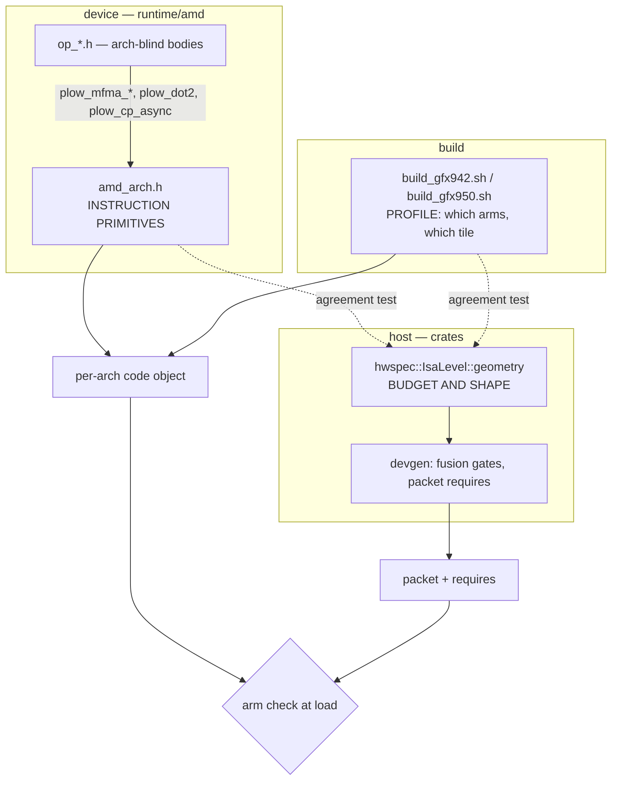

# 14 — AMD Arch Divergence: one source tree, two CDNA levels

> gfx942 (CDNA3, MI300X/MI325X) and gfx950 (CDNA4, MI350X/MI355X) run the SAME `runtime/amd/*.h`.
> This chapter records why that is a decision rather than an accident, which layer owns which kind
> of difference, the one place a genuine algorithm fork is justified, and the threshold at which
> the decision should be reopened.

---

## Role in the System

**Modules:**
[`runtime/amd/amd_arch.h`](../../runtime/amd/amd_arch.h) — instruction primitives ·
[`crates/hwspec/src/isa.rs`](../../crates/hwspec/src/isa.rs) — `IsaLevel::geometry` ·
[`crates/hwspec/tests/device_header_agreement.rs`](../../crates/hwspec/tests/device_header_agreement.rs) — the drift guard

---

## 1. The verdict

**Do not fork the kernels into per-arch source trees.** Three reasons, in order of weight:

1. **The divergence is small and it is not algorithmic.** About 0.2% of the AMD runtime's lines
   mention an arch macro at all, and the overwhelming majority select an *instruction* or a
   *constant*, not a different method (§2).
2. **Shared source keeps the two parts comparable, and comparability is what finds these bugs.**
   The claim to be careful with is the seductive one — "the other part runs the identical code
   correctly, so the fault is arch-specific." That reasoning is only as good as the evidence that
   the other part ever *ran* the code. It failed exactly that way once: a fold was assumed correct
   on gfx950 because gfx950 shipped it, when in fact gfx950 emitted the same broken packet and no
   long-prompt run had ever reached the bucket that triggers it (§5). What shared source really buys
   is weaker and more durable — a *single* body to fix, one set of markers, and a diff that means
   something. Two trees drift; nothing compares them.
3. **A fork relocates the maintenance cost rather than removing it.** The real cost is in §5, and
   it is not `#if`.

---

## 2. The divergence, measured

Counting rule: non-comment lines in `runtime/amd` mentioning `PLOW_CDNA4`, `PLOW_HAS_MX_CVT`,
`PLOW_HAS_MX_MMA`, `PLOW_LDS_MAX_BYTES`, `__gfx950__` or `__gfx942__`. Comments are excluded —
this file set carries its rationale inline, and prose about an arch is not a conditional site.

| | lines | arch sites | % |
|---|--:|--:|--:|
| `amd_arch.h` (the file whose job is to hold them) | 408 | 15 | 3.68% |
| all op bodies + `amd_common.h` + `interp.hip` | 23,965 | 39 | **0.16%** |
| **whole AMD runtime** | **24,373** | **54** | **0.22%** |

31 of the 54 are true `#if`/`#elif`; the rest are ordinary expressions
(`constexpr bool DIRECT = PLOW_CDNA4 && …`). The largest op file, `op_attention.h`, carries 7 sites
in 5,121 lines. **There is no op body where arch conditionals are a structural feature of the code.**

Re-measure with this rule before reopening §6 — not on the impression that "there are a lot of
`#if`s", because there are 31 in 24,373 lines.

---

## 3. Who owns what

Three layers. The boundary between them is what keeps §2 low.

### 3.1 `amd_arch.h` owns INSTRUCTION PRIMITIVES

Op bodies call wrappers; they never name a builtin only one arch has. Before this header existed,
every CDNA4-only builtin was called unconditionally and the interpreter compiled for gfx950 and
nothing else.

| primitive | CDNA4 | CDNA3 |
|---|---|---|
| bf16 MFMA | `32x32x16` / `16x16x32` | `32x32x8` / `16x16x16`, issued twice |
| fp8 MFMA | `32x32x64_f8f6f4`, scaled form available | `32x32x16_fp8_fp8`, unscaled |
| fp8 encoding | OCP e4m3 | e4m3**FNUZ** — `0x80` is NaN, every other byte is half its OCP value |
| MX converts / fp4 | `cvt_scalef32_*`, native | native convert absent; exact software e2m1 decode for w4a16 |
| `global_load_lds` | 16 B/lane | 4 B/lane |

The fragment map (`MFMA_M/N/K = 32/32/16`) is identical on both, so no call site re-indexes: one
CDNA4 issue is exactly two CDNA3 issues over the two halves of the same lane fragment, same
accumulator, same f32 accumulation order per k-step. **That equality is what makes a bit-identical
cross-arch GEMM comparison meaningful**, and it is worth preserving deliberately.

gfx942 implements w4a16 by decoding checkpoint fp4 weights to bf16 before the dot or MFMA. True
A4W4 still requires an architecture-specific body because CDNA3 has no native fp4 matrix core.
Unsupported encodings must be refused by the packet/object capability handshake rather than
silently producing a plausible value.

### 3.2 The per-arch geometry table owns BUDGET AND SHAPE

Not instructions — sizes. These necessarily exist in several places; each is now *checked* against
one source of truth rather than independently maintained:

| statement | where | checked by |
|---|---|---|
| host model (the source of truth) | `hwspec::IsaLevel::geometry()` | — |
| device-side ceiling | `PLOW_LDS_MAX_BYTES` in `amd_arch.h` | header-agreement test |
| device-side tile / stage default | `#if PLOW_CDNA4` in `op_gemm.h` | header-agreement test |
| shipped decode profile | `PLOW_OCC4` branch in `build_gfx942.sh` | header-agreement test |
| probe recipe | `AMD_PREFILL_DEFINES_CDNA3` in `kernelcaps` | `cdna3_recipe_matches_the_arch_geometry` |
| packet `requires`, emitter fusion gate | `devgen::manifest`, `devgen::gm_lds_halves()` | derived — no literals |

| | gfx942 (CDNA3) | gfx950 (CDNA4) |
|---|--:|--:|
| LDS / workgroup | 65,536 B | 163,840 B |
| `GM_DBUF` | 1 | 2 |
| prefill tile | 192×256×64 → 64,512 B | 256×256×64 → 147,456 B |
| decode tile (shipped) | 128×256×32 (`PLOW_OCC4`) | 256×256×64 |
| decode arena `GM_LDS_HALVES` | **15,360** | **73,728** |

### 3.3 The build scripts own the PROFILE

Which object gets which arm — `PLOW_OCC4`, `PLOW_L2HIER`, `PLOW_MOE_DEC_LG`. These are per-part
*decisions*, not per-part *code*, and they belong where the object is built. `op_gemm.h` defaults to
the CDNA3 tile off `PLOW_CDNA4` for exactly this reason: a build that forgets a flag still gets a
tile that fits, rather than one that fails the LDS limit at link time.

---

## 4. Where a genuine fork IS justified

**Tier-E fp8 GEMM.** gfx950 reaches fp8 through a scaled `32x32x64_f8f6f4` that applies the block
scale *inside* the MFMA. gfx942 has no analogue: its widest fp8 MFMA is K=16 and unscaled, and its
operand format is e4m3FNUZ rather than OCP. That is not one algorithm with two spellings — it is a
different loop shape (4× the K per issue), a different epilogue (an explicit `PLOW_FP8_MMA_FIX`
scale the scaled form does not need), and a different staging fixup (`GM8_FIX8` zeroes `0x80` in
registers before the operand reaches LDS, because on FNUZ that byte is NaN and would poison the
tile).

The right shape is **a separate function in the same file**, dispatched by an arch predicate — which
is what `d_gemm_fp8_t` and the A4W4 grouped-MoE bodies already are. Not a separate tree, and not a
200-line `#if` inside one body. The test for whether a fork was done right:

- the two functions sit next to each other and are read together;
- everything they share — tiling, LDS layout, epilogue plumbing — is still shared;
- the arch predicate appears once, at the dispatch, not throughout.

When one arch has no implementation, keep the refusal beside the implemented body and expose it
through the packet/object capability contract; do not compile a silent fallback.

---

## 5. The maintenance cost that IS real

It is not `#if`. It is **a value duplicated across the host/device boundary and keyed by arch ad
hoc** — and it has shipped silent corruption more than once.

**The canonical instance.** `devgen`'s `GM_LDS_HALVES` mirror held the CDNA4 value on every part.
Fused decode GEMVs stage `x` only through LDS, so the emitter choosing a fused opcode is a *promise*
that `M·K` fits. A host believing 73,728 fuses batches far past what a gfx942 occ4 object's 15,360
actually holds, and the surplus rows are written past the end of `plow_smem`. Symptom: a device
exception at higher concurrency, fluent-but-wrong text otherwise. **No batched-decode blob was ever
correct on gfx942, and nothing failed to build.**

Two properties made it invisible, and both generalise:

- **It is silent by construction.** The host is not asking the device anything; it is *remembering*.
  A stale memory produces a confident wrong answer.
- **It only bites off the default path.** Every gfx942 emit at batch 1 fits both arenas, so the bug
  needed batched decode on CDNA3 — a combination only ever serve-gated on CDNA4.

**The same shape has three siblings**, which is why it gets a section rather than a footnote: an
arm implemented on one backend and never written on the other while the emitter folded operands for
it regardless; a runtime `MAX_CHUNK` constant shadowing the packet's own `shapes.max_chunk`; and a
config field parsed but read nowhere while the code read the environment variable directly. In every
case the duplicate worked and the original rotted.

**The guards.** `crates/hwspec/tests/device_header_agreement.rs` reads `op_gemm.h`, `amd_arch.h` and
`build_gfx942.sh` **as text** and fails when the host table disagrees. Text rather than the
preprocessor is deliberate: `kernelcaps` already probes these macros through hipcc, and a check that
needs a toolchain is a check that gets skipped on the machine where the edit is made.

The instruction-selection twin is `scripts/asm_audit.py` with per-arch expectation files. The two
contracts are **inverses** — `v_mfma_f32_32x32x16_fp8_fp8` is forbidden on gfx950 (selecting it is
half rate) and required on gfx942 (it is the only fp8 MFMA the silicon has). One expectation file
cannot state both, so the audit reads each object's arch from its own ELF header and refuses a
cross-arch pairing. Without that, pointing the audit at the wrong arch produced a *correct
disassembly checked against an inverted contract* — a clean pass against the wrong rules.

**Every one of these guards was demonstrated failing before it was trusted.** A consistency check
that has never gone red is not evidence that the things it compares agree.

---

## 6. The tripwire

Split an op into per-arch bodies when **either** holds:

- its arch-conditional sites exceed **~15% of its lines**; or
- any one op body has more `#if` than shared code.

Today the whole AMD runtime is at **0.22%** and the worst op file at 0.38% — a factor of ~40 from
the threshold.

A third condition, which no measurement can see: **split when the two arches stop being able to
share a test.** The value of one tree is that a fix, a marker, and a golden comparison each apply
once. When that stops being true, the tree has already forked in everything but layout.

---

## See also

- [07 — Cost Model](07-cost-model.md) — where the LDS budget filters tiles
- [11 — Tuning Coverage](11-tuning-coverage.md) — why a measurement is keyed by ISA and build, not SKU name
- [13 — Prefill Chunking](13-prefill-chunking.md) — the `MAX_CHUNK` sibling of §5's defect class
- `runtime/amd/amd_arch.h` — the instruction-primitive layer, with the clang diagnostics that motivated each wrapper
- `scripts/asm_expect_gfx942.json` — the CDNA3 instruction-selection contract
- `perf-data/plow-gfx942/arch-hygiene.md` — the audit this chapter concludes
