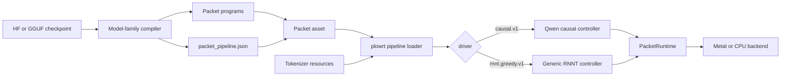
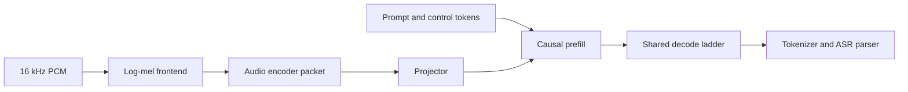
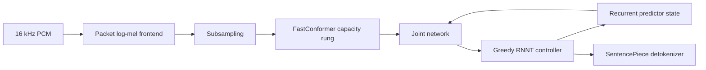

# ASR packet pipelines

Plow represents speech recognition as a packet pipeline rather than a model mode
inside the runtime. The compiled asset declares its driver, programs, tensors and
geometry. `plowrt` binds that declaration to a backend and supplies audio,
tokenizer resources and request scheduling.

This keeps model-family code out of the packet executor. Qwen3-ASR and Nemotron
3.5 use different frontends and decoders, but share the asset contract, runtime
interface and serving layer.

## Components and ownership

| Layer | Owns | Does not own |
|---|---|---|
| Model compiler | Checkpoint names, graph lowering, capacity ladders, packet metadata | Serving policy |
| Packet asset | Driver name, program roles, tensor roles, scalar parameters | Host model classes |
| ASR adapter | Audio frontend, tokenizer, language rules, decode controller | Device-specific dispatch |
| Packet runtime | Tensor lookup, transfers, copies and numbered program execution | ASR semantics |
| Serving mux | Admission, microbatch formation, cancellation and result ordering | Model architecture |
| HTTP/WebSocket layer | Protocol validation, audio limits, credit and final delivery | Kernel selection |

The shared packet metadata schema is `PacketPipelines` in
`crates/plow-asset/src/packet_pipeline.rs`. A pipeline contains:

- `name`: the public pipeline/model identifier used by serving;
- `driver`: the host controller ABI, currently `causal.v1` or
  `rnnt.greedy.v1` for ASR;
- `programs`: semantic roles mapped to packet program numbers;
- `tensors`: semantic roles mapped to checked tensor names, dtypes and shapes;
- `parameters`: bounded scalar geometry and controller settings.

The loader validates the descriptor against the packet before inference. Runtime
controllers bind roles instead of relying on checkpoint tensor names or program
ordering.

## Compile and load flow

`load_packet_transcriber` accepts one supported ASR pipeline per packet. Multiple
ASR pipelines are rejected until the CLI has an explicit pipeline selector. The
loader returns a `Transcriber`, the selected pipeline name, driver and backend.
Serving therefore identifies a model by the packet pipeline name rather than by
a hard-coded ASR flag in the packet runtime.

## Qwen3-ASR causal pipeline

Qwen3-ASR uses a Whisper-compatible log-mel frontend, an audio tower and
projector, then a causal language-model decoder with audio embeddings overlaid
at declared token positions.

The compiler marks current audio packets with `qwen_audio_graph_v1`. On Metal,
that contract selects the specialized audio executor. An older packet without a
compatible marker falls back to the checked checkpoint-weight implementation;
it is not sent through the unsafe persistent generic audio walk. This makes
stale assets fail safely while rebuilt assets retain the optimized path.

Qwen exposes physical decode slots through `Transcriber::batch_capacity`.
Requests are packed into active slots, encoder and prefill currently run per
recording, and decode runs across the occupied prefix. Cancellation and input
errors retire individual members; a device failure terminates the whole cohort.

## Nemotron RNNT pipeline

Nemotron 3.5 uses a cache-aware FastConformer encoder and a recurrent RNNT
predictor/joint network. The compiler emits the generic `rnnt.greedy.v1`
contract, including frontend geometry, duration-capacity encoder programs,
predictor state tensors, joint rungs and blank-token policy.

The greedy controller is backend-neutral. It selects the smallest encoder
capacity covering the valid frames, retains predictor state in packet tensors,
batches joint frames up to the compiled limit and enforces the maximum symbols
per frame. Model-specific code only maps GGUF metadata and vocabulary resources
into this contract.

## Packet runtime and backends

`PacketRuntime` is the accelerator boundary. Controllers can resolve a tensor,
read or write it, copy between tensors and execute a numbered program or program
sequence. A backend implements those operations and the packet opcodes; it does
not implement Qwen or Nemotron control flow.

| Path | Metal | CPU | CUDA/HSA |
|---|---:|---:|---:|
| `rnnt.greedy.v1` packet controller | Verified | Available for correctness | Packet-runtime adapters pending |
| Qwen `causal.v1` ASR controller | Verified | Not yet wired | Packet-runtime adapters pending |
| HTTP and WebSocket serving | Shared | Shared when the model path is available | Shared when a backend is added |

Metal kernels and device selection remain under `exec/apple` and
`runtime/apple`. Frontends, conformer/RNNT plans, packet metadata, controllers,
tokenization and serving contain no Metal types. New CUDA, HSA or optimized CPU
implementations should extend `PacketRuntime` and the required opcodes rather
than add accelerator branches to model adapters.

ANE execution is not part of the current ASR path. There is also no forced
aligner: both pipelines return decoder text and optional language only.

## Serving and scheduling

Both multipart HTTP and WebSocket requests enter the same `AsrMux`. A persistent
model-owning worker thread forms a bounded cohort during a short cold-arrival
window and calls `transcribe_batch`. The queue is bounded from the model's batch
capacity, preserves result order and keeps device ownership out of async tasks.

WebSocket protocol v1 accepts paced PCM under sample credit. It accumulates one
utterance and submits one inference job on `finish`. The advertised
`partial_mode=final_only` is deliberate: meaningful partials require cached
encoder windows and decoder or predictor state. Replaying the complete model on
every audio chunk was slower and unstable.

An adapter can declare a `FinalizationPolicy`. Qwen reserves and appends one
second of deterministic low-amplitude endpoint input; RNNT and future adapters
default to no padding. The generic server enforces the adjusted maximum before
adding that input.

Current microbatching improves Qwen decode utilization, but encoder and prefill
are sequential. Continuous slot refill, stage overlap, reusable streaming state
and duration-aware admission are separate scheduling improvements. The packet
roles and capacity ladders provide the boundary needed to add them without
changing the wire protocol.

## Adding another ASR family

1. Define the frontend and decoder semantics with a scalar oracle.
2. Reuse `causal.v1`, `rnnt.greedy.v1` or introduce a versioned driver when the
   host state machine is materially different.
3. Emit semantic program/tensor roles and validate all shapes and parameters in
   the shared packet schema.
4. Implement the driver using `PacketRuntime`; keep checkpoint naming in the
   compiler or adapter.
5. Add optimized backend opcodes behind the same plan and retain a correctness
   path.
6. Gate components against an independent reference, then run end-to-end WER,
   latency, RTF, concurrency and long-lived-process tests.

The compile and serving commands for the currently supported models are in the
repository [README](../../README.md#asr-quickstart-apple-silicon). Detailed
protocol and validation instructions are in [the ASR runtime guide](../runtime/asr.md).
