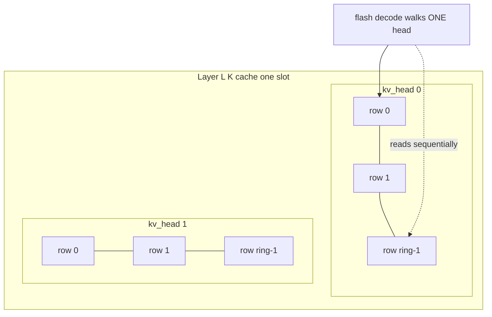
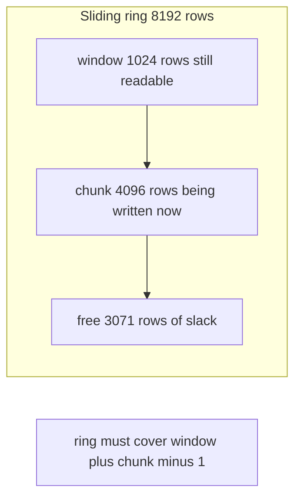
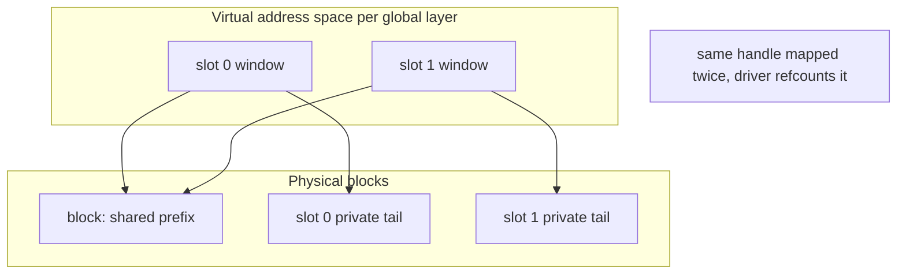
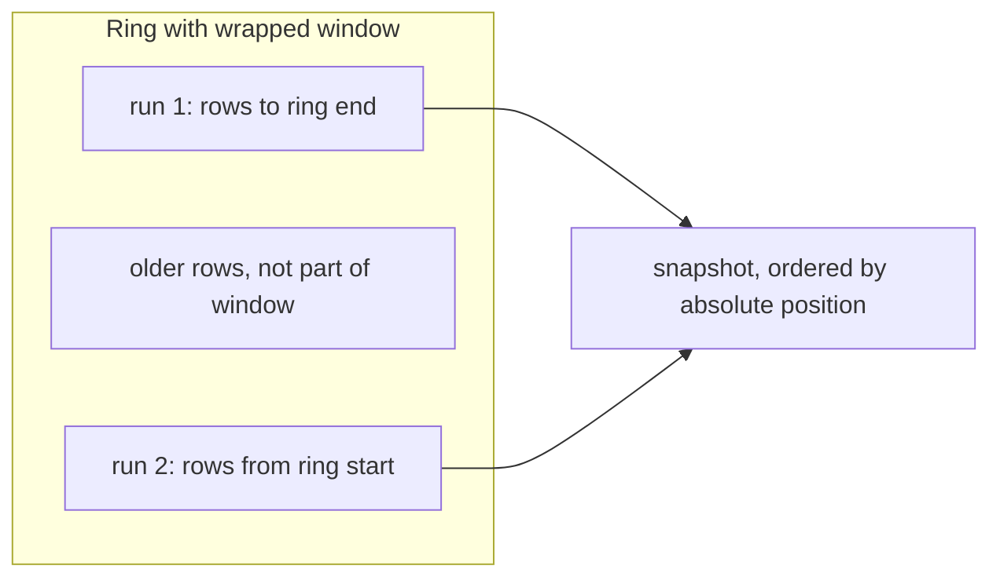
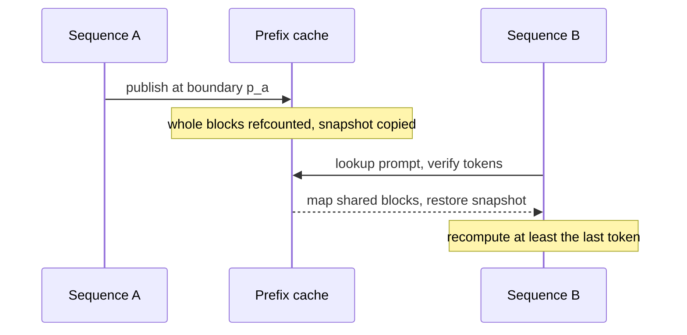

# 22 — KV Cache

> **Scope:** How Plow stores, addresses, writes, reads, sizes, shares and reuses
> attention KV. This chapter is the single source of truth for KV; where other
> chapters describe a paged/page-table KV design, read this one instead — see
> [§13](#13-what-this-chapter-replaces).
>
> Everything below is what the emitter (`crates/devgen`) writes into a packet and
> what the runtime (`crates/plowrt`) and device interpreters (`runtime/`) do with
> it on this branch. Numbers are measured on Gemma-4-12B BF16, H100, TP1.

---

## The five decisions

| Decision | What Plow does | Why |
|---|---|---|
| **Layout** | Head-major, batch-major: `[slot][kv_head][ring_row][head_dim]` | The *reader* decides. Decode walks one head at a time, so a head's rows must be contiguous |
| **Addressing** | A power-of-two **ring** per layer, indexed `row & kv_mask` | A windowed layer never needs more than `window + chunk` live rows |
| **Write** | The per-head norm+RoPE op stores straight into the cache | The cache write is not a copy, it *is* the norm's store |
| **Allocation** | Global layers on CUDA VMM, sliding layers on flat device memory | Only whole blocks of a non-wrapping cache can be multi-mapped and shared |
| **Reuse** | Radix-matched shared blocks for global layers, copied snapshots for everything else | A wrapping ring cannot be shared by mapping; it can only be copied |

---

## 1. Layout: head-major, batch-major, ring-addressed

One KV tensor per layer per side (K and V). Its element index is

```
elem = ((slot * n_kv_head + kv_head) * kv_stride + (row & kv_mask)) * head_dim + d
```

`kv_stride` is the **allocated** ring depth, not the current length, so it has to
travel with the instruction rather than be inferred
(`runtime/common/dev_isa.h:1485`): `HEADNORM_ROPE j0 = out_stride`,
`FLASH_PREFILL j0 = kv_stride`, `FLASH_DECODE i3 = kv_stride`.



The rationale is worth quoting in full, because it is the one place the layout
choice is argued from the reader rather than the writer
(`runtime/common/dev_isa.h:1473-1483`):

> THE KV CACHE IS HEAD-MAJOR: `[kv_head][ctx][head_dim]`, NOT
> `[ctx][kv_head][head_dim]`.
>
> Token-major looks like the natural choice — appending a token is one
> contiguous write across every head — and it is what this ran with for a long
> time. But it is the READER that decides. `flash_decode` walks ONE head at a
> time, so under token-major its consecutive KV rows sit `n_kv_head * head_dim`
> apart: at Gemma-31B that is 16 x 256 halves = 8 KB of stride around 512 bytes
> of payload. A workgroup's 512 threads then span 512 KB of address space to
> read 256 KB of data, and every row lands in a different DRAM page.
>
> Head-major makes one head's rows CONTIGUOUS, so those same 512 threads read
> 256 KB of dead-sequential memory. And the writer pays nothing for it:
> `headnorm_rope` already runs one wave per `(token, head)`, so each wave still
> writes its own contiguous 512 bytes — just at a different address.

**The batch axis is outermost** and each sequence owns a private ring
(`crates/devgen/src/lib.rs:2390`): the per-slot stride is `kv_head * ring * hd`,
and at one slot the tensor is byte-identical to the single-sequence cache.

**Measured null:** re-packing these bytes another way — token-major, or
vLLM-style paging — moved nothing (`crates/devgen/src/lib.rs:2377`: "a
byte-repack (token-major, or vLLM-style paging) is a measured null here"). The
layout is settled; do not re-litigate it without a new measurement.

---

## 2. The ring, and the chunk that sizes it

A windowed layer only ever reads the last `window` positions, so storing `ctx`
rows for it is waste. Plow stores a **ring** instead and masks the index. The
device header carries the invariant (`runtime/common/dev_isa.h:1857`):

> A prefill CHUNK of C tokens has queries at `[c0, c0+C)`, which between them
> need KV rows `[c0-1023, c0+C-1]` — a span of `W + C - 1`. And the chunk writes
> all C of its rows before flash reads any of them, so a row must not be
> clobbered before it is used: `RING >= window + max_chunk - 1`.

Two consequences that drive every memory decision in this chapter:

1. **The ring is sized by the chunk, not by the context.** A sliding layer's
   footprint is fixed once you choose the prefill chunk; growing `max_ctx`
   costs it nothing.
2. **A ring is only possible at all because prefill is chunked**
   (`dev_isa.h:1871`). Unchunked prefill would need the whole prompt live.

The emitter's formulas (`crates/devgen/src/lib.rs`):

| Function | Definition | Line |
|---|---|---|
| `kv_ring_rows(window, chunk)` | `(window + chunk - 1).next_power_of_two()` | 3087 |
| `kv_ring(full=true, ...)` | `(ctx, 0xFFFF_FFFF)` — no masking on global layers | 3102 |
| `kv_ring(full=false, ...)` | `r = min(ctx, kv_ring_rows(...))`, mask `r - 1` | 3102 |
| `default_chunk(window)` | `window.next_power_of_two()` clamped to `[128, 8192]` | 3037 |
| `request_chunk(window)` | `PLOW_MAX_REQUEST_CHUNK` else `max_chunk(window)` | 3068 |

The ring must be a power of two because the index is an AND, and the emitter
asserts it: a non-power-of-two ring "aliases rows to WRONG (in-bounds) rows —
silent corruption", and a ring below `window + chunk - 1` means "a chunk's rows
would wrap onto their own history — a silent wrong answer, not a crash".



Note that `kv_ring` is fed **`request_chunk`**, not the aggregate `max_chunk`:
the invariant is about the rows *one sequence* writes before its flash reads,
not the total rows in a packed launch. Since each slot owns its own ring, a
packed launch of several shorter requests does not widen it. See
[§6](#6-what-it-costs) for the lever this opens, and
[13 — Prefill Chunking](13-prefill-chunking.md) for the bucket ladder that the
same chunk decision sets.

Scale of the win, from the header's own worked example: on Gemma-4-31B, 50 of 60
layers are windowed, and at 128k context a full-depth cache would be 110 GiB "of
which 99 GiB is never read". Ringing the sliding layers takes their share from
about 100 GiB to 6.7 GiB.

---

## 3. The write is the norm's store

There is **no KV append op**. `HeadNormRope` (and its fp8 twin) writes the cache
as the store half of the per-head norm, at exactly the layout `FlashDecode`
reads (`crates/devgen/src/lib.rs:2374`). K and V are separate emissions of the
same op: the V site is weightless and skips RoPE.

The op carries the geometry it needs: `j0` = ring depth, `j1` = ring mask, `t5`
= positions, `t6` = fp8 scale tensor when present. Whether it writes the cache
at all is decided by `out_stride`: zero means the token-major `[ntok][nhead][hd]`
layout, which is the **query** norm, not a cache.

Four write addressings share one body (`runtime/nvidia/op_norm.cuh:796-812`):

| Mode | Row address | When |
|---|---|---|
| Packed prefill | `pfslot[t]` selects the slot, `pos[t]` the row | Cross-request packed chunks; `pfslot[t] < 0` rows are skipped padding |
| Per-batch ring | token `t` *is* sequence `t`, row `pos[t]` | Batched decode; no host patching |
| Mixed step | slot and position from `plow_mixed_row` | Prefill and decode rows in one launch |
| Legacy single ring | `(out_row0 + t)`, `out_row0` patched per step | The original B=1 path |

Every one of them masks with `kv_mask`, so a sliding layer wraps and a global
layer does not.

### The one place head-major is not free

[§1](#1-layout-head-major-batch-major-ring-addressed) argues that head-major
costs the writer nothing, and for the norm's store that holds: a wave writes its
own contiguous row either way. It stops holding the moment something wants to
move a **row range** rather than a row, which is exactly what CPU-prefill
handoff does (`crates/plowrt/src/exec/kv_handoff.rs`):

> MLA declares `kv.{l}.ckv` as `dbatch × ctx × dk` — `[slot][seq][width]`. Rows
> `[0, n)` are one run of `n × row_bytes`. Dense GQA declares `kv.{l}.k` as
> `dbatch × kv_heads × ring × head_dim` — `[slot][head][seq][dim]`. The same
> rows are `kv_heads` runs strided by the ring, and a single-run copy would
> write head 0's rows over the front of head 0 and nothing else correctly.

So a transfer that is one memcpy under a sequence-major cache becomes a
`kv_heads`-way scatter under this one. The module discriminates the two by
`HeadNormRope`'s ring stride, which dense GQA sets and MLA's k-rope leaves at
zero, and refuses by name rather than guessing. `check_transferable` and
`plan_with_layout` now plan that scatter, so head-major caches can hand off;
`check_seq_major` remains the stricter test for paths that still require one
run.

---

---

## 4. The read

Prefill and decode read the same bytes through `kv_stride` and `kv_mask`. Decode
resolves a head base once and then walks `kbase + (kv & kv_mask) * D`
(`runtime/nvidia/op_attention.cuh:784`); prefill stages tiles by
`row = kv & kv_mask` (`op_attention.cuh:1648`). The window arrives as an operand
(`FLASH_DECODE i4`, `FLASH_PREFILL i5`), so one kernel serves global and sliding
layers, and the attention **role objects** are selected on that signature: the
sliding role matches `n_head 16, n_kv_head 8, window 1024, hd 256`, while the
global px4 role additionally requires `window == 0` and `kv_mask == u32::MAX`
(`crates/devgen/src/attention_prefill_role.rs:398-430`).

---

## 5. FP8 KV

`PLOW_FP8_KV` stores the cache as e4m3 with a per-row f32 scale. A "row" is one
`(token, kv_head)` vector; its amax picks the scale as `amax / 448`, and the
scale array is `f32[kv_head][ctx]` **in the same head-major ring**, so the
reader indexes it with the row it already computed
(`runtime/nvidia/op_norm.cuh:946-956`). Both K and V are quantized; Q is not,
because Q is never cached.

Readers differ by phase: decode accumulates the dot product on raw values and
applies the row scale once at the end (`op_attention.cuh:895`), while prefill
dequantizes at the shared-memory staging step so the tensor-core path below it
sees bf16 unchanged (`op_attention.cuh:1650`).

> **Accuracy of the "half the bytes" claim.** The comments say half. Netting the
> scale it is a little less: at `hd 256` a row is 256 bytes plus a 4-byte scale
> against 512 bytes, so about 49%. At `hd 512` it is closer to 49.6%. The
> difference never matters for a sizing decision, but the doc should not repeat
> a round number the code does not quite deliver.

---

## 6. What it costs

Per slot, summed over layers:

```
per_slot_bytes = Σ_layers  kv_heads(L) × ring_rows(L) × head_dim(L) × elem_bytes × 2
```

Gemma-4-12B is 48 layers: **8 global** (1 KV head, `hd` 512, ring = ctx) and
**40 sliding** (8 KV heads, `hd` 256, window 1024, ring = `next_pow2(1024 +
chunk - 1)`). One KV head serves all 16 query heads on the global layers
(`crates/devgen/src/lib.rs:4527`).

Three shipped packets, predicted against what the runtime actually uploaded:

| Packet | ctx | chunk | slots | sliding ring | global / sliding per slot | per slot | predicted | uploaded |
|---|---|---|---|---|---|---|---|---|
| default | 8192 | 4096 | 16 | 8192 | 128 MiB / 2560 MiB | 2.625 GiB | 42.0 GiB | **42.00** |
| long context | 16384 | 4096 | 16 | 8192 | 256 MiB / 2560 MiB | 2.75 GiB | 44.0 GiB | **44.00** |
| 32 slot | 8192 | 2048 | 32 | 4096 | 128 MiB / 1280 MiB | 1.375 GiB | 44.0 GiB | **44.00** |

Read the table across, not down. **Doubling the context costs 2 GiB**, because
only the 8 global layers scale with context. **Halving the chunk saves 20 GiB**
at the same slot count, because the 40 sliding layers — 95% of the footprint —
are sized by the chunk. The sliding layers dominate not because their window is
large but because their ring is eight times their window.

This makes the prefill chunk a three-way decision, and the three pull in
different directions:

1. it is the top of the prefill bucket ladder, so larger is better for prefill
   throughput;
2. it multiplies the sliding KV, so smaller is better for concurrency;
3. the qualified attention **role objects** require the 4096 and 8192 row rungs,
   so dropping it disables them.

That third constraint is why the 32-slot packet above runs with both attention
roles off. **There is a lever that has not been pulled:** `kv_ring` is sized by
`request_chunk`, and `PLOW_MAX_REQUEST_CHUNK` lowers that independently of
`PLOW_MAX_CHUNK` while the packed planner enforces the same cap per request
(`crates/plow-asset/src/packed_prefill.rs:384`). A packet with aggregate chunk
4096 and request chunk 1024 should keep the 4096-row rungs and their roles while
ringing the sliding layers at 2048 rows, i.e. 0.75 GiB per slot instead of
2.625 GiB. Derived from the code, not yet measured.

---

## 7. Slots, and who owns the memory

A **slot** is one of the `B` sequence lanes the compiled decode batch provides
(`crates/plowrt/src/exec/gpu.rs:5443`). Admission happens in the serve mux,
which places a job in the first idle slot inside the current decode rung and
charges a KV row budget across all live slots; when the budget is full "the job
stays queued, says nothing, costs no slot. This is the whole backpressure
mechanism" (`crates/plowrt/src/serve/mux.rs:1364`).

Recycling a slot does **not** clear its cache. `in.kvlen` bounds what attention
reads, so rewinding `pos[b]` to zero makes the old rows unreachable
(`gpu.rs:5477`).

The allocator is split by layer type, and this split is the reason the prefix
cache looks the way it does:

- **Global layers are CUDA VMM-backed.** One contiguous virtual reservation per
  `(layer, K|V)` spans the whole batch-major tensor, so the tensor table keeps
  one base and the flash addressing is untouched (`memory/vmm.rs:14-24`).
  Physical blocks — `PLOW_VMM_BLOCK_MIB`, default 2 MiB — are mapped under a
  slot's frontier as it grows (`ensure_rows`), with a `vmm-premap` thread
  keeping two block columns mapped ahead and `ensure_rows` acting as the
  correctness backstop.
- **Sliding layers stay on flat device allocations** (`vmm.rs:1155`: "full
  layers VMM-backed, sliding on cudaMalloc"), because a wrapping ring has no
  stable block identity to map.



Two pools smooth the driver cost. The **block pool**
(`PLOW_KV_POOL_MIB`, default 512) parks zero-reference handles instead of
releasing them and pre-creates about two window columns so even the first
request after load skips the commit. **Deferred reclaim**
(`PLOW_VMM_DEFERRED_RECLAIM`, default on) keeps block column 0 mapped when it is
private and hands the rest to a background thread, because "nothing about that
work has to happen before the next occupant starts EXCEPT block column 0:
prefill writes row 0 at once, and an idle decode row parks at `pos = 0`"
(`vmm.rs:2660`). Waiting for an in-flight copy-out uses a condvar rather than
sleep polling.

---

## 8. Prefix cache

The cache answers one question: can a new prompt start from another sequence's
already-computed KV? What is shareable differs per layer type, which is why the
answer has two halves.

**Matching.** Token ids are hashed per block with a chained block hash and
matched in a radix tree; every hash match is then verified against the node's
stored tokens, so a collision ends the match rather than serving the wrong KV
(`crates/plowrt/src/memory/prefix.rs:182`).

**Global layers share by mapping.** The prefix's whole blocks are the *same
physical handles*, mapped into each sharing sequence's virtual window
(`vmm.rs:6`). Held once in HBM, read by everyone.

**Everything else is copied at a boundary.** A published boundary `p_a` is
quantised to 32 tokens, and the snapshot holds four things
(`exec/gpu/prefix.rs:513`): the sliding rings' last `window` rows, the fp8 ring
scales, the fp8 global-scale prefix, and the sub-block tail of the global KV
that no whole block covers.

The sliding rings are the expensive part, and the wrap is why:



A window that wraps is two contiguous runs, so the snapshot costs **up to two
pitched device copies per tensor per layer**, i.e. `2 × 2 × n_sliding` — up to
160 copies on Gemma-4-12B (`prefix.rs:373-409`); an unwrapped window needs only
one, and the zero-row slice is now skipped. A boundary is only publishable
while the rings still hold it: `rows - p_a <= ring - window`, otherwise the
window has wrapped past and is unrecoverable (`prefix.rs:633`).

**What must stay private.** Partial blocks, so later prefill never writes into a
shared block; block column 0 of a recycled slot, since overwriting it "would
corrupt every sharer"; and the global fp8 scales, which live in flat tensors
that slot reuse overwrites.



**Publishing is not free, so it is gated.** Every prefill completion and slot
recycle used to publish a snapshot regardless of whether anything could ever
reuse it, paying the copies and an allocation on workloads with a zero hit rate.
`PLOW_VMM_PUBLISH_SHARED` (default on) records each sequence's leading 32 tokens
and publishes only once that lead has been seen on another sequence
(`vmm.rs:1994`). Unique-prompt benchmarks now pay nothing; a shared prefix costs
one extra miss on its first sighting.

**Enablement is an allowlist, not a probe.** With `PLOW_VMM_PREFIX` unset the
runtime enables VMM prefix reuse only on Hopper, only without TP, packed-CUDA
prefill, live rings or mixed-step sections, and only for the exact geometry it
was qualified on: BF16 KV, `hd_full` 512, `hd_slide` 256, window 1024 — that is,
Gemma-4 hybrid (`exec/gpu/prefix.rs:106-146`). `PLOW_PREFIX_CACHE=0` is the
master switch and disables every side effect.

Eviction runs a soft cap — `PLOW_VMM_CACHE_MIB`, else 5% of device memory —
dropping output-only boundaries first, then zero-reference leaf nodes, then
snapshots by least-recent use.

---

## 9. Plow and PagedAttention, one level apart

Both systems face the same contradiction: KV must look **contiguous to the
attention kernel**, but sequences arrive and leave at unpredictable lengths, so
one contiguous allocation per sequence either reserves for the worst case or
fragments the heap. The two resolve it at different layers of the machine.

**vLLM resolves it in software, inside the kernel.** KV lives in fixed-size
blocks — 16 tokens is the common default. Each sequence owns a block table
mapping logical block index to physical block, the attention kernel takes that
table as an argument and gathers block by block, and sharing a prefix means
pointing two block tables at one physical block and copying on write.

**Plow resolves it in hardware, underneath the kernel.** Each slot gets one
contiguous *virtual* range per layer and side; physical blocks are mapped into
it as the sequence grows, and sharing a prefix maps the same physical handle
into two sequences' ranges. The kernel is handed a flat base and a stride and
never learns the memory is discontiguous — the MMU translates.

| | vLLM PagedAttention | Plow |
|---|---|---|
| Indirection lives in | the kernel, a block-table lookup per block | the MMU, ordinary page tables |
| The kernel sees | a gather over block pointers | flat base plus stride, `row & kv_mask` |
| Block granularity | about 16 tokens | the VMM granule: 2 MiB, i.e. 4096 rows of one head at `hd` 256 bf16 |
| Sharing unit | a block, copy-on-write | a physical handle, multi-mapped |
| Windowed layers | still blocks, still `ctx`-many | not paged at all; a ring of `window + chunk` rows |
| Growth cost | a free-list pop | a driver map call, hidden by pool and premap |
| Fragmentation | none by construction | none inside a reservation |

**What Plow's side buys.** The kernel reads dead-sequential memory with no block
table in registers and no per-block branch — that is what makes a 512-thread
workgroup read 256 KB of contiguous KV ([§1](#1-layout-head-major-batch-major-ring-addressed)).
And the windowed layers get something a block table cannot express: because the
ring is *addressed* modulo its size, 40 of 48 layers never allocate beyond
`window + chunk` rows however long the context grows. That is the 20 GiB in
[§6](#6-what-it-costs).

**What it costs.** The sharing granularity is the VMM granule rather than 16
tokens — roughly 250x coarser. A prefix is therefore only shareable *by mapping*
when it is block-aligned, and everything below that granularity (the partial
block, the sliding rings, the fp8 scales) has to be **copied** into a snapshot
instead. That is the whole of [§8](#8-prefix-cache), and it is the price of
keeping the kernel simple. Driver calls on the admission path are the second
cost, paid down by the block pool, the premap thread and deferred reclaim.

One measured note, offered as a result rather than an argument: Plow has tried
the other side. Re-packing this cache token-major, or vLLM-style paged, is
recorded as a **measured null** on these shapes
(`crates/devgen/src/lib.rs:2377`) — the kernel-side gather did not pay for
itself once the layout was head-major. That is a finding about this model family
and these kernels, not a general claim about PagedAttention, which solves a
harder allocation problem than Plow's fixed slot count poses.

---

## 10. Packed prefill and prefix reuse

A packed launch writes several slots' KV rows in one kernel, so **every row must
be mapped before the launch**. Only the unified token-batch route or an explicit
`PLOW_PF_BATCH=1` plans that admission from the packed metadata, reserving the
admitted slot's rows plus row zero of every other slot
(`admit_packed_slot`, `gpu.rs:5564`).

The decision is (`gpu.rs:3078-3084`):

```rust
let prefix_requested = config.nv_vmm_prefix() == Some(true) || prefix_layout.is_some();
let unified_packed   = config.token_batch && !config.fusion
                    && prefix_layout.is_some() && packed_prefill_metadata.is_some();
let packed_prefix    = prefix_requested && (config.pf_batch_cuda() || unified_packed);
```

If prefix reuse is on without one of those routes, packed prefill is dropped,
not silently degraded, and the log says which knobs would restore it. With the
shipped defaults — token batching on, fusion off — packed prefill and prefix
reuse coexist.

Padding interacts here too. A packed bucket's pad rows are charged to one
request's KV positions unless masked padding is compiled in
(`PLOW_MAX_REQUEST_CHUNK`), which marks pad rows with slot `-1` so the write
skips them. Without it, a long prompt near `max_ctx` is *rejected*: no request
can absorb a multi-thousand-row pad.

---

## 11. Tensor parallelism and context parallelism

Under TP the cache shards on the **kv-head axis** and replicates when it cannot
split: `kvh_local = kvh / tp` when `tp <= kvh`, else 1, with `tp / kvh` ranks
sharing a head (`crates/devgen/src/lib.rs:3132`). Ring depth is never split by
TP, only the head count, so on Gemma-4 global layers — one KV head — every rank
holds a full copy. The comment calls this "the design's chosen tradeoff": 2x on
a minority of layers.

Decode context parallelism is **declared but not implemented**: `dcp_layout`
panics for `d > 1`, and the cross-rank merge op is a reserved stub
(`docs/arch/21-decode-context-parallelism.md:157`). It is scoped to the MLA
latent cache, not to this dense head-major cache.

---

## 12. Knobs

| Knob | Default | Effect |
|---|---|---|
| `PLOW_MAX_CHUNK` | `next_pow2(window)` | Prefill chunk; sets the sliding ring and the bucket ladder top |
| `PLOW_MAX_REQUEST_CHUNK` | = `PLOW_MAX_CHUNK` | Per-request cap; enables masked padding and shrinks the ring independently |
| `PLOW_FP8_KV` | off | e4m3 cache with per-row scales |
| `PLOW_PREFIX_CACHE` | on | Master switch for all prefix reuse |
| `PLOW_VMM_PREFIX` | unset = auto | Force VMM prefix reuse on or off, bypassing the allowlist |
| `PLOW_VMM_PUBLISH_SHARED` | on | Publish only leads seen on a second sequence |
| `PLOW_VMM_BLOCK_MIB` | 2 | Physical block size, the prefix match granularity |
| `PLOW_KV_POOL_MIB` | 512 | Block pool cap; 0 disables |
| `PLOW_VMM_DEFERRED_RECLAIM` | on | Background unmapping, keeping column 0 mapped |
| `PLOW_VMM_CACHE_MIB` | 5% of device | Prefix cache soft cap |
| `PLOW_VMM_LIVE_RINGS` | off | Grow packet KV with the live frontier; disables prefix auto-selection |

Benchmarks that compare against an engine with prefix caching disabled must set
`PLOW_PREFIX_CACHE=0`, or random prompts sharing a short lead will silently
become cache hits.

---

## 13. What this chapter replaces

[06 — Runtime](06-runtime.md) described KV as page-table indirection over a
`BlockAllocator` and a per-sequence `PageTable`, in the style of PagedAttention.
That code exists at `crates/plowrt/src/memory/kv.rs` but is **retained and
unused** (`memory/streamer.rs:212`); no shipping GPU packet reaches it, and a
paged repack of this cache is a measured null. The live design is the head-major
ring in this chapter.

Two further things that do not exist, despite appearing in older notes: there is
no separate KV append or copy op, and `PLOW_KV_KEEP_MIB` is not a knob.
