# Plow — Full Architecture & Design Document

> **Scope:** This document covers the complete system architecture of Plow (née Infervisor) — a heterogeneous, statically-scheduled compiler and runtime for transformer inference across GPUs, CPUs, and DPUs. Section I presents the full design vision. Section II documents what is currently implemented and operational.

> **Honesty rule (2026-07-23):** “described”, “compiled”, “GPU-correct”,
> “model-verified”, and “performance-qualified” are different states. A hardware
> descriptor, opcode declaration, or compiling kernel does not make an operator
> or model supported. Status claims below are bounded to the current checkout;
> detailed tuning architecture and gates live in
> [the design notes](../../the design notes).

---

## Table of Contents

- [I. Full Design Vision](#i-full-design-vision)
  - [1. System Purpose & Goals](#1-system-purpose--goals)
  - [2. High-Level Architecture](#2-high-level-architecture)
  - [3. Compiler Pipeline](#3-compiler-pipeline)
  - [4. Tile Dependency Graph (Central IR)](#4-tile-dependency-graph-central-ir)
  - [5. Scheduler](#5-scheduler)
  - [6. Packet ABI & Instruction Stream](#6-packet-abi--instruction-stream)
  - [7. Counter Coordination System](#7-counter-coordination-system)
  - [8. Runtime Architecture](#8-runtime-architecture)
  - [9. Cross-Vendor Portability](#9-cross-vendor-portability)
  - [10. Multi-GPU & Parallelism](#10-multi-gpu--parallelism)
  - [11. Serving & Multi-Tenancy](#11-serving--multi-tenancy)
  - [12. Formal Verification (Lean 4)](#12-formal-verification-lean-4)
- [II. Implementation Status](#ii-implementation-status)
  - [13. Workspace & Crate Map](#13-workspace--crate-map)
  - [14. Implemented Compiler Flow](#14-implemented-compiler-flow)
  - [15. Implemented Runtime](#15-implemented-runtime)
  - [16. Implemented Verification](#16-implemented-verification)
  - [17. Models Supported](#17-models-supported)
  - [18. What Remains Unimplemented](#18-what-remains-unimplemented)

---

# I. Full Design Vision

## 1. System Purpose & Goals

Plow is an ahead-of-time (AOT) compiler and persistent-kernel runtime that takes a transformer model and a hardware topology, compiles them into per-executor packet streams, and runs inference by having each executor walk its stream while coordinating through a shared counter pool.

### 1.1 Design Principles

| Principle | Description |
|-----------|-------------|
| **Static scheduling** | All scheduling decisions made at compile time; runtime never invokes the compiler |
| **Counter-based coordination** | Atomic integers express dataflow — no CPU in the critical path |
| **Cross-vendor portability** | Same semantics/scheduler; select from executable backend capabilities and calibrated costs |
| **Packet-driven execution** | Variable-length POD records cast directly on device — no serialization overhead |
| **Formal correctness** | Lean 4 proofs verify schedule safety, tile partition, memory allocation |

### 1.2 Target Hardware

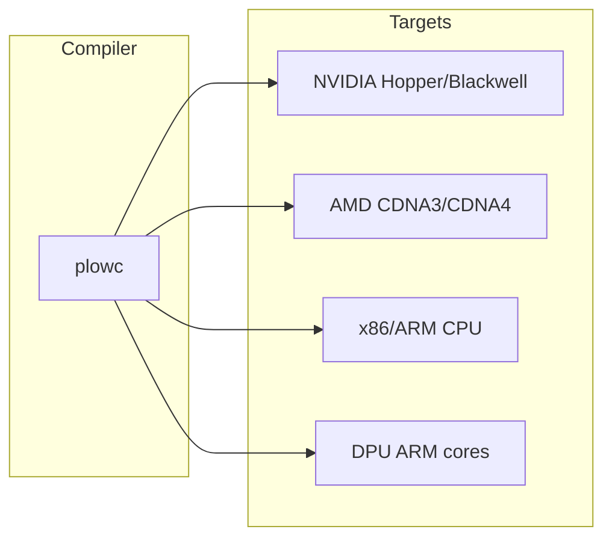

- **NVIDIA**: Hopper (H100), Blackwell (B200), Ada Lovelace (RTX 4090/6000)
- **AMD**: CDNA3 (MI300X), CDNA4 (MI350X)
- **CPU**: Host coordination + reference kernels
- **DPU**: RDMA, network ops (future)

### 1.3 Performance Targets

- Per-token decode latency within a small multiple of theoretical HBM-bandwidth floor
- Cross-GPU sync overhead < 5% of per-token time on TP/PP topologies
- AOT compile once at startup; no recompilation in the hot path

---

## 2. High-Level Architecture

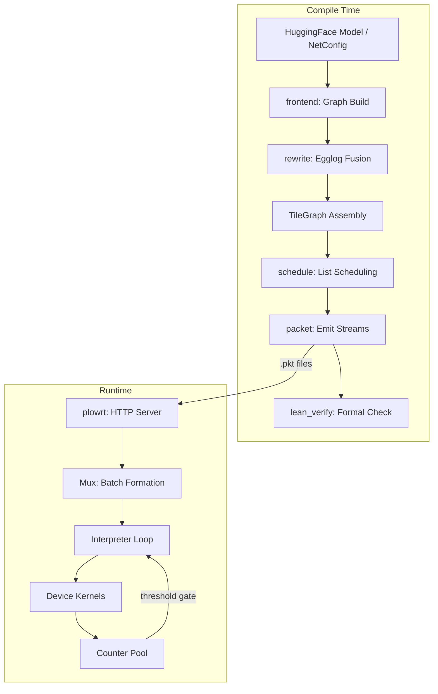

The system splits cleanly into **compile-time** (plowc) and **runtime** (plowrt). The compiled artifact is a set of `.pkt` binary streams + JSON sidecars describing memory layout, KV paging, weight tiling, and block structure.

---

## 3. Compiler Pipeline

The compiler is two distinct halves with a clean interface between them:

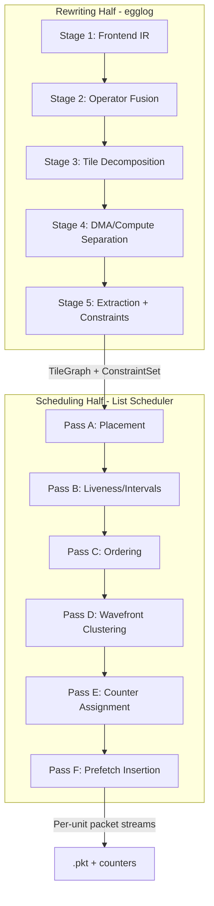

### 3.1 Rewriting Half (egglog equality saturation)

The rewriting engine uses `egglog` (e-graph + datalog) to find the optimal *form* of the computation:

1. **Operator fusion** — GEMM+bias, GEMM+activation, RMSNorm+QKV, norm+RoPE
2. **Tile decomposition** — batch-size-aware tile shape selection (square for prefill, skinny for decode)
3. **DMA/compute separation** — explicit load/compute/store nodes
4. **DMA deduplication & SRAM handoff** — eliminate HBM round-trips

### 3.2 Scheduling Half (interval-conflict list scheduler)

The scheduler assigns tiles to hardware resources using:

- **Interval trees** per resource (SM occupancy, SRAM slots, DMA engines, HBM bandwidth)
- **Borrow-checker logic** — the same interval-conflict algorithm as Rust's NLL, generalized with capacity resources
- **Wavefront clustering** — groups tile edges into shared counters (fine/coarse selectable)
- **Prefetch insertion** — DMA packets issued early under counter protection

### 3.3 Cost Model and Executable Kernel Selection

The generic rewrite/schedule path queries a `CostModel` bound to a `GpuSpec`
for abstract tile legality, SRAM, GEMM/Flash/Row cycle estimates, DMA, and
interconnect costs.

That is not yet the complete production selection path. Model-specific emitters
also use `DevOp` and duplicated `pick_tile` logic; the current Gemma picker even
looks up one GPU SKU directly. Abstract candidates are not proof that the
runtime instantiates the corresponding kernel.

The target selection boundary is:

```text
NetworkBlockDefinition
  -> semantic DAG + concrete phase/state/precision buckets
  -> deduplicated OpSignature and fused-region cases
  -> generated executable KernelSpec registry
  -> analytical shortlist
  -> exact/inherited offline tuning records
  -> block/interpreter qualification
  -> egglog extraction + schedule
  -> Lean legality/correctness checks
  -> AOT packet bundle with selection provenance
```

Only explicit tuning/provisioning workflows write measurements. Ordinary model
compilation reads qualified records and uses a declared fallback tier when no
exact match exists. Repeated equivalent blocks tune once and carry an execution
weight; global-attention, DSA-indexer, Mamba-state, shared-expert, first/last, or
otherwise exceptional layers become distinct block definitions.

The database stores canonical `block_definition`, deduplicated `op_case`,
`kernel_measurement`, end-to-end `block_measurement`, and objective-specific
`selection` records. A microbenchmark record is provisional until its oracle,
resource, packet, and complete-block checks pass. Qualified publication is
atomic; negative and stale records remain for provenance but are not selected.

---

## 4. Tile Dependency Graph (Central IR)

The TileGraph is the contract between the two halves:

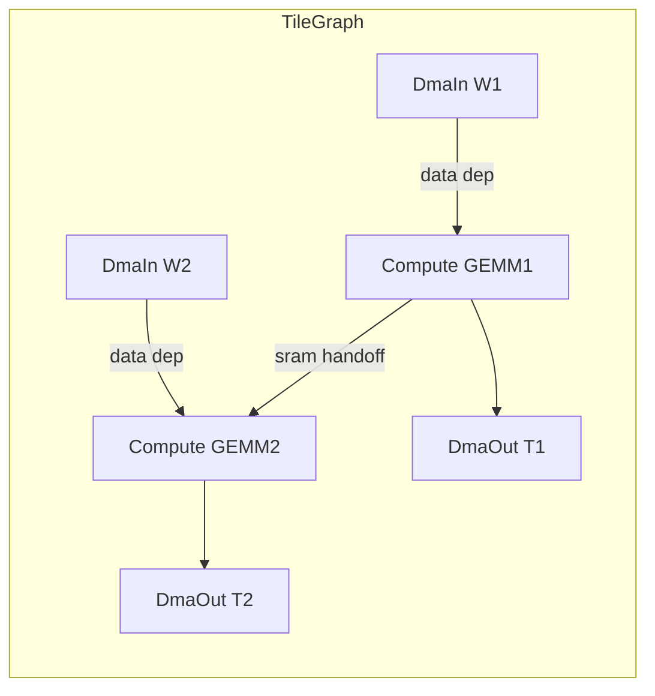

Each node carries:
- `NodeKind`: DmaIn / Compute / DmaOut
- `OpSpec`: tile shape, GEMM/Flash/Row params
- Constraints: colocation groups, SRAM footprint, placement hints, locality requirements

Edges encode:
- Data dependencies (producer → consumer)
- Locality requirements (MustColocate / PreferColocate)
- Prefetch class (Critical / Beneficial / Neutral)
- Handoff kind (SramSameSm / Dsm / Hbm)

---

## 5. Scheduler

### 5.1 Machine Model

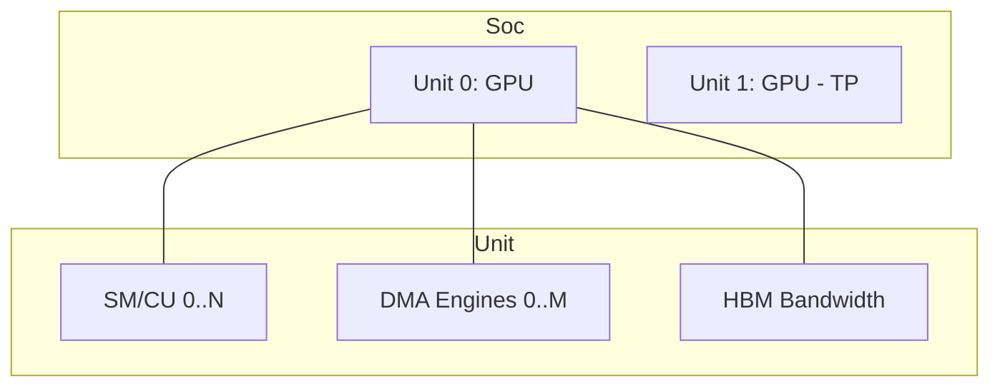

The `Soc` (system-on-chip) model represents:
- Multiple `Unit`s (GPUs) connected by interconnect
- Per-unit: SMs/CUs, DMA engines, host threads, DPU engines
- Bandwidth capacity modeled via interval trees

### 5.2 Scheduling Configuration

| Knob | Options | Purpose |
|------|---------|---------|
| `Granularity` | PerTile / PerOp | How finely ops expand onto SMs |
| `DmaModel` | Separate / Collapsed | DMA as distinct tasks or folded |
| `ClusterMode` | Fine / Coarse | Counter clustering granularity |
| `qsize` | 3 (default) | Prefetch buffer depth |
| `max_tiles_per_op` | 0 = unlimited | Caps extreme stream sizes |

### 5.3 Post-Schedule Passes

After the main schedule:
1. **Counter elimination** (§8.1) — drop counters already covered by resource-order
2. **Scope narrowing** (§8.2) — downgrade IntraGpu → IntraSm when same-SM
3. **Prefetch hoisting** (§8.3) — reorder DMA-ins earlier to hide latency
4. **SRAM temporal fit** (§8.5) — promote demoted handoffs back to SramSameSm

---

## 6. Packet ABI & Instruction Stream

### 6.1 Stream Format

```
┌──────────────────────────────────┐
│ Stream Header (20 bytes)         │
│  magic: u32 "INVP"              │
│  version: u16                    │
│  bucket_id: u16                  │
│  n_insts: u32                    │
│  n_counters: u32                 │
│  plan_gen: u16                   │
│  flags: u16                      │
├──────────────────────────────────┤
│ Record 0: Header + Body + IDs    │
│ Record 1: Header + Body + IDs    │
│ ...                              │
├──────────────────────────────────┤
│ Counter Table                    │
│  [Counter; n_counters]           │
└──────────────────────────────────┘
```

### 6.2 Opcode Encoding (u16)

```
Bits [15:12]  Backend     [11:8]  Family        [7:0]  Variant
0 = Generic   0 = Control          dtype/epilogue combos
1 = CUDA      1 = DMA              0=tma_load, 1=tma_store
2 = ROCm      2 = RDMA             0=p2p, 1=allreduce
3 = CPU       3 = Gemm             bf16/fp8/w4a8/grouped
              4 = Flash            causal/sliding/decode
              5 = Row              reduce/pointwise/fused
              6 = Layout           copy/gather/permute
              7 = Token            sample/tokenize
```

### 6.3 Record Types

| Body | Size | Fields |
|------|------|--------|
| `Header` | 12 B | opcode, resource, unit, index, wait_len, succ_len |
| `DmaBody` | 12 B | bytes, tensor, slot, kind, access |
| `GemmBody` | 32 B | coord[2], m, n, k, bm, bn, bk, out, tmem |
| `FlashBody` | 28 B | coord[2], seq_q, seq_kv, head_dim, bq, bkv, heads, out, tmem |
| `RowBody` | 20 B | coord, rows, feat, br, out, operands |
| `LayoutBody` | 88 B | kind, rank, elem_size, shape[6], in/out_stride[6], bases |
| `TokenBody` | 16 B | in_slot, out_slot, kind, vocab, arg |
| `Counter` | 12 B | id, threshold, scope |

All records are `#[repr(C)]`, 4-byte aligned, no implicit padding — kernel `reinterpret_cast`-safe.

### 6.4 Resource Kinds

| Kind | Placement | Examples |
|------|-----------|----------|
| `Sm` | GPU compute unit | GEMM, Flash, Row |
| `Dma` | DMA/TMA engine | Weight/activation loads/stores |
| `Dpu` | Network/DPU | RDMA transfers |
| `Host` | CPU thread | Sample, tokenize, coordination |

---

## 7. Counter Coordination System

### 7.1 Scope Tiers

| Tier | Scope | Storage | Latency | Use |
|------|-------|---------|---------|-----|
| 0 | IntraSm | Shared memory | ~cycles | mbarrier within SM |
| 1 | IntraGpu | GPU global | ~tens ns | SM-to-SM tile deps |
| 2 | CrossUnit | Host pinned | ~µs | TP/PP sync, CPU coord |

### 7.2 Counter Determination

```
For each consumer node C:
    threshold = count of producer edges into C
    scope = max(scope of all producers' placements vs C's placement)
    
For each producer P with edge to C:
    P.successors.push(C.counter_id)
```

### 7.3 Wavefront Clustering

Fine clustering: one counter per consumer tile (max pipelining)
Coarse clustering: one counter per op boundary (fewer counters)

The scheduler selects per-boundary based on whether the edge is memory-bound (fine benefits) or compute-bound (coarse suffices).

---

## 8. Runtime Architecture

### 8.1 Serving Stack

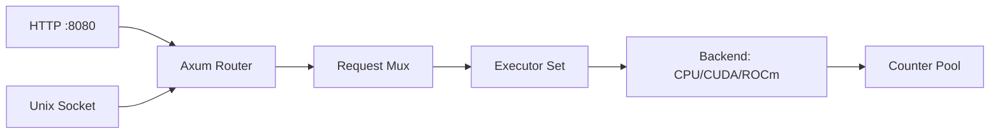

### 8.2 Execution Model

The runtime:
1. Loads compiled `.pkt` streams + `weights.json` + sidecars
2. Allocates the address-map arena (weights, KV, scratch, request I/O)
3. Per request: selects bucket by (phase, batch, seq), writes indirection, dispatches

The interpreter loop (per executor):
```
loop {
    inst = stream[pc]
    for each wait_counter: spin until counter >= threshold
    dispatch(inst.body)       // kernel invocation
    for each succ_counter: atomic_increment
    pc++
}
```

### 8.3 Memory Architecture

| Region | Lifetime | Contents |
|--------|----------|----------|
| Persistent | Model load | GEMM weights (tiled bf16) |
| Static | Model load | RoPE freq tables, masks |
| Growable | Per-sequence | KV cache (paged, per-layer) |
| Scratch | Per-iteration | Intermediate activations |
| RequestIo | Per-request | Input tokens, output logits |

### 8.4 KV Cache Paging

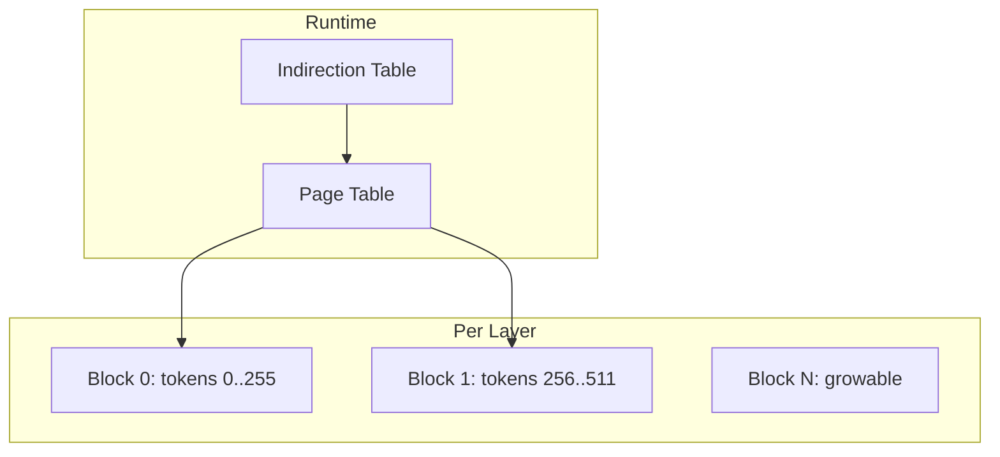

Per-layer KV buffers are `Growable` address-map entries. The runtime grows them by allocating additional blocks as sequences extend past the compiler's initial reservation.

---

## 9. Cross-Vendor Portability

### 9.1 Portability Boundary

| Layer | Portable? | Honest boundary |
|-------|-----------|-----------------|
| Semantic rewrite rules | Intended | Must state dtype, rounding, layout, state, and determinism preconditions |
| Scheduler/counter model | Intended | Backend scope, residency, and launch constraints still require validation |
| Packet schema | Shared | Generated ABI identity and dispatch presence must be checked |
| Analytical model | Parameterized | Cold-start shortlist only; not proof of executable or fastest code |
| Kernel capability registry | Target shared schema | Entries and resource envelopes are backend/profile specific |
| Calibration database | Shared schema | Measurements are hardware/toolchain/kernel/profile specific |
| Matrix/DMA/collectives | Vendor specific | MMA/WGMMA/MFMA, TMA/cp.async/buffer loads, fabric primitives differ |

Adding a `GpuSpec` is necessary but insufficient. A supported port also needs
real kernel instantiations, a complete interpreter profile, resource reports,
correctness/tail/state tests, block and model canaries, and seed calibration.
Unsupported families must select a declared reference fallback or fail clearly;
they must never dispatch a stub.

SM100 and SM120 are separate capability targets. SM100-only tcgen05/TMEM or
block-scale assumptions must not leak into the consumer SM120 path.

### 9.2 Architecture Descriptors

The `hwspec` registry carries raw descriptors such as SM/CU count, shared
memory, HBM, L2/TMEM where present, interconnect, MMA rates, and chiplet/DSM
grouping. Registry presence means “known to the model”, not “all Plow operators
are runtime- and performance-qualified on this device”.

---

## 10. Multi-GPU & Parallelism

### 10.1 Strategies

| Strategy | Mechanism | Status |
|----------|-----------|--------|
| Tensor Parallel (TP) | Split GEMM along N across GPUs | Wired |
| Pipeline Parallel (PP) | Split layers across GPUs | Planned |
| Expert Parallel (EP) | Shard MoE experts across GPUs | Planned |
| Data Parallel (DP) | Replicate model, shard batch | Planned |

### 10.2 TP Implementation

Under TP, the compiler:
1. Divides GEMM N-dimension by `num_gpus`
2. Each unit gets its shard of the TileGraph
3. Cross-unit RDMA packets coordinate via CrossUnit counters
4. Weight shapes are per-device (total / N)

### 10.3 Collective Lowering (Design)

Collectives decompose into tile-level DMA + compute nodes:
- All-reduce → ring of P2P transfers + partial reductions
- All-gather → fan-out P2P copies
- Each step coordinates via Tier 2/3 counters

---

## 11. Serving & Multi-Tenancy

### 11.1 Request Mux

The mux handles:
- Arrival-rate batch formation (configurable hold time)
- SLO-aware admission (predicted wait > threshold → shed)
- Bucket selection per (phase, batch, seq)
- KV arena management (per-sequence grow/reclaim)

### 11.2 Multi-Tenant Design

Each tenant has:
- Disjoint counter ID range
- Own indirection table layout
- Own queue region in executor's stream
- Temporal (not spatial) isolation within an iteration

### 11.3 API

OpenAI-compatible `/v1/chat/completions` endpoint with:
- Streaming (SSE) support
- Multi-model serving (multiple `--assets` dirs)
- Unix domain socket option for local IPC

---

## 12. Formal Verification (Lean 4)

### 12.1 Checkpoint Architecture

| Checkpoint | Verifies | Lean Module |
|------------|----------|-------------|
| A | Rewrite rule soundness | `Plow.Rewrite` |
| B | Tile partition + cost bounds | `Plow.TilePartition` |
| C | SRAM temporal fit | `Plow.Sram` |
| D | Schedule + reclamation | `Plow.Verify` + `Plow.Protocol` |
| E | Wire round-trip | `Plow.Wire` |
| F | Allocation safety | `Plow.Memory` |

### 12.2 Verification Flow

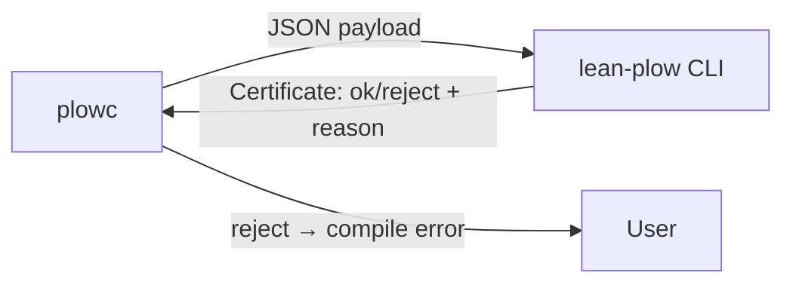

Each checkpoint is a decidable check backed by a proven universal theorem. The Rust side marshals the data; Lean re-checks from first principles.

---

# II. Implementation Status

Status levels used here:

| Level | Meaning |
|-------|---------|
| Declared | Schema/opcode/descriptor exists |
| Compiled | Target object builds and dispatch arm is present |
| GPU-correct | Device output passes an independent oracle |
| Model-verified | Real checkpoint passes end-to-end parity |
| Tuned | Reproducible block/model evidence meets the stated target |

A ✓ in an older component table means the named core exists; it does not imply
all five levels for every model, precision, phase, or hardware target.

## 13. Workspace & Crate Map

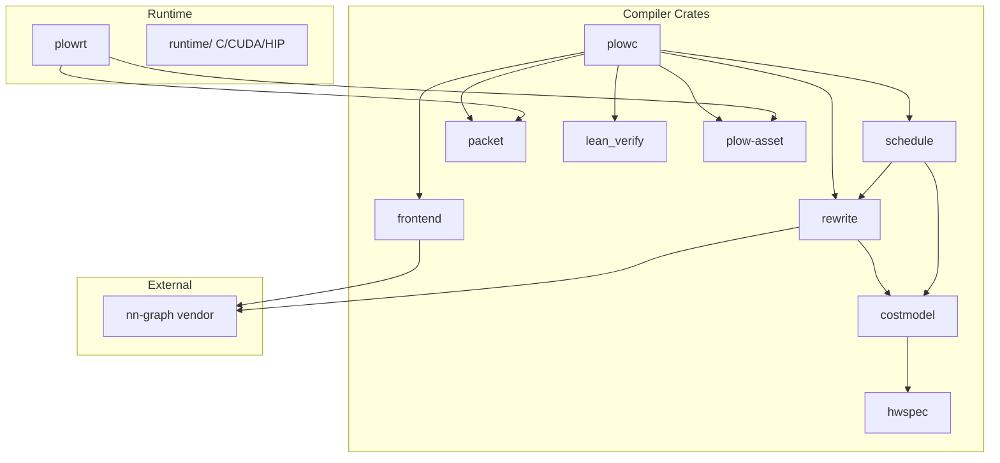

### 13.1 Rust Crates (implemented)

| Crate | Lines | Purpose | Status |
|-------|-------|---------|--------|
| `hwspec` | ~500 | GPU capability registry (H100, B200, MI300X, MI350X, RTX) | ✓ Complete |
| `costmodel` | ~1200 | Tile candidates, GEMM/Flash/Row cycle estimates, SRAM model | ✓ Complete |
| `frontend` | ~50 | Hub layer over nn-graph model zoo | ✓ Complete |
| `rewrite` | ~2500 | Egglog fusion rules + tile graph assembly | ✓ Complete |
| `schedule` | ~3000 | List scheduling, counter alloc, memory planning, prefetch | ✓ Complete |
| `packet` | ~1300 | Variable-length POD packet ABI (v5), encode/decode | ✓ Complete |
| `plowc` | ~2000 | Compiler driver: end-to-end pipeline | ✓ Complete |
| `lean_verify` | ~800 | Lean 4 subprocess dispatch (checkpoints A–F) | ✓ Complete |
| `plow-asset` | ~500 | Shared schema types (compiler↔runtime boundary) | ✓ Complete |
| `plowrt` | ~2500 | Host runtime: serve, simulate, mux, executor | ✓ Complete |

### 13.2 Runtime (C/CUDA/HIP)

| Directory | Purpose | Status |
|-----------|---------|--------|
| `runtime/common/` | Packet decode, dispatch table, interpreter, memmap | ✓ Implemented |
| `runtime/cpu/` | CPU reference kernels (GEMM, flash, row, layout, DMA) | ✓ Implemented |
| `runtime/nvidia/` | CUDA kernels (Hopper, Blackwell, RTX 6000) | ✓ Implemented |
| `runtime/amd/` | HIP/ROCm kernels (MI300/MI350, gfx950) | ✓ Implemented |
| `runtime/bench/` | Microbenchmarks (CU counters) | ✓ Implemented |
| `runtime/tests/` | ABI layout, golden program, GEMM/attention tests | ✓ Implemented |

### 13.3 Lean 4 (lean-plow/)

| Module | Purpose | Status |
|--------|---------|--------|
| `Plow.Basic` | Core definitions | ✓ |
| `Plow.Rewrite` | Rewrite rule soundness | ✓ |
| `Plow.TilePartition` | Tile/GEMM partition validity | ✓ |
| `Plow.Sram` | SRAM occupancy bounds | ✓ |
| `Plow.Protocol` | Counter protocol correctness | ✓ |
| `Plow.Wire` | Packet wire format round-trip | ✓ |
| `Plow.Memory` | Address-map allocation safety | ✓ |
| `Plow.Verify` | Top-level verifier entry | ✓ |
| `Plow.Cost` / `CostBounds` | Cost model bounds | ✓ |
| `Plow.Prefetch` | Prefetch correctness | ✓ |
| `Plow.KvPool` / `KvPerf` | KV cache properties | ✓ |
| `Plow.CLI.*` | Checkpoint dispatchers | ✓ |

---

## 14. Implemented Compiler Flow

### 14.1 Full Pipeline (operational)

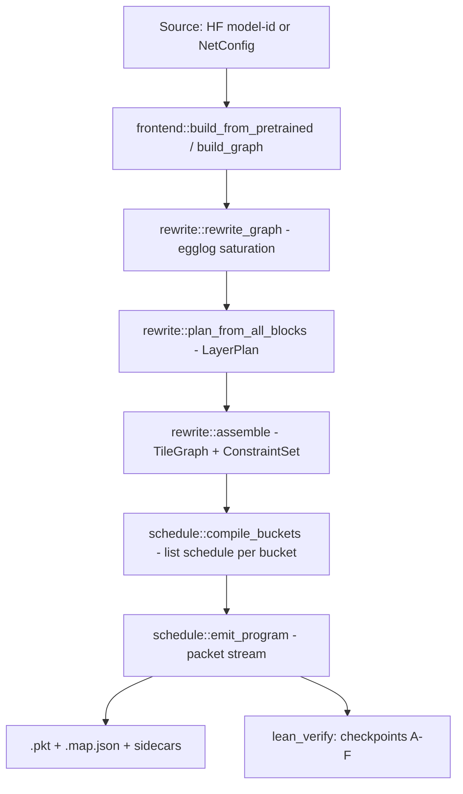

### 14.2 Egglog Rules (implemented)

The `crates/rewrite/src/egl/rules.egg` file contains annotated rewrite rules:
- GEMM + bias fusion
- GEMM + activation fusion (SiLU, GeLU)
- RMSNorm + QKV projection fusion
- Norm + RoPE fusion (Q/K paths)
- Residual-add fusion
- SwiGLU gate*up fusion
- Attention sliding/causal variants

Each rule has a `; rule: <name>` annotation that checkpoint A verifies against the Lean theorem catalog.

### 14.3 Tile Decomposition (partial implementation)

The generic cost model enumerates abstract MMA-legal candidates, applies SRAM
and (when the exact spec reports it) TMEM filters, and can add split-K candidates
for small M. Separately, model emitters contain concrete `DevOp` tables and
`pick_tile` functions. These two sources are not yet unified, and some opcode
tile names have historically reached the same body.

Therefore the current status is **candidate generation implemented; executable
cross-backend kernel selection partial**. The target `KernelSpec` registry makes
the built instantiation list authoritative and lets a block manifest request
only the GEMM/attention/MoE/MLA/Mamba cases reachable from that network block.

### 14.4 Post-Schedule Passes (all implemented)

1. **Counter elimination** — drops redundant counters covered by resource-order (Lean: `resourceOrdered ⊆ happensBefore`)
2. **Scope narrowing** — downgrades IntraGpu → IntraSm when all producers/consumers share one SM
3. **Prefetch hoisting** — moves DMA-in packets earlier to overlap with compute
4. **SRAM temporal fit** (Phase 3) — greedy per-candidate promotion with reschedule; accepts only if makespan improves

### 14.5 Compiler Outputs (per bucket)

| File | Content |
|------|---------|
| `{phase}_b{batch}_s{seq}.pkt` | Binary packet stream |
| `{stem}.map.json` | Address map (arena layout, per-buffer offset/reserved) |
| `{stem}.blocks.json` | Per-transformer-block task ranges |
| `{stem}.experts.json` | MoE routing metadata |
| `{stem}.decode_kv.json` | Decode-phase KV patching schema |
| `{stem}.request_io.json` | Per-request buffer schema |
| `{stem}.trace.json` | Chrome trace (optional) |
| `weights.json` | Network manifest (weight tiling, bucket stats) |
| `assets.json` | HBM sizing summary |
| `footprint.json` / `.csv` | Per-bucket memory breakdown |
| `static_tensors.bin` | Compile-time constants (when present) |

---

## 15. Implemented Runtime

### 15.1 plowrt CLI

```
plowrt serve --assets <dir> [--assets <dir>...] --port 8080
plowrt simulate --assets <dir> [--bucket decode:1:128]
```

**Serve mode**: loads compiled assets, allocates arena, starts HTTP server, dispatches requests through the mux.

**Simulate mode**: dry-run or golden-reference execution of packet streams (no device needed).

### 15.2 Runtime Components

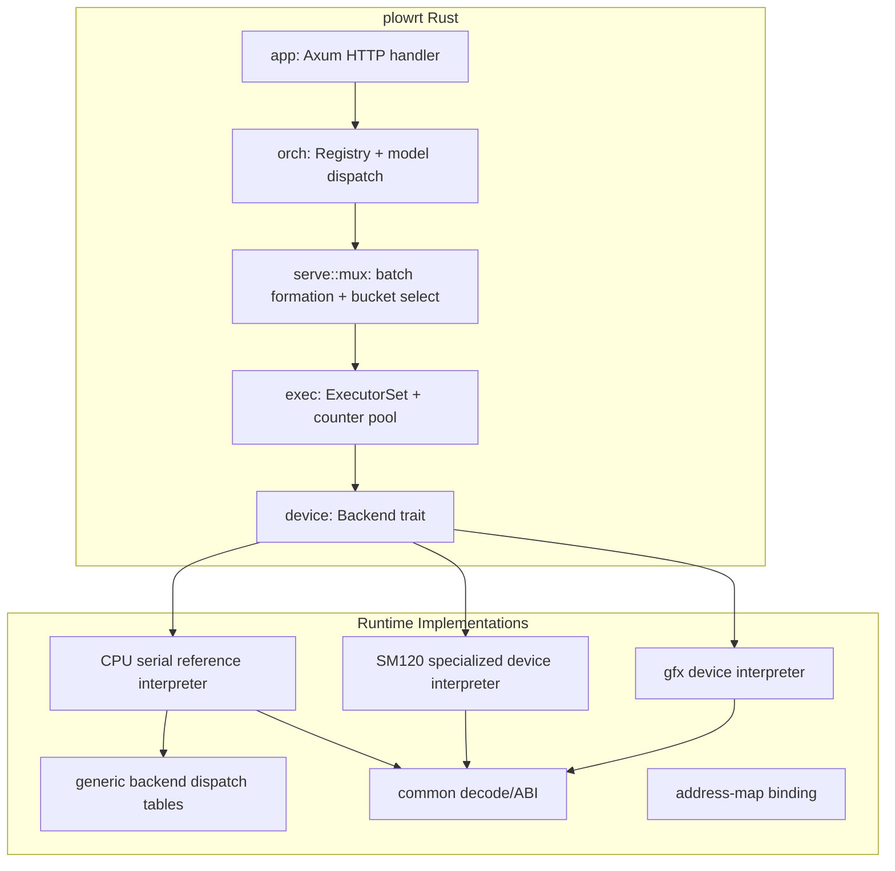

### 15.3 Device Backends

| Backend | Current honest scope |
|---------|----------------------|
| CPU reference | Generic correctness path for core packet families; not a performance port |
| NVIDIA generic dispatch | Reference/fused family registrations exist, but registration files explicitly leave some performant Hopper/Blackwell variants unregistered |
| NVIDIA SM120 specialized interpreter | Strong Gemma dense/MoE decode and prefill coverage; current checkout lacks MLA/DSA dispatch and has no Mamba ABI/kernel |
| AMD device interpreter | MFMA/attention/MoE plus MLA/DSA work exists on gfx paths; qualification remains model/shape/hardware specific |

The host `Backend` abstraction covers allocation, upload, launch, and lifecycle,
but it does not make operator coverage uniform. The planned generated registry
will expose exact backend/profile capability instead of a blanket backend flag.

### 15.4 Interpreter (C runtime)

`plow_interp_run()`:
1. Decode stream header (validate magic, version)
2. For each instruction: check wait counters → dispatch kernel → increment successor counters
3. Returns error codes: -1 missing kernel, -2 unsatisfied wait, -3 decode error, -4 missing binding

### 15.5 Dispatch Table

Each backend registers its kernel function pointers:
```c
typedef void (*kernel_fn)(const void* body, kctx* ctx, const PlowBinding* b);
dispatch_table dt;
register_hopper(&dt);   // or register_blackwell, register_mi300, register_cpu
```

The opcode's family+variant index into the table.

### 15.6 Request Mux (implemented)

- **Batch formation**: configurable hold time (`--max-hold-ms`)
- **SLO admission**: predicted wait > threshold → HTTP 503
- **Bucket selection**: (phase, batch, seq) → cached `.pkt` stream
- **KV arena**: per-sequence grow with paged blocks (per `KvPaging` schema)

---

## 16. Implemented Verification

### 16.1 Lean Integration (operational)

The `lean_verify` crate spawns the `plow_verify` binary (built by `lake build` in `lean-plow/`) for each checkpoint, passing a JSON payload and receiving a certificate.

Verified properties:
- **A**: Every egglog rewrite rule name has a corresponding soundness theorem
- **B**: Tile partition covers the GEMM shape; tile-work ≤ cost_bound
- **C**: SRAM temporal fit conditions (opt-in, not per-bucket)
- **D**: Schedule respects counter protocol; reclamation safety
- **E**: Wire format round-trips (smoke test)
- **F**: Address-map allocation non-overlapping + within arena

### 16.2 Integration Tests

| Test | Verifies |
|------|----------|
| `lean_verify.rs` | Full pipeline with Lean enabled |
| `lean_verify_rewrite.rs` | Checkpoint A rule catalog |
| `lean_verify_tile_partition.rs` | Checkpoint B partition validity |
| `lean_verify_sram_fit.rs` | Checkpoint C SRAM conditions |
| `lean_verify_schema.rs` | JSON marshaling fidelity |
| `lean_verify_wire.rs` | Checkpoint E wire round-trip |
| `lean_verify_growable_kv.rs` | Growable KV entries in checkpoint D/F |
| `lean_verify_negative.rs` | Injected bugs are caught |

---

## 17. Model and Hardware Coverage

Model parsing/lowering, packet emission, device launch, numerical parity, and
performance qualification are separate. The current checkout supports them to
different depths:

| Family | Current honest status |
|--------|-----------------------|
| Gemma dense/MoE | Strongest specialized path and benchmark evidence, especially SM120; exact size/precision/phase cells remain explicit |
| Llama/Qwen dense/GQA | Emitters and reused core ops exist; no blanket all-size/all-hardware tuned claim |
| DeepSeek/Kimi MLA+MoE | Semantic lowering and AMD MLA-family work exist; current SM120 interpreter lacks MLA dispatch |
| GLM MLA+DSA | Compiler/AMD paths and reference work exist; current SM120 interpreter lacks MLA/DSA dispatch |
| Mamba/hybrid | Target only in the current checkout; no live packet ABI, device dispatch, or end-to-end model path |

Likewise, `hwspec` entries for Ada, Hopper, SM100/SM120, CDNA3, and CDNA4 mean
the devices are described, not fully supported. Hardware support is asserted
only per scorecard cell after the exact operator set compiles, dispatches,
passes independent GPU/model oracles, and has a reproducible baseline. SM100
and SM120 are maintained as distinct capability families.

---

## 18. What Remains Unimplemented

### 18.1 From the Design Documents

| Feature | Design Section | Status |
|---------|---------------|--------|
| Dynamic work-stealing (large batch) | §11.2 hybrid scheduler | Design only |
| Pipeline parallel (PP) | §10.1 | Hooks present, planning future |
| Expert parallel (EP) | §10.1 | Detection done, dispatch future |
| Data parallel (DP) | §10.1 | Not started |
| DPU integration | §11, hypervisor §6 | Not started |
| Multi-tenant isolation | §12 | Design only |
| Speculative decoding | hypervisor §15.6 | Flag reserved |
| Iterative egg↔scheduler feedback | §6.4 | Design only |
| Distributed transpose collective | §11.3 | Design only |
| Cross-node RDMA (Tier 4 counters) | §7.3, §9.6 | Design only |
| Disaggregated KV cache | hypervisor §11.2 | Not started |
| Training support | - | Explicitly out of scope |

### 18.2 Runtime and Kernel Gaps

| Gap | Notes |
|-----|-------|
| Generated kernel/profile registry | ABI constants, dispatch arms, build instantiations, resources, and compiler candidates are not one source of truth |
| Resource-compatible interpreter profiles | Worst-arm register/shared-memory poisoning is handled ad hoc; dense/MoE/latent/Mamba profiles are target design |
| Competitive prefill kernels | Existing campaigns identify GEMM/grouped-GEMM/paged-attention throughput as the main vLLM gap |
| SM120 MLA/DSA | Compiler/opcode plans exist, but current SM120 interpreter has no corresponding dispatch arms |
| Mamba-2 | No current main packet ABI, state contract, device kernel, or end-to-end model validation |
| Portable multi-device collectives | TP pieces exist; complete PP/EP/cross-node production coverage remains incomplete |
| Watchdog/progress diagnostics | Needed to localize counter or packet stalls even when verified schedules are expected not to deadlock |

### 18.3 Compiler and Tuning Gaps

| Gap | Notes |
|-----|-------|
| Common semantic operator signature | Generic `OpKind` and specialized `DevOp` paths remain split |
| Registry-backed selection | Model-specific `pick_tile` logic is duplicated and can hardcode a GPU spec |
| Offline calibration database | No normalized hardware/toolchain/kernel/profile/op/block measurement store drives compilation yet |
| Network block tune manifest | Block definitions do not yet enumerate, deduplicate, qualify, and publish only their relevant op cases |
| Block-level promotion gate | Microbenchmark winners are not transactionally promoted after full interpreter/block validation |
| Egglog kernel-realization extraction | Egglog does not yet choose among registry-backed fused/layout/precision realizations using measured region costs |
| Lean capability/state checks | Existing proofs cover core rewrites/schedule/memory; registry ABI, finite measured selection, DSA reuse, and Mamba state contracts remain target work |

---

## Appendix A: Glossary

| Term | Definition |
|------|-----------|
| **Executor** | Independent unit consuming a packet queue (SM, CU, CPU thread, DPU core) |
| **Packet** | One instruction in the compiled schedule (variable-length POD record) |
| **Counter** | Atomic integer expressing a dataflow dependency between tasks |
| **Schedule** | Compiled packet streams + counter table for a (model, shape-bucket) |
| **Iteration** | One token (decode) or one prefill chunk |
| **TileGraph** | The central IR: DAG of DmaIn/Compute/DmaOut nodes with dependency edges |
| **Shape Bucket** | A (batch, seq, phase) tuple with a dedicated compiled stream |
| **Handoff** | Data passing between ops — SramSameSm (no HBM), Dsm, or Hbm round-trip |
| **Wavefront Clustering** | Grouping fine tile-tile edges into shared counters |
| **Soc** | System-on-chip model: units + interconnect |
| **Unit** | One GPU in the Soc (with its SMs, DMA engines, memory) |

## Appendix B: Build & Run

```bash
# Enter dev shell
nix develop

# Build everything
cargo build --workspace

# Run compiler
cargo run -p plowc -- --model google/gemma-3-4b-it --gpu "MI300X" \
    --batch 1 --seq 128 --phase decode --out ./out

# Run runtime
cargo run -p plowrt -- serve --assets ./out --port 8080

# Run tests
cargo test --workspace

# Build Lean verifier
cd lean-plow && lake build
```

## Appendix C: Key File Paths

| Path | Purpose |
|------|---------|
| `crates/plowc/src/lib.rs` | Compiler driver |
| `crates/plowc/src/main.rs` | CLI entry point |
| `crates/rewrite/src/egl/rules.egg` | Egglog fusion rules |
| `crates/rewrite/src/tilegraph.rs` | TileGraph assembly |
| `crates/schedule/src/config.rs` | Scheduler configuration |
| `crates/packet/src/lib.rs` | Packet ABI definition |
| `crates/plowrt/src/main.rs` | Runtime CLI |
| `runtime/common/interp.c` | C interpreter |
| `runtime/nvidia/register_hopper.cu` | Hopper kernel registration |
| `runtime/amd/register_mi300.hip` | MI300 kernel registration |
| `lean-plow/Plow/Verify.lean` | Top-level verifier |
| `include/packet.h` | C packet struct mirror |
