# P3: synchronization and broadcast for the real BF16 layer stage (Xeon 6975P-C)

Checklist phase P3. Same stage, dumps and gate as P2 (`l2r_layer.c`, `p2_gate.py`), with new broadcast and
barrier modes. Raw evidence: `/tmp/g4c/l2r/results/{p3_sync,p3,p3v2}`. Tools in `runtime/cpu/bench/l2r/`:
`sync.c` (idle microbench), `l2r_layer.c` (`L2R_BCAST`, `L2R_BARRIER`), `p3_sum.py` (summary).

* Host:
  * kernel 6.18.51-120.163.amzn2023, microcode 0x1000434.
  * Isolation and QoS as in P0/P1: 90 inference cores 2-31, 34-63 and 66-95; `cpu_dma_latency=0`; THP `madvise`.
* Build: `cc -O3 -march=sapphirerapids -mamx-tile -mamx-bf16 -mavx512bf16 -mcldemote -pthread`. The GEMV is AVX-512.
* Runs: 5,000 steps × 3 reps per cell, plus 2 × 200,000-step long runs. The tables report the median over the
  reps; the p50 spread is (max − min) / mean.
* Gate: **56/56 runs PASS** (54 sweep + 2 long), unchanged thresholds.

## Dependency critical path of one decode layer

Each GEMV is row-partitioned over the 90 workers, so every GEMV needs the whole previous vector on every
worker. That gives one all-to-all exchange point per arrow below: 8 per layer, of which 7 are data
dependencies. Numbers are E2B L0 2K in the best mode (`repnt.diss`): phase critical-path compute, then the
mean barrier wait, in µs.

```mermaid
flowchart LR
  x[x_in] --> P0["0 norm + q/k/v rows<br/>2.0 / 2.5"]
  P0 -->|q,k,v all-gather| P1["1 q/k norm, rope, split-K attention<br/>8.9 / 4.9"]
  P1 -->|"partials (m,l,o) to reader nodes"| P2["2 combine heads<br/>5.6 / 2.6"]
  P2 -->|attn all-gather| P3["3 o rows<br/>1.7 / 2.2"]
  P3 -->|o all-gather| P4["4 residual, norms, gate/up, gelu·up<br/>9.2 / 2.9"]
  P4 -->|act all-gather| P5["5 down rows<br/>4.8 / 2.5"]
  P5 -->|down all-gather| P6["6 residual, PLE gate, gelu·ple<br/>1.8 / 3.6"]
  P6 -->|pact all-gather| P7["7 PLE projection<br/>0.8 / 1.7"]
  P7 -->|"pp → worker 0: norm, residual, scalar"| out[x_out]
```

Exchanged bytes per step, sliding layers (E2B L0 / E4B L0; full layers with head 512 double q, partials and attention output):

| vector | E2B | E4B |
|---|---:|---:|
| q + k + v (fp32) | 10 KiB | 12 KiB |
| attention partials, per worker | 8 KiB | 8 KiB |
| attention output (bf16) | 4 KiB | 4 KiB |
| o and down (fp32 hidden) | 6 KiB each | 10 KiB each |
| act (bf16, intermediate 6,144 / 10,240) | 12 KiB | 20 KiB |
| PLE (bf16) | 0.5 KiB | 0.5 KiB |

All of these are 1-20 KiB per exchange. Every exchange is latency-bound, not bandwidth-bound.

## Idle microbench: vector handoff on the real SNC topology (`sync.c`)

One-way core-to-core latency from core 0:

| target | node | latency |
|---|---|---:|
| core 1 | same node | 195-204 ns |
| core 31 | same node | 202-209 ns |
| core 32 | adjacent node | 156-167 ns |
| core 64 | far node | 191-195 ns |

* UMWAIT and CLDEMOTE move these by ≤ 11 ns.

One exchange of a 2,560-byte vector, each core contributing a slice and then reading all of it (µs, three reps):

| participants | dissemination | flag-in-data | flag-in-data + CLDEMOTE | hierarchical | hierarchical + UMWAIT |
|---|---:|---:|---:|---:|---:|
| 32 (one SNC node) | 1.11 / 1.08 / 1.09 | 0.61 / 0.58 / 0.58 | 0.67 / 0.65 / 0.65 | n/a | n/a |
| 64 (two nodes) | 1.52 / 1.52 / 1.47 | 1.19 / 1.20 / 1.16 | 1.29 / 1.28 / 1.21 | n/a | n/a |
| 96 (full socket) | 2.15 / 2.12 / 2.10 | 2.14 / 2.06 / 2.18 | 2.24 / 2.21 / 2.30 | 1.92 / 1.92 / 1.89 | 1.84 / 1.83 / 1.81 |

* Flag-in-data reproduces the source's die-local handoff: 0.58 µs vs its 0.51.
* Flag-in-data loses its advantage once the exchange crosses dies. Full socket, the best primitive is
  hierarchical + UMWAIT at 1.81-1.84 µs.

## Broadcast and barrier modes in the real stage, under load

"Under load" here means during the stage's own BF16 GEMV. The sync + broadcast column is step p50 minus the
same stage's no-all-gather compute critical path, i.e. everything that is not compute.

| stage | broadcast.barrier | step p50 / p99 µs (p50 spread) | phase compute sum | barrier wait sum | sync + broadcast µs |
|---|---|---|---:|---:|---:|
| E2B L0 2K | direct.diss | 147.8 / 153.8 (1.3%) | 132.7 | 20.0 | 127.6 |
| E2B L0 2K | rep.diss | 61.4 / 79.0 (0.5%) | 47.4 | 21.0 | 41.2 |
| E2B L0 2K | **repnt.diss** | **51.8 / 65.8 (2.0%)** | 34.8 | 22.9 | **31.6** |
| E2B L0 2K | repnt.hier | 56.1 / 69.0 (0.8%) | 33.7 | 27.9 | 36.0 |
| E2B L0 2K | fid.diss | 52.7 / 63.9 (0.5%) | 53.5 | 6.3 | 32.5 |
| E2B L0 2K | no all-gather (barriers only) | 32.4 / 49.8 (5.2%) | 20.2 | 16.3 | 12.2 |
| E2B L4 16K | direct.diss | 191.2 / 199.1 (0.1%) | 178.6 | 25.8 | 118.4 |
| E2B L4 16K | rep.diss | 113.0 / 121.4 (0.4%) | 99.6 | 29.0 | 40.1 |
| E2B L4 16K | **repnt.diss** | **103.7 / 115.4 (0.6%)** | 87.7 | 30.4 | **30.8** |
| E2B L4 16K | repnt.hier | 105.5 / 118.9 (1.0%) | 86.8 | 32.9 | 32.7 |
| E2B L4 16K | fid.diss | 109.2 / 118.2 (1.6%) | 113.5 | 10.1 | 36.4 |
| E2B L4 16K | no all-gather | 84.7 / 98.1 (0.2%) | 72.8 | 24.3 | 11.9 |
| E4B L0 2K | direct.diss | 207.2 / 216.6 (4.8%) | 194.4 | 31.2 | 102.6 |
| E4B L0 2K | rep.diss | 148.1 / 158.2 (1.8%) | 134.9 | 37.5 | 43.4 |
| E4B L0 2K | **repnt.diss** | **139.0 / 148.5 (0.3%)** | 125.3 | 36.8 | **34.3** |
| E4B L0 2K | repnt.hier | 143.4 / 154.0 (3.2%) | 127.9 | 41.2 | 38.7 |
| E4B L0 2K | fid.diss | 144.4 / 153.9 (1.4%) | 169.3 | 6.0 | 39.8 |
| E4B L0 2K | no all-gather | 116.4 / 125.5 (2.6%) | 104.7 | 33.3 | 11.7 |

What the modes are:

* **direct** is the P2 path: every worker reads the shared vectors wherever they are homed.
* **rep**: each producer copies its slice into one replica per SNC node, homed on that node.
* **repnt**: rep with non-temporal full-line stores.
* **fid**: repnt lines with the step tag at both ends; readers poll for it, and 7 of the 8 barriers are dropped.
* **repcld** (rep + CLDEMOTE) and a gather with all lines prefetched first were also run, once each, on
  E2B L0 2K in `results/p3`:
  * repcld: 72.4 µs, worse than rep.
  * prefetched gather: no change.

Findings:

* **Replicas per SNC node with non-temporal stores remove ~83% of the P2 all-gather cost.**
  * E2B L0 broadcast cost: 115 → 19 µs over the barrier-only floor. The step: 147.8 → 51.8 µs (2.9×).
  * Plain stores leave the lines in the producer's L2. Every remote reader then snoops it, and those reads
    serialize on the producer.
  * NT stores land the lines in the reader node's memory side, so the gather becomes a local L3/memory read.
* **Attention partials go only to the nodes that read them.** Each line of a worker's partial block is written
  only to the replicas of the SNC nodes whose combine workers read it.
  * Owner-homed partials (one copy, readers pull) are worse: 59.6 vs 51.0 µs on E2B L0 (`results/p3`).
* **The barrier mechanism is not the cost.**
  * fid removes 7 barriers. Its barrier wait drops 22.9 → 6.3 µs.
  * But its compute sum rises 34.8 → 53.5 µs, because each gather now polls until the slowest producer's line
    arrives.
  * Step time is 1.7-5.3% slower than repnt (E2B L0 52.7 vs 51.8). The exchange cost is the dependency itself: the
    slowest producer plus a cross-die line transfer. The barrier only measures it.
* **Hierarchical barriers lose under load.**
  * Idle, hier beats dissemination by 0.2-0.3 µs.
  * In the stage it is 1.8-4.4 µs slower per layer on all three stages.
  * The node-leader stage serializes three cross-die hops behind the slowest member of each node. Not
    isolated further.
* **Sync cost does not depend on the stage's KV traffic.**
  * Sync + broadcast is 31.6 µs at 2K and 30.8 µs at 16K. The 16K stage reads 32 MiB of KV per step (L2/L3).
  * E4B's L3-bound FFN costs only 34.3 µs. Its larger vectors add ~3 µs.
  * A DRAM-resident KV stream (128K) is P4.
* **The remaining sync + broadcast cost is ~31 µs per layer.** For E2B L0 that splits into:
  * ~12 µs of barrier floor plus load imbalance: 8 exchanges × ~1.5 µs (the no-all-gather case).
  * ~15 µs of gather reads (compute sum 34.8 vs 20.2 µs without the all-gather).
  * ~5 µs remainder: NT stores in the producers, and more imbalance.

## Correctness over extended runs

* **False sharing.** Every flag, arrival counter and gate is on its own 64-byte line. Every replica segment
  is 64-byte aligned and padded to whole lines. NT stores are full-line only.
* **Stale epochs.**
  * The dissemination flags carry the epoch value, not a toggle.
  * fid buffers alternate by step parity, and each line carries the step tag (`st + 1`) at both ends. A torn
    or stale line fails the two-tag check and is re-polled.
* **Memory ordering.** Each producer issues `sfence` after its NT stores, before it arrives at a barrier or
  before its tagged lines can be observed. Readers poll with whole-line loads.
* **Long runs.** 200,000 steps each, about 10.5 s, on E2B L0 2K:

  | mode | p50 µs | p95 µs | p99 µs | max µs | gate (first and last step) |
  |---|---:|---:|---:|---:|---|
  | fid | 52.58 | 56.0 | 63.0 | 346 | PASS, out cos 0.99999982 |
  | repnt | 51.62 | 54.75 | 63.3 | 288 | PASS, out cos 0.99999982 |

  * There were no hangs and no gate drift.
  * The rare 0.3 ms maximum is unattributed. It is outside p99, and HZ=100 ticks still run on the
    inference cores.

## Checklist items

| item | status |
|---|---|
| single-die, two-die, full-socket handoff | done (`sync.c`, 32/64/96 cores) |
| flag-in-data, sequence counters, hierarchical, dissemination | done, idle and in-stage. The dissemination flags are epoch sequence counters, and hier uses a per-node arrival counter |
| transfer sizes matching hidden / attention / FFN vectors | done in-stage: the real vectors, 0.5-20 KiB. The microbench uses 2,560 B |
| whole attention heads and FFN partitions within dies | **not done**, see below |
| replace full-socket barriers with producer/consumer handoffs | done (fid). It is correct but no faster, because the dependency is the cost |
| fusion within the BF16 gates | unchanged from P2: norms, residuals and gelu·up are fused/redundant. No new fusion; an unfused variant was not built |
| sync under simultaneous BF16 GEMV and KV streaming | done: every in-stage number is under the stage's own GEMV, at 2K and 16K (KV from L3). DRAM KV is P4 |
| false sharing, stale epochs, ordering, tail stalls over long runs | done (above) |

Why whole heads were not placed within dies:

* E2B has 8 query heads over 1 KV head, and E4B 8 over 2. Whole heads over 3 dies is a 3/3/2 imbalance, and
  it puts each KV head's whole stream on one die.
* The split-K-by-position attention already keeps the KV read balanced and node-local. Its partials go only to
  the reader nodes.
* Per-die heads also would not remove the cross-die exchange before `o`, gate/up and down, which need the
  whole vector.

## Stretch target: ≤ 4 µs sync + broadcast per real layer

**Missed, and not reachable with a 90-core row-partitioned layer.** The arithmetic from the measured floors:

* The layer has 7 data-dependent all-to-all exchanges. The best full-socket exchange measured idle is
  1.81 µs, so the floor is 7 × 1.81 ≈ 12.7 µs before any imbalance. Measured in-stage, the barrier-only floor
  is 11.7-12.2 µs, on all three stages.
* ≤ 4 µs requires die-local exchanges: 7 × 0.58 µs ≈ 4.1 µs within one SNC node of 32 cores.
* One node has 30 inference cores. An E2B layer is then 2.3-2.75 MiB per core, which does not fit in L2
  (P1: ≤ 1.53 MiB held).

L2 residency of a real BF16 layer needs the whole socket's L2. A whole-socket layer pays ≥ 12 µs of exchange
latency. The two goals conflict on this part.

## Exit gate P3

| criterion | result |
|---|---|
| stretch: ≤ 4 µs sync + broadcast per layer under load, p99 recorded | **missed**. Best is 30.8-34.3 µs (repnt.diss) on all three stages. E2B L0 p99 is 65.8 µs vs p50 51.8. The floor is ≥ 12 µs by construction (above) |
| numerical gate | **PASS** 56/56 runs, every boundary, including 2 × 200k-step runs |
| critical path understood | yes: 7 data exchanges, each costing ~1.5 µs of barrier floor and imbalance plus ~2 µs of gather reads |

**P3 exit: PASS on correctness; stretch target infeasible as framed.** Carried forward:

* Default stage modes become `L2R_BCAST=repnt L2R_BARRIER=diss`.
  * E2B L0 2K: 51.8 µs per layer, vs P2's 145.
  * E2B L4 16K: 103.7 µs. E4B L0: 139.0 µs.
  * Projected E2B decode: 35 layers × ~52-104 µs ≈ 2-4 ms per token, if every layer's weights were resident.
    They are not: one socket's L2 holds about two E2B layers.
* P4: KV policy at 2K-128K. It includes the P1 AMX-after-KV slowdown and the DRAM-KV case for full-attention
  layers.
* P5 needs a different stage geometry from this one: L2 holds only about two E2B layers at a time, so serving
  is DRAM/L3-backed.
  * Options are layer pipelining across dies, or the existing plowrt CPU engine with these broadcast lessons
    (per-node NT replicas).
  * Choose one by measurement, not projection.
